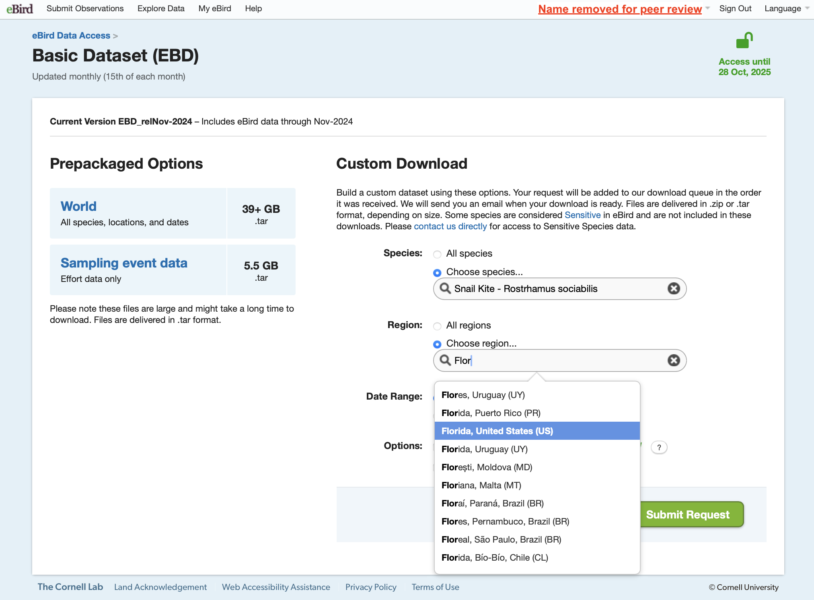

# Read me (begin here)

This file is the code used for a paper *to be submitted* to ***Methods in Ecology and Evolution***. Thus, we hope this program is applied for different users in an intuitive and practical way. Our aim is to provide a rapid assessment of short trends of local persistence probability by incorporating population dynamics robust models (Dennis & Ponciano, 2014; Humbert *et al.*, 2009) withing the risk-based population viability monitoring framework (Staples *et al.*, 2005) using time series data from eBird. Thus, we begin by organizing eBird data records in a time series of weekly high counts estimates, filtering by best practices recommended elsewhere (Backstrom *et al*., 2024; Johnston e*t al.*, 2021; Kelling *et al.*, 2019; Strimas-Mackey *et al.*, 2023).  

We focused on the community science platform [eBird](https://ebird.org/home), with an example that have long-term monitoring efforts to understand population dynamics, the Snail Kite in Florida [*Rostrhamus sociabilis*](https://birdsoftheworld.org/bow/species/snakit/cur/introduction) (see *Prepare the data from eBird and time-series vectors*). Specifically, we concentrate our analysis on the population of Snail kites in the Payne's Prairie wetland, in Alachua County, northcentral Florida, fitting continuous version of the discrete-time equal sampling Gompertz State-Space model: 

1. The density-dependence Ornstein-Uhlenbeck State-Space model (OUSS)
2. The density-independence Exponential Growth State Space model (EGSS)

We applied a risk-based viable population monitoring framework (see Staples *et al.*, 2005), estimating the probability of local persistence (1-probability of ending below a threshold.

The statistical properties for our proceedings are based on Dennis *et al.* (1991), Dennis *et al.* (2006), Dennis & Ponciano (2014), Humbert *et al.* (2009), and reference within them. We adjusted the functions and code published as supplementary information in Humbert *et al.* (2009) and Dennis & Ponciano (2014) (see `OACColombia/rouss` in GitHub). 

# Packages
```{r, include=T}
#package with rouss functions (Dennis & Ponciano 2014)
#remotes::install_github("OACColombia/rouss", force = T); #Restar session
library(rouss)

#R functions and datasets to support "Modern Applied Statistics with S", a book from W.N. Venables and B.D. Ripley
  library(MASS);
#Lognormal distribution
  library(kde1d)
#To conduct eBird data filtering and manipulation (see Strimas et al. 2018 and 2023)
  library(auk); 
#To data management and visualization - sevent packages in one
  library(tidyverse)
#To conduct Spatiotemporal Subsampling
  library(dggridR)
#load maps
  library(maps); 
#composite figure
  library(gridExtra); 
#bootstrap resampling and CIs
  library(boot)
```

# eBird data organization

Note that you have to download the `ebd` file from [eBird](https://ebird.org/data/download).

## eBird download data

Go to [eBird](https://ebird.org/data/download). You have to sign in in eBird:


If you are in the home page, check you are sign-in and move down on the page to "Request data"


You have to submit an application to have access to the data. Once you have access, click on "Basic dataset (EBD)"


Then, you can select by Species, region, date. In our case, lets download _Rostrhamus sociabilis_ in Florida (US). 


In the options, include the sampling event data. In Snail Kite for US it will save the sampling event, but for other Neotropical species tested in preliminary attempts, the sampling data was not recovered and the user should download the 5.5 GB (comprised in `.tar` formats) Sampling event data.

After submitting the request, the link to download will arrive to the email registered in your eBird account. You can deploy the `.txt` files in a `data_raw` directory to be called during filtering.


This file will have the detections and observer counts for our species.

## Pre-filtering
We can simplify the eBird data selecting only columns of our interest (it will reduce the size of the dataset)

```{r eval=F}
colsE <- c("observer_id", "sampling_event_identifier",
           "group identifier",
           "common_name", "scientific_name",
           "observation_count",
           "country", "state_code", "locality_id", "latitude", "longitude",
           "protocol_type", "all_species_reported",
           "observation_date",
           "time_observations_started",
           "duration_minutes", "effort_distance_km",
           "number_observers")
```

To conduct some filters, we will generate temporal files in our computer. Here we generate only a single temporal file, overwriting for the different species.

```{r eval=F}
#generate a temporal file to save the filtering eBird data (f_ebd) and sampling (f_sed)
f_ebd <- "data_tmp/ebd_Examples.txt" 
f_sed <- "data_tmp/sed_Examples.txt" 
```

The construction of time-series of the estimation of individuals from eBird will assume spatiotemporal subsampling, selecting a single value with the high counts (assuming to be the minimum number of individuals) per week in spatial sampling units of $100 \text{ km}^2$.

```{r eval=F}
#Spatial grid cells - diameters of ~11km (area of 95.98 ~> ~100 km^2)
set.seed(123)
dggs_pop <- dgconstruct(spacing = 11) 
#spacing 11 correspond to Characteristic Length Scale (CLS), or diameter of spherical cell
```

## Filtering

Filtering for protocol, distance, duration, only complete lists

```{r eval=F}
ebd_filt <- auk_ebd("data_raw/ebd_US-FL_snakit_smp_relJun-2024.txt") %>%
  auk_protocol(c("Traveling", "Stationary")) %>%
  auk_distance(distance = c(0,5)) %>%
  auk_duration(duration = c(0,300))%>%
  auk_complete() %>%
  auk_filter(f_ebd,overwrite=T, keep = colsE) %>%
  read_ebd()
```

Then, just for the sake of double check and organization, we can remove the observations without count estimation, add distance $0$ to stationary protocols, modify the time of observations started to decimal and round hour sampling to an integer, extract year, month, week, and day_of_year. Also, we can confirm and filter out by effort, such as observers $≤10$, distance $≤5 \text{ km}$, duration $≤5 \text{ hours}$, and only records with abundance estimation.

```{r eval=F}
#Some effort extraction and confirmation
ebd_filt <- ebd_filt %>%
  mutate(
    # I don't want here count in 'X', to convert to NA
    observation_count = as.integer(observation_count),
    # effort_distance_km to 0 for non-travelling counts
    effort_distance_km = if_else(protocol_type == "Stationary",
                                 0, effort_distance_km),
    # convert time to decimal hours since midnight
    time_observations_started = time_to_decimal(time_observations_started),
    hour_sampling = round(time_observations_started, 0),
    # split date into year, month, week, and day of year
    year = year(observation_date),
    month = month(observation_date),
    week = week(observation_date),
    day_of_year = yday(observation_date)) %>%
  filter(number_observers <= 10,         #Only list with less than 10 observers
         effort_distance_km <= 5,        #be sure of distance effort
         duration_minutes %in% (0:300),  #be sure of duration effort
         !is.na(observation_count))      #only records with abundance estimation
```

Now we can add a new variable that identify each cell from a grid of hexagons (spatial sampling units).

```{r eval=F}
#add a new variable that identify cell, and have the maximum count per week per cell
SnailKite <- ebd_filt %>%
  mutate(cell = dgGEO_to_SEQNUM(dggs_pop, #id for cells
                                longitude, latitude)$seqnum) %>%
  group_by(cell, year, month, week) %>%
  mutate(max_count = max(observation_count, na.rm = T), 
         n_lists = n()) |>
  ungroup()

```

## Time-series (weeks between January 2018-May 2024)

We adjust the time-series from the 1st week of 2018 (January) to the 22nd of 2024 (May). Since 2018, Snail kites reached more than 1000 records (Figure SI1). In addition, in 2018 was the species established in Paynes' Prairie, which is the spatial cell with higher records. We extract the high count per week.

```{r eval=FALSE}
hist(SnailKite$year, breaks = 50, main = "Florida Snail kites, checklists per year", xlab = "Year")
abline(h = 1000, v = 2017, col = "red")

snailkites.week <- SnailKite |>
  filter(observation_date >= "2018-01-01") |>
  mutate(Time.t = case_when(year == 2018 ~ week,
                            year > 2018 ~ week+(52*(year-2018)))) #|> View()
  
snailkites.week.counts <- snailkites.week |>
  group_by(cell, Time.t) |>
  summarise(Observed.y = round(max(max_count),0))

```


And we can save this as an outcome for backup.

```{r eval=F}
saveRDS(SnailKite, "data_tmp/SnailKiteCellsID_filtered.rds")
saveRDS(snailkites.week, "data_tmp/SnailKiteCellsWeek.rds")
saveRDS(snailkites.week.counts, "data_tmp/SnailKiteCellsCountsWeek.rds")
```

This file will serve to generate a map figure with the sampling effort after filtering the eBird data following best practices (see Johnston *et al.*, 2021).

# Snail Kite in Payne's Prairie, Alachua County, FL - Figure 1

We focused on the sampling unit with higher number of checklists, which correspond to the Payne's Prairie State Park wetland system in Alachua County. For this locality, we also have counts published from Poli *et.al.* (2020), and 2 areas that are surveyed: Payne's Prairie and Payne's Prairie Central.


This wetland overlap with an hexagonal cell that concentrate most records.

## Figure 1 - Map of sampling units
```{r eval=FALSE}
#A global map to make figures ###
world1 <- sf::st_as_sf(maps::map(database = 'world', plot = FALSE, fill = TRUE))
world1

#Get the number of observations in each cell
CellObservationsSK   <- SnailKite %>% 
  group_by(cell) %>%
  summarise(count=n())

#Get the grid cell boundaries for cells which had quakes
gridSnailKite <- dgcellstogrid(dggs_pop,CellObservationsSK$cell)

#Update the grid cells' properties to include the number of lists in each cell
gridSnailKite <- merge(gridSnailKite, CellObservationsSK, by.x="seqnum", by.y="cell")

# Handle cells that cross 180 degrees
wrapped_gridSnailKite = st_wrap_dateline(gridSnailKite, 
                                         options = c("WRAPDATELINE=YES","DATELINEOFFSET=180"), quiet = TRUE)

my_breaks = c(5, 50, 500, 5000)

arrow1 <- tibble(
  x1 = -82.3,
  x2 = -80.75,
  y1 = 29.6,
  y2 = 29.7
)

Fig1a <- ggplot() +
  geom_sf(data = world1)+
  geom_sf(data=wrapped_gridSnailKite,
          aes(color = count, 
              fill = count),
          alpha = 0.7) +
  #  geom_point(data = SnailKite, aes(x = longitude, y = latitude), size = 0.1)+
  scale_color_gradient(low="#440154", 
                       high="#FDE725",
                       trans = "log10",  
                       breaks = my_breaks,
                       labels = my_breaks)+
  scale_fill_gradient(low="#440154", 
                      high="#FDE725",
                      trans = "log10",  
                      breaks = my_breaks,
                      labels = my_breaks)+
  coord_sf(xlim = c(-84.5, -79.5), 
           ylim =  c(24.1, 30.9)) +
  labs(y = "Latitude",
       x = "Longitude",       
       tag = expression(bold("(a)")),
       title = "Snail Kites in Florida",
       subtitle = "eBird effort in spatial sampling units",
       color = expression(Log["10"]~"lists"),
       fill = expression(Log["10"]~"lists")) +
  annotate("text", x = -80, y = 29.75, label = "Payne's \n Prairie") +
  geom_curve(data = arrow1, aes(x = x1, y = y1, xend = x2, yend = y2),
             arrow = arrow(length = unit(0.08, "inch")), size = 0.5,
             color = "red", curvature = -0.3) +
  theme_classic()+
  theme(legend.position = c(0.2,0.25),
        legend.direction = "vertical",
        legend.box.background = element_rect(colour = "black"))

#Zoom to Payne's Prairie
arrow2 <- tibble(
  x1 = c(-82.328576, -82.334182, -82.303112, -82.292372),
  x2 = c(-82.3, -82.375, -82.25, -82.2),
  y1 = c(29.619306, 29.574222, 29.606876, 29.549109),
  y2 = c(29.7, 29.475, 29.65, 29.535)
)

Fig1b <- ggplot() +
  geom_sf(data=wrapped_gridSnailKite,
          aes(color = count, 
              fill = count)) +
  geom_point(data = SnailKite, aes(x = longitude, y = latitude), 
             size = 0.5, alpha = 0.25)+
  scale_color_gradient(low="#440154", 
                       high="#FDE725",
                       trans = "log10",  
                       breaks = my_breaks,
                       labels = my_breaks)+
  scale_fill_gradient(low = alpha("#440154", 0.25), 
                      high = alpha("#FDE725", 0.25),
                      trans = "log10",  
                      breaks = my_breaks,
                      labels = my_breaks)+
  coord_sf(xlim = c(-82.475, -82.125), 
           ylim =  c(29.45, 29.725),
           expand = T) +
  labs(y = "Latitude",
       x = "Longitude",       
       tag = expression(bold("(b)")),
       title = "Snail Kites in Payne's Prairie wetland",
       subtitle = "with eBird records and popular localities") +
  annotate("text", x = -82.25, y = 29.71, label = "Sweetwater Wetlands \n Park") +
  annotate("text", x = -82.4, y = 29.475, label = "US-441") +
  annotate("text", x = -82.2, y = 29.65, label = "La Chua trail") +
  annotate("text", x = -82.2, y = 29.525, label = "Wacahoota trail") +
  geom_curve(data = arrow2, aes(x = x1, y = y1, xend = x2, yend = y2),
             arrow = arrow(length = unit(0.08, "inch")), size = 0.5,
             color = "red", curvature = -0.3) +
  theme_classic()+
  theme(legend.position = "none")

Fig1 <- grid.arrange(Fig1a, Fig1b, ncol = 2, widths = c(1, 2))

ggsave("results/Fig1_SnailKitesMap.pdf", 
       plot = Fig1, dpi = 300, width = 10, height = 5, units = "in")

```

![Figure 1. Map of spatial sampling of Snail Kites in Florida (a) and zoom to the hexagonal cell with higher records in eBird (b). Each hexagonal cell corresponds to an area of ~100 km2, and the bright color identify cells with higher sampling in eBird (note log10 scale). A single cell in northcentral Florida (~Payne’s Prairie Preserve State Park) concentrated 7,197 checklists (intense yellow color and red arrow in (a), with transparency in (b)). Records of Snail Kite in Payne’s Prairie display some popular visited sites within this sampling unit (b), some overlapped with standardized long-term monitoring](results/Fig1_SnailKitesMap.png)

# Payne's Prairie has standardized monitoring data - combine with eBird

Joining eBird and standardized monitoring (benchmark).

```{r}
#Saved data
SnailKite <- readRDS("data_tmp/SnailKiteCellsID_filtered.rds")
snailkites.week <- readRDS("data_tmp/SnailKiteCellsWeek.rds")
snailkites.week.counts <- readRDS("data_tmp/SnailKiteCellsCountsWeek.rds")

#Cell with more values
CellTop <- SnailKite |>
  group_by(cell) |>
  mutate(n_checklists = n()) |>
  ungroup() |>
  filter(n_checklists == max(n_checklists)) |>
  select(cell) |>
  unique()

#The monitoring data by Poli et al. (2020)
Poli.etal <- data.frame(observation.date = c("2018-02-19",
                                             "2018-03-12",
                                             "2018-04-09",
                                             #"2018-05-14",
                                             #"2018-05-31",
                                             "2018-06-04",
                                             "2018-07-16",
                                             "2018-08-07",
                                             "2018-08-27",
                                             #"2018-09-01",
                                             "2018-10-15",
                                             "2018-12-17"),
                        abundance.monitored = c(1,2,4,#1,#6,
                                                8,6,6,
                                                12,#9,
                                                7,
                                                29))

Poli.etal <- Poli.etal |>
  mutate(observation.date = ymd(observation.date),
         year = year(observation.date),
         week = week(observation.date),
         Time.t = case_when(year == 2018 ~ week,
                            year > 2018 ~ week+(52*(year-2018)))) |>
  select(!observation.date)

#The monitoring data by standardized methods 2019
snail.kite.project.pp <- read_csv("data_raw/Snail kite surveys on PP and PPC 2018_2024.csv") |> 
  mutate(observation.date = mdy(date),
         year = year(observation.date),
         week = week(observation.date),
         Time.t = case_when(year == 2018 ~ week,
                            year > 2018 ~ week+(52*(year-2018)))) |>
  group_by(Time.t, year, week) |>
  summarise(abundance.monitored = max(count))

#including Poli et al.
snail.kite.project.pp <- snail.kite.project.pp |>
  full_join(Poli.etal) |>
  arrange(Time.t)

#Generate the time-series for the cell with more records
snailkites.paynesp <- snailkites.week.counts |>
  filter(cell == CellTop$cell)

#To return dates from original data
datesPP <- snailkites.week |> 
  group_by(Time.t) |> 
  summarise(observation.date = min(observation_date))

snailkites.paynesp <- snailkites.paynesp |>
  left_join(datesPP)

#Add standardized monitored
snailkites.PP <- snailkites.paynesp |>
  left_join(snail.kite.project.pp, by = "Time.t") |>
  arrange(Time.t)

#Figure
snailkites.PP |>
  pivot_longer(cols = !c(Time.t, cell, year, week, observation.date),
               names_to = "group",
               values_to = "Abundance") |> 
  drop_na(Abundance) |>
  ggplot(aes(x = observation.date, y = Abundance, fill = group))+
    geom_line(aes(color = group), alpha = 0.25, linetype = "dashed") +
    geom_point(aes(shape = group), color = "black")+
    labs(x = "Observation date",
       y = "Population abundance",
       tag = "",
       fill = "",
       color = "",
       shape = "")+
    scale_color_manual(values = c("black", "blue"),
                       labels = c("Standardized Monitored","eBird observations"))+
    scale_fill_manual(values = c("black", "blue"),
                       labels = c("Standardized Monitored","eBird observations"))+
    scale_shape_manual(values = c(19, 21),
                       labels = c("Standardized Monitored","eBird observations"))+
    theme_classic()+
    theme(legend.position = c(0.2, 0.8))
```

## Population viability monitoring framework

### 1. Fit an initial model to the first part of the time-series
We will fit an EGSS model for the first two years (weeks from 1 to 105)

```{r}
sk.pp.init <- snailkites.PP |>
  filter(Time.t %in% c(1:105))
```

Lets fit a first EGSS model for the eBird data observations
```{r}
#Define variables
yt1 = sk.pp.init |>
  ungroup() |>
  arrange(Time.t) |>
  drop_na(Observed.y) |>
  select(Observed.y) |>
  log()

#log-abundance estimate as a vector
yt1 <- yt1$Observed.y

tt1 <- sk.pp.init |>
  ungroup() |>
  arrange(Time.t) |>
  drop_na(Observed.y) |>
  select(Time.t)

#time vector (week since 2018-01)
tt1 <- tt1$Time.t

#Estimate REML parameters
sk.egss.parms <- egss_remle(yt = yt1,
                            tt = tt1,
                            fguess_egss = guess_egss(yt = yt1,
                                                     tt = tt1))
#predict trajectory
sk.egss.predict.init <- egss_predict(yt = yt1,
                                tt = tt1,
                                parms = sk.egss.parms$remles,
                                plot.it = T)

#recall "Observed.y" is the eBird weekly high counts

#change names to combine
colnames(sk.egss.predict.init[[1]]) <- c("Time.t", "Estimated_eBird_EGSS","eBird.Observed")
```

Trying the EGSS for the standardized monitored.
```{r}
#Define variables
ytB = sk.pp.init |>
  ungroup() |>
  arrange(Time.t) |>
  drop_na(abundance.monitored) |>
  select(abundance.monitored) |>
  log()

#Standardized abundance monitored as a vector
ytB <- ytB$abundance.monitored

ttB <- sk.pp.init |>
  ungroup() |>
  arrange(Time.t) |>
  drop_na(abundance.monitored) |>
  select(Time.t)

#corresponding time vector
ttB <- ttB$Time.t

skB.egss.parms <- egss_remle(yt = ytB,
                            tt = ttB,
                            fguess_egss = guess_egss(yt = ytB,
                                                     tt = ttB))

skB.egss.predict.init <- egss_predict(yt = ytB,
                                tt = ttB,
                                parms = skB.egss.parms$remles,
                                plot.it = T)
#change names to combine
colnames(skB.egss.predict.init[[1]]) <- c("Time.t", "Estimated_SKProj_EGSS","abundance.monitored")
```

And make the figure SI2a
```{r}
sk.Estimated <- data.frame(sk.egss.predict.init) |>
  left_join(data.frame(skB.egss.predict.init)) |>
  left_join(datesPP) #this recover the observation date per week

FigS2a <- sk.Estimated |>
  pivot_longer(cols = !c(Time.t,observation.date),
               names_to = "group",
               values_to = "Abundance") |>
  drop_na(Abundance) |>
  ggplot(aes(x = observation.date, 
             y = Abundance, 
             fill = factor(group,
                           levels = c("abundance.monitored",
                                      "Estimated_SKProj_EGSS",
                                      "eBird.Observed",
                                      "Estimated_eBird_EGSS"))))+
    geom_line(aes(color = factor(group,
                           levels = c("abundance.monitored",
                                      "Estimated_SKProj_EGSS",
                                      "eBird.Observed",
                                      "Estimated_eBird_EGSS")), 
                  linetype = factor(group,
                           levels = c("abundance.monitored",
                                      "Estimated_SKProj_EGSS",
                                      "eBird.Observed",
                                      "Estimated_eBird_EGSS"))), 
              alpha = 0.75) +
    geom_point(aes(shape = factor(group,
                           levels = c("abundance.monitored",
                                      "Estimated_SKProj_EGSS",
                                      "eBird.Observed",
                                      "Estimated_eBird_EGSS"))), 
               color = "black", 
               alpha = 0.75, size = 3)+
    labs(x = "Observation date",
       y = "Population abundance",
       tag = expression(bold("(a)")),
       fill = "",
       color = "",
       shape = "",
       linetype = "")+
    scale_color_manual(values = c("white", "#fc8d59","white", "#91bfdb"),
                       labels = c("Standardized Monitored (SM)", "Estimated trajectory (SM - EGSS)", "eBird weekly high count", "Estimated trajectory (eBird - EGSS)"))+
    scale_fill_manual(values = c("#d73027", "#fc8d59", "#4575b4", "#91bfdb"),
                       labels = c("Standardized Monitored (SM)", "Estimated trajectory (SM - EGSS)", "eBird weekly high count", "Estimated trajectory (eBird - EGSS)"))+
    scale_shape_manual(values = c(21, 24, 21, 24),
                       labels = c("Standardized Monitored (SM)", "Estimated trajectory (SM - EGSS)", "eBird weekly high count", "Estimated trajectory (eBird - EGSS)"))+
  scale_linetype_manual(values = c("solid","dashed","solid","dashed"),
                        labels = c("Standardized Monitored (SM)", "Estimated trajectory (SM - EGSS)", "eBird weekly high count", "Estimated trajectory (eBird - EGSS)"))+
    theme_classic()+
    theme(legend.position = c(0.2, 0.85))
```


How much is the prediction out of the estimation? Lets generate Figure SI2b
```{r}
#Estimated EGSS from eBird
lm(Estimated_eBird_EGSS~abundance.monitored, data = sk.Estimated)
#Estimated EGSS from Standardized Monitored
lm(Estimated_SKProj_EGSS~abundance.monitored, data = sk.Estimated)

#Function to generate equation in the figure
lm_eqn <- function(df, x, y){
    m <- lm(y ~ x, df);
    eq <- substitute(italic(y) == a + b %.% italic(x)*","~~italic(r)^2~"="~r2, 
         list(a = format(unname(coef(m)[1]), digits = 2),
              b = format(unname(coef(m)[2]), digits = 2),
             r2 = format(summary(m)$r.squared, digits = 3)))
    as.character(as.expression(eq));
}

FigS2b <- ggplot(sk.Estimated)+
  geom_abline(slope = 1)+
  geom_point(aes(x=abundance.monitored, y=Estimated_SKProj_EGSS), 
             color = "black", fill = "#fc8d59", shape = 24, alpha = 0.75, size = 3)+
  geom_smooth(aes(x=abundance.monitored, y=Estimated_SKProj_EGSS),
              method = "lm", color = "#fc8d59", se = F, linetype = "dashed")+
  geom_text(x = 60, y = 30, 
            label = lm_eqn(df = sk.Estimated,
                           x = sk.Estimated$abundance.monitored, 
                           y = sk.Estimated$Estimated_SKProj_EGSS), 
            parse = TRUE, color = "#fc8d59")+
  geom_point(aes(x=abundance.monitored, y=Estimated_eBird_EGSS), 
             color = "black", fill = "#91bfdb", shape = 24, alpha = 0.75, size = 3)+
  geom_smooth(aes(x=abundance.monitored, y=Estimated_eBird_EGSS),
              method = "lm", color = "#91bfdb", se = F, linetype = "dashed")+
    geom_text(x = 50, y = 0, 
            label = lm_eqn(df = sk.Estimated,
                           x = sk.Estimated$abundance.monitored, 
                           y = sk.Estimated$Estimated_eBird_EGSS), 
            parse = TRUE, color = "#91bfdb")+
  scale_y_continuous(limits = c(0,80))+
  labs(x = "Observed abundance (Standardized Monitored)",
       y = "Estimated trajectory of population abundance",
       tag = expression(bold("(b)")))+
  coord_fixed()+
  theme_classic()

#and combine in the figure

FigS2 <- grid.arrange(FigS2a, FigS2b, ncol = 2, widths = c(1.5, 1))

#It looks not good in the `Rmd`, but it is saved with good proportions
ggsave("results/FigS2_Step1.pdf", 
       plot = FigS2, dpi = 300, width = 12, height = 5, units = "in")

ggsave("results/FigS2_Step1.png", 
       plot = FigS2, dpi = 300, width = 12, height = 5, units = "in")
```


### 2. First estimation of p(local persistence) for eBird

With the estimated model parameters and the data up to the first 2 years (95 weeks with observation), we estimated the probability that the population will end below a critical threshold ($N_{critical}$, as the critical number of individuals) for the next two years (104 weeks). Let assume this $N_{critical} = 1/2 (\exp\bar{(y)})$. The resulting probability is recorded.

```{r}
#variables:
#Log observations for the entire dataset
yt = snailkites.PP |>
  ungroup() |>
  arrange(Time.t) |>
  drop_na(Observed.y) |>
  select(Observed.y) |>
  log()

#Vector form
yt <- yt$Observed.y

tt <- snailkites.PP |>
  ungroup() |>
  arrange(Time.t) |>
  drop_na(Observed.y) |>
  select(Time.t)

#Time vector of the time series
tt <- tt$Time.t

#the first two years length
last.tt <- length(yt1) 

#Define N_critical
N.critical = (1/2)*mean(exp(yt))

#number of simulations
ntraj = 5000 #for visual reasons, only 1000 in this first iteration

#threshold times to project (two years = 104 weeks)
thres.times <- as.numeric(0:104)

#Maximum simulation length
len.sim <- max(thres.times)+1

#last observed time (week)
m = last(tt[1:last.tt])

#plot the abundance data
plot(tt[1:last.tt], 
     exp(yt[1:last.tt]), 
     type="b", lwd=2, cex.lab=1.25, col = "#4575b4", pch = 1,
     xlim=c(min(tt),max(tt)),
     ylim=c(0,100), 
     ylab="Population abundance", xlab="Time (week since 2018-01-01)")
points(x = sk.Estimated$Time.t,
     y = sk.Estimated$Estimated_eBird_EGSS,
     type = "b", col = "#91bfdb", pch = 2)
legend("topright", legend=c("Observed eBird", 
                           "Estimated trajectory (eBird - EGSS)",
                           "Projected above threshold",
                           "Projected below threshold (eBird)"
                           ),
       col=c("#4575b4","#91bfdb","#d3d3d398","#fc8d5998"
             ), 
       lty=c(2,2,1,1
             ), pch = c(1,2,NA,NA
                        ), cex=0.8)

#simulating population trends from EGSS-eBird
sim.mat.eBird <- egss_sim(ntraj,
                          tt = thres.times,
                          parms = sk.egss.parms$remles)

#initiating array to store last points of simulation at time m+5
last.points <- rep(0,ntraj)

for(n in 1:ntraj){
  Pop.sim <- exp(c(yt[last.tt], sim.mat.eBird[-1,n]));
  if(Pop.sim[len.sim]>=N.critical){
    lines(m+thres.times, Pop.sim, col="#d3d3d318", lty = "solid")
  }else{lines(m+thres.times, Pop.sim, col="#fc8d5918", lty = "solid")}
  
  last.points[n] <- Pop.sim[len.sim]
}

#add critical value line
abline(h=N.critical, lty=2, lwd=1)	

#How many of the simulations (ntraj) end below N_critical? Probability of extinction
P.ext1 <- length(which(round(last.points,2) <= N.critical))/ntraj

#Distribution with library(ke31d)
kde.sims <- kde1d(x=last.points)

P.ext2 <- pkde1d(q=N.critical, obj=kde.sims)

phi <- 1-(mean(c(P.ext1, P.ext2)))

lines(x = (kde.sims$values*250 + m + last(thres.times)),
      y = kde.sims$grid_points,
      col="#d3d3d398", lwd=2, lty=1)

lines(x = (kde.sims$values[kde.sims$grid_points <= N.critical]*250 + m + last(thres.times)),
      y = kde.sims$grid_points[kde.sims$grid_points <= N.critical],
      col="#FF000098", lwd=2, lty=1)

# Bootstrap function to calculate probability of local persistence
bootstrap_phi <- function(data, indices) {
  resampled_data <- data[indices]
  P.ext1 <- length(which(round(resampled_data, 2) <= N.critical)) / length(resampled_data)
  kde.sims <- kde1d(x=resampled_data)
  P.ext2 <- pkde1d(q=N.critical, obj=kde.sims)
  1 - mean(c(P.ext1, P.ext2))
}

# Number of bootstrap samples
nboot <- 5000

# Perform bootstrap
bootstrap_results <- boot(data=last.points, statistic=bootstrap_phi, R=nboot)

# Calculate confidence intervals
conf_intervals <- boot.ci(bootstrap_results, type="perc")

title(main=paste0("EGSS - P(local persistence) = ", 
                  signif(phi, digits=2),
                  " (CIs: ",
                  signif(conf_intervals$percent[4],2),
                  "-",
                  signif(conf_intervals$percent[5],2),
                  ")"), 
      cex=1.5)

#Exported pdf 10x5
```

### 3. Add the next month of observations, repeat model fit and projection to estimate p(local persistence)

We can add the next month of observations (week 108; end of January 2020) to the time-series, and the model parameters are re-estimated as well as the probability of crashing below the $N_{critical}$ for the next two years (104 weeks). We will try to fit a OUSS for this new updated data set, and decide by the density dependence parameter.


```{r}
#105 + 4 (weeks)
last.tt <- which(tt==109)

yt[1:last.tt] #It was already converted to the log-abundance
tt[1:last.tt]

OUSS.partial <- ouss_remle(yt = yt[1:last.tt],
                           tt = tt[1:last.tt],
                           fguess = guess_ouss(yt = yt[1:last.tt],
                                               tt = tt[1:last.tt]))

OUSS.partial$remles 

model <- if(OUSS.partial$remles[2] < 0.025){"EGSS"}else{"OUSS"}
model

EGSS.partial <- egss_remle(yt = yt[1:last.tt], 
                         tt = tt[1:last.tt],
                         fguess_egss = guess_egss(yt = yt[1:last.tt],
                                                  tt = tt[1:last.tt]))
sk.egss.predict1 <- egss_predict(yt = yt[1:last.tt],
                                         tt = tt[1:last.tt],
                                         parms = EGSS.partial$remles,plot.it = F)

#recall "Observed.y" is the eBird weekly high counts

#change names to combine
colnames(sk.egss.predict1[[1]]) <- c("Time.t", "Estimated_eBird_EGSS","eBird.Observed")

sk.Estimated.1 <- data.frame(sk.egss.predict1) |>
  left_join(datesPP)

#N.critical, len.sim, and ntraj were already correct
  #but m changes

m = last(tt[1:last.tt])

#plot the abundance data
plot(tt[1:last.tt], 
     exp(yt[1:last.tt]), 
     type="b", lwd=2, cex.lab=1.25, col = "#4575b4", pch = 1,
     xlim=c(min(tt),max(tt)),
     ylim=c(0,100), 
     ylab="Population abundance", xlab="Time (week since 2018-01-01)")
points(x = sk.Estimated.1$Time.t,
     y = sk.Estimated.1$Estimated_eBird_EGSS,
     type = "b", col = "#91bfdb", pch = 2)
legend("topright", legend=c("Observed eBird", 
                           "Estimated trajectory (eBird - EGSS)",
                           "Projected above threshold",
                           "Projected below threshold (eBird)"
                           ),
       col=c("#4575b4","#91bfdb","#d3d3d398","#fc8d5998"
             ), 
       lty=c(2,2,1,1
             ), pch = c(1,2,NA,NA
                        ), cex=0.8)

#simulating population trends from EGSS-eBird
sim.mat.eBird <- egss_sim(ntraj,
                          tt = thres.times,
                          parms = EGSS.partial$remles)

#initiating array to store last points of simulation at time m+5
last.points <- rep(0,ntraj)

for(n in 1:ntraj){
  Pop.sim <- exp(c(yt[last.tt], sim.mat.eBird[-1,n]));
  if(Pop.sim[len.sim]>=N.critical){
    lines(m+thres.times, Pop.sim, col="#d3d3d318", lty = "solid")
  }else{lines(m+thres.times, Pop.sim, col="#fc8d5918", lty = "solid")}
  
  last.points[n] <- Pop.sim[len.sim]
}

#add critical value line
abline(h=N.critical, lty=2, lwd=1)	

#How many of the simulations (ntraj) end below N_critical? Probability of extinction
P.ext1 <- length(which(round(last.points,2) <= N.critical))/ntraj

#Distribution with library(ke31d)
kde.sims <- kde1d(x=last.points)

P.ext2 <- pkde1d(q=N.critical, obj=kde.sims)

phi <- 1-(mean(c(P.ext1, P.ext2)))

lines(x = (kde.sims$values*250 + m + last(thres.times)),
      y = kde.sims$grid_points,
      col="#d3d3d398", lwd=2, lty=1)

lines(x = (kde.sims$values[kde.sims$grid_points <= N.critical]*250 + m + last(thres.times)),
      y = kde.sims$grid_points[kde.sims$grid_points <= N.critical],
      col="#FF000098", lwd=2, lty=1)

# Number of bootstrap samples
nboot <- 5000

# Perform bootstrap
bootstrap_results <- boot(data=last.points, statistic=bootstrap_phi, R=nboot)

# Calculate confidence intervals
conf_intervals <- boot.ci(bootstrap_results, type="perc")

title(main=paste0(model," - P(local persistence) = ", 
                  signif(phi, digits=2),
                  " (CIs: ",
                  signif(conf_intervals$percent[4],2),
                  "-",
                  signif(conf_intervals$percent[5],2),
                  ")"), 
      cex=1.5)

```

### 4.1. Iterate the process and showing some examples

Iterating this process, for instance nine moments every 28 weeks (7 months):

```{r}

ntraj = 5000

m <- seq(105, 334, 28)

#A vector of time steps to evaluate (position)
last.tt <- rep(0,length(m))
for(i in 1:length(m)){
    last.tt[i] <- which(tt == m[i])
  }

#array to store p.below critical point, CIs, and model
  phi <- rep(0,length(tt))
  CI.lo <- rep(0,length(tt))
  CI.hi <- rep(0,length(tt))
  model <- rep(0,length(tt))

  #Layout of 3 rows and 3 columns
  par(mfrow=c(3,3),mar=c(3,3,3,1),  oma=c(2,2,2,1), mgp=c(2,0.5,0))

  for(t in last.tt){
    plot(tt[1:last.tt], 
     exp(yt[1:last.tt]), 
     type="b", lwd=2, cex.lab=1.25, col = "#4575b4", pch = 1,
     xlim=c(min(tt),max(tt)),
     ylim=c(0,100), 
     ylab="Population abundance", xlab="Time (week since 2018-01-01)")

    last.points <- rep(0,ntraj)

    OUSS.partial <- ouss_remle(yt = yt[1:t],
                               tt = tt[1:t],
                               fguess = guess_ouss(yt = yt[1:t],
                                                   tt = tt[1:t]))

    model[t] <- if(OUSS.partial$remles[2] < 0.025){
      "EGSS"
        }else{
          "OUSS"
          }
  
    if(model[t] == "OUSS"){
      parcial.predict <- ouss_predict(yt = yt[1:t],
                                      tt = tt[1:t],
                                      parms = OUSS.partial$remles,
                                      plot.it = F)
      
      parcial.predict <- as.data.frame(parcial.predict[1])
      
      points(x = parcial.predict$tt,
             y = parcial.predict$Predict.t,
             type = "b", col = "#91bfdb", pch = 2);

      sim.mat.eBird <- egss_sim(ntraj,
                          tt = thres.times,
                          parms = OUSS.partial$remles)

      
      for(j in 1:ntraj){
      Pop.sim <- exp(c(yt[t], sim.mat.eBird[-1]))
        if(Pop.sim[len.sim]>=N.critical){
          lines(tt[t]+thres.times, Pop.sim, col="#d3d3d318", lty = "solid")
        }else{
          lines(tt[t]+thres.times, Pop.sim, col="#FF000018", lty = "solid")}
  
      last.points[j] <- Pop.sim[len.sim]
      }
      
      abline(h=N.critical, lty=2, lwd=1)	
      
      P.ext1 <- length(which(round(last.points,2) <= N.critical))/ntraj
      
      #Lognormal with library(ke31d)
      kde.sims <- kde1d(x=last.points)

      P.ext2 <- pkde1d(q=N.critical, obj=kde.sims)

      phi[t] <- 1-(mean(c(P.ext1, P.ext2)))

      lines(x = (kde.sims$values*250 + tt[t] + last(thres.times)),
            y = kde.sims$grid_points,
            col="#d3d3d398", lwd=2, lty=1)
      
      lines(x = (kde.sims$values[kde.sims$grid_points <= N.critical]*250 + tt[t] + last(thres.times)),
      y = kde.sims$grid_points[kde.sims$grid_points <= N.critical],
      col="#FF000098", lwd=2, lty=1)
      
      nboot <- 5000
      bootstrap_results <- boot(data=last.points, statistic=bootstrap_phi, R=nboot)
      conf_intervals <- boot.ci(bootstrap_results, type="perc")
      CI.lo[t] <- conf_intervals$percent[4]
      CI.hi[t] <- conf_intervals$percent[5]
        
      title(main=paste0(tt[t], " - ", model[t],
                        " - P(local persistence) = ",
                        signif(phi[t], digits=2),
                        " (CIs: ",
                        signif(CI.lo[t],2),
                        "-",
                        signif(CI.hi[t],2),
                        ")"), 
      cex=1.5)
    }
    
    else{
      
      EGSS.partial <- egss_remle(yt = yt[1:t],
                           tt = tt[1:t],
                           fguess_egss = guess_egss(yt = yt[1:t],
                                               tt = tt[1:t]))
    
      parcial.predict <- egss_predict(yt = yt[1:t],
                                      tt = tt[1:t],
                                      parms = EGSS.partial$remles,
                                      plot.it = F)
      
      points(x = parcial.predict$tt,
             y = parcial.predict$Predict.t,
             type = "b", col = "#91bfdb", pch = 2);
      sim.mat.eBird <- egss_sim(ntraj,
                          tt = thres.times,
                          parms = EGSS.partial$remles)
    for(j in 1:ntraj){
      Pop.sim <- exp(c(yt[t], sim.mat.eBird[-1]))
  
        if(Pop.sim[len.sim]>=N.critical){
          lines(tt[t]+thres.times, Pop.sim, col="#d3d3d318", lty = "solid")
        }else{
          lines(tt[t]+thres.times, Pop.sim, col="#FF000018", lty = "solid")}
  
      last.points[j] <- Pop.sim[len.sim]
      }
      
      abline(h=N.critical, lty=2, lwd=1)	
      
      P.ext1 <- length(which(round(last.points,2) <= N.critical))/ntraj
      
      #Lognormal with library(ke31d)
      kde.sims <- kde1d(x=last.points)

      P.ext2 <- pkde1d(q=N.critical, obj=kde.sims)

      phi[t] <- 1-(mean(c(P.ext1, P.ext2)))

      lines(x = (kde.sims$values*250 + tt[t] + last(thres.times)),
            y = kde.sims$grid_points,
            col="#d3d3d398", lwd=2, lty=1)
      
      
      lines(x = (kde.sims$values[kde.sims$grid_points <= N.critical]*250 + tt[t] + last(thres.times)),
      y = kde.sims$grid_points[kde.sims$grid_points <= N.critical],
      col="#FF000098", lwd=2, lty=1)

            nboot <- 5000
      bootstrap_results <- boot(data=last.points, statistic=bootstrap_phi, R=nboot)
      conf_intervals <- boot.ci(bootstrap_results, type="perc")
      CI.lo[t] <- conf_intervals$percent[4]
      CI.hi[t] <- conf_intervals$percent[5]
        
      title(main=paste0(tt[t], " - ", model[t],
                        " - P(local persistence) = ",
                        signif(phi[t], digits=2),
                        " (CIs: ",
                        signif(CI.lo[t],2),
                        "-",
                        signif(CI.hi[t],2),
                        ")"), 
      cex=1.5)}

}

#save pdf  
  
par(mfrow=c(1,1))

```

### 4.2. Iterate the process for every month

Let iterates for each time period

```{r eval=FALSE}
ntraj = 1000

#A vector of the time step (week)
m <- seq(104, 334, 4)

#A vector of position for each time steps to evaluate within m
last.tt <- rep(0,length(m))
for(i in 1:length(m)){
    last.tt[i] <- which(tt == m[i])
  }

#array to store p.below critical point (last point < N.critical/ntraj)
  phi <- rep(0,length(tt))
  
  model <- rep(0,length(tt))

  #Layout of 3 rows and 3 columns
  par(mfrow=c(2,1),mar=c(3,3,3,1),  oma=c(2,2,2,1), mgp=c(2,0.5,0))

  for(t in last.tt){
    plot(tt[1:t],
         exp(yt[1:t]),
         type="b", lwd=2, cex.lab=1.25, col = "blue",
         xlim=c(min(tt),max(tt)),
         ylim=c(0,90),
         ylab="Population abundance", xlab="Time (week since 2018-01-01)")
    
    last.points <- rep(0,ntraj)

    OUSS.partial <- ouss_remle(yt = yt[1:t],
                               tt = tt[1:t],
                               fguess = guess_ouss(yt = yt[1:t],
                                                   tt = tt[1:t]))

    model[t] <- if(OUSS.partial$remles[2] < 0.025){
      "EGSS"
        }else{
          "OUSS"
          }
  
    if(model[t] == "OUSS"){
      parcial.predict <- ouss_predict(yt = yt[1:t],
                                      tt = tt[1:t],
                                      parms = OUSS.partial$remles,
                                      plot.it = F)
      
      parcial.predict <- as.data.frame(parcial.predict[1])
      
      points(x = parcial.predict$tt,
             y = parcial.predict$Predict.t,
             type = "b", col = "red", pch = 2)
      
      for(j in 1:ntraj){
        sim.mat <- ouss_sim(1,
                            tt = thres.times,
                            parms = OUSS.partial$remles)
      
      Pop.sim <- exp(c(yt[t], sim.mat[-1]))
  
        if(Pop.sim[len.sim]>=N.critical){
          lines(tt[t]+thres.times, Pop.sim, col="#d3d3d318", lty = "solid")
        }else{
          lines(tt[t]+thres.times, Pop.sim, col="#FF000018", lty = "solid")}
  
      last.points[j] <- Pop.sim[len.sim]
      }
      
      abline(h=N.critical, lty=2, lwd=1)	
      
      P.ext1 <- length(which(round(last.points,2) <= N.critical))/ntraj
      
      #Lognormal with library(ke31d)
      kde.sims <- kde1d(x=last.points)

      P.ext2 <- pkde1d(q=N.critical, obj=kde.sims)

      phi[t] <- 1-(mean(c(P.ext1, P.ext2)))

      lines(x = (kde.sims$values*250 + tt[t] + last(thres.times)),
            y = kde.sims$grid_points,
            col="#d3d3d398", lwd=2, lty=1)
      
      
      lines(x = (kde.sims$values[kde.sims$grid_points <= N.critical]*250 + tt[t] + last(thres.times)),
      y = kde.sims$grid_points[kde.sims$grid_points <= N.critical],
      col="#FF000098", lwd=2, lty=1)

      title(main=paste0(tt[t], " - ", model[t], " - P(local persistence) = ", signif(phi[t], digits=2)), cex=1.5)}
  
    else{
      
      EGSS.partial <- egss_remle(yt = yt[1:t],
                           tt = tt[1:t],
                           fguess_egss = guess_egss(yt = yt[1:t],
                                               tt = tt[1:t]))
    
      parcial.predict <- egss_predict(yt = yt[1:t],
                                      tt = tt[1:t],
                                      parms = EGSS.partial$remles,
                                      plot.it = F)
      
      points(x = parcial.predict$Time.t,
             y = parcial.predict$REMLE,
             type = "b", col = "red", pch = 2)
      
    for(j in 1:ntraj){
    
      sim.mat <- egss_sim(1,
                          tt = thres.times,
                          parms = EGSS.partial$remles)
      Pop.sim <- exp(c(yt[t], sim.mat[-1]))
  
        if(Pop.sim[len.sim]>=N.critical){
          lines(tt[t]+thres.times, Pop.sim, col="#d3d3d318", lty = "solid")
        }else{
          lines(tt[t]+thres.times, Pop.sim, col="#FF000018", lty = "solid")}
  
      last.points[j] <- Pop.sim[len.sim]
      }
      
      abline(h=N.critical, lty=2, lwd=1)	
      
      P.ext1 <- length(which(round(last.points,2) <= N.critical))/ntraj
      
      #Lognormal with library(ke31d)
      kde.sims <- kde1d(x=last.points)

      P.ext2 <- pkde1d(q=N.critical, obj=kde.sims)

      phi[t] <- 1-(mean(c(P.ext1, P.ext2)))

      lines(x = (kde.sims$values*250 + tt[t] + last(thres.times)),
            y = kde.sims$grid_points,
            col="#d3d3d398", lwd=2, lty=1)
      
      
      lines(x = (kde.sims$values[kde.sims$grid_points <= N.critical]*250 + tt[t] + last(thres.times)),
      y = kde.sims$grid_points[kde.sims$grid_points <= N.critical],
      col="#FF000098", lwd=2, lty=1)

      title(main=paste0(tt[t], " - ", model[t], " - P(local persistence) = ", signif(phi[t], digits=2)), cex=1.5)}

  }
  
  par(mfrow=c(1,1))
```


## 5. Recovery the data and make figure
Recovering the data

```{r eval=FALSE}
localpersist <- data.frame(phi = phi,
                           model = model,
                           t = c(1:length(phi))) 

#some adjustment
localpersist[localpersist == 0] <- NA
localpersist$Time.t <- tt[localpersist$t]

#including standardized monitoring
inset.plot <- ggplot(snailkites.PP, aes(x = observation.date, 
                                       y = abundance.monitored))+
              geom_point(color = "black", alpha = 0.6)+
              geom_point(aes(y = Observed.y), fill = "blue", shape = 21, alpha = 0.6)+
              labs(x = "",
                   y = "")+
                theme_classic()+
              theme(panel.border = element_rect(colour = "black", fill=NA, size=1),
                    plot.margin = unit(x = c(2, 2, -3, -3), units = "mm"))
  

coeff <- 100

main.plot <- snailkites.PP |>
  left_join(localpersist) |> 
  ungroup() |>
  mutate(phi = phi*coeff) |>
  pivot_longer(cols = !c(Time.t, cell, year, week, observation.date, model,t),
               names_to = "group",
               values_to = "Abundance") |>
  drop_na(Abundance) |> filter(Abundance > 0) |>
  ggplot(aes(x = observation.date, y = Abundance, fill = group))+
    geom_vline(xintercept = snailkites.PP$observation.date[95], color = "gray", linetype = "dotted")+
    geom_line(aes(color = group), linetype = "solid", alpha = 0.5) +
    geom_point(aes(shape = group, alpha = group), color = "black")+
    labs(x = "Observation date",
       y = "Population abundance",
       tag = "",
       fill = "",
       color = "",
       shape = "", 
       alpha = "") +
  scale_y_continuous(limits = c(0,100),
                     sec.axis = sec_axis(trans = ~./100, 
                                         name = "Probability (Local persistence)"))+
    scale_color_manual(values = c("white", "blue", "red"),
                       labels = c("Standardized Monitored","eBird observations", "P(Local persistence)"))+
    scale_fill_manual(values = c("black", "blue", "red"),
                       labels = c("Standardized Monitored","eBird observations", "P(Local persistence)"))+
    scale_alpha_manual(values = c(0.6, 0.6, 1),
                       labels = c("Standardized Monitored","eBird observations", "P(Local persistence)"))+
    scale_shape_manual(values = c(19, 21,23),
                       labels = c("Standardized Monitored","eBird observations", "P(Local persistence)"))+
    theme_classic()+
    theme(legend.title = element_blank(),
          legend.position = c(0.9,0.9),
          legend.background = element_blank(),
          legend.box.background = element_rect(colour = "black"),
          axis.line.y.right = element_line(color = "red"),
          axis.ticks.y.right = element_line(color = "red"))

library(cowplot)

plot.with.inset <-
  ggdraw() +
  draw_plot(main.plot) +
  draw_plot(inset.plot, x = 0.05, y = .7, width = .27, height = .25)

```


### Standardized monitores - benchmark
How is the P(local persistence) for long term?


```{r}
#Standardized Monitored
ytSM = snailkites.PP |>
  ungroup() |>
  arrange(Time.t) |>
  drop_na(abundance.monitored) |>
  select(abundance.monitored) |>
  log()

ytSM <- ytSM$abundance.monitored

ttSM <- snailkites.PP |>
  ungroup() |>
  arrange(Time.t) |>
  drop_na(abundance.monitored) |>
  select(Time.t)

ttSM <- ttSM$Time.t

last.tt.SM <- length(ytB); #the first two years length Standardized Monitores

N.critical.SM = (1/2)*mean(exp(ytSM))

#number of simulations
ntraj = 100

#threshold times to project (two years = 104 weeks)
thres.times <- as.numeric(0:104)

#Maximum simulation length
len.sim <- max(thres.times)+1

#last observed time (week)
m.SM = last(ttSM[1:last.tt.SM])

#plot the abundance data
plot(ttSM[1:last.tt.SM], 
     exp(ytSM[1:last.tt.SM]), 
     type="b", lwd=2, cex.lab=1.25, col = "#d73027", pch = 1,
     xlim=c(min(tt),max(tt)),
     ylim=c(0,100), 
     ylab="Population abundance", xlab="Time (week since 2018-01-01)")
points(x = sk.Estimated$Time.t,
     y = sk.Estimated$Estimated_SKProj_EGSS,
     type = "b", col = "#fc8d59", pch = 2)
legend("topright", legend=c("Standardized Monitored (SM)", 
                           "Estimated trajectory (SM - EGSS)",
                           "Projected above threshold",
                           "Projected below threshold (SM)"
                           ),
       col=c("#d73027","#fc8d59","#d3d3d398","#fc8d5998"
             ), 
       lty=c(2,2,1,1
             ), pch = c(1,2,NA,NA
                        ), cex=0.8)

#simulating population trends from EGSS-eBird
sim.mat.SM <- egss_sim(ntraj,
                          tt = thres.times,
                          parms = skB.egss.parms$remles)

#initiating array to store last points of simulation at time m+5
last.points.SM <- rep(0,ntraj)

for(n in 1:ntraj){
  Pop.sim <- exp(c(ytSM[last.tt.SM], sim.mat.SM[-1,n]));
  if(Pop.sim[len.sim]>=N.critical.SM){
    lines(m.SM+thres.times, Pop.sim, col="#d3d3d318", lty = "solid")
  }else{lines(m.SM+thres.times, Pop.sim, col="#fc8d5918", lty = "solid")}
  
  last.points.SM[n] <- Pop.sim[len.sim]
}

#add critical value line
abline(h=N.critical.SM, lty=2, lwd=1)	

#How many of the simulations (ntraj) end below N_critical? Probability of extinction
P.ext1 <- length(which(round(last.points.SM,2) <= N.critical.SM))/ntraj

#Distribution with library(ke31d)
kde.sims <- kde1d(x=last.points.SM)

P.ext2 <- pkde1d(q=N.critical.SM, obj=kde.sims)

phi <- 1-(mean(c(P.ext1, P.ext2)))

lines(x = (kde.sims$values*250 + m.SM + last(thres.times)),
      y = kde.sims$grid_points,
      col="#d3d3d398", lwd=2, lty=1)

lines(x = (kde.sims$values[kde.sims$grid_points <= N.critical.SM]*250 + m.SM + last(thres.times)),
      y = kde.sims$grid_points[kde.sims$grid_points <= N.critical.SM],
      col="#FF000098", lwd=2, lty=1)


title(main=paste0("EGSS - P(local persistence) = ", signif(phi, digits=2)), cex=1.5)

#Exported pdf 10x5

```
