\clearpage

# Read me (begin here)

This file is the code used for a paper \textit{to be submitted} to \textbf{\textit{Methods
in Ecology and Evolution}}. We hope this code is applied for
different users in an intuitive and practical way. Our aim is to describe and test a framework to estimate risk-based population viability - local persistence probability ($\phi$) from community science data ([eBird](https://ebird.org/home)). Using a case study, we assess the accuracy of local persistence probability estimates by comparing estimates using eBird data with those from robust systematic monitoring. Then, we conducted a sensitivity analysis to assess how robust are the local persistence estimates to limitation in the number of eBird observations available. We used the risk-based viable population monitoring framework ([Staples *et al.*,
2005](https://conbio.onlinelibrary.wiley.com/doi/full/10.1111/j.1523-1739.2005.00283.x)), fitting robust continuous mechanistic state-space population models under density-independent ([Humbert *et al.*, 2009](https://nsojournals.onlinelibrary.wiley.com/doi/pdfdirect/10.1111/j.1600-0706.2009.17839.x)). This population dynamic can be (and we provide the code for) to density-dependent dynamics ([Dennis & Ponciano, 2014](https://esajournals.onlinelibrary.wiley.com/doi/abs/10.1890/13-1486.1)). We focused on the recent (since 2018) expanded population of Snail Kite ([*Rostrhamus sociabilis plumbeus*](https://birdsoftheworld.org/bow/species/snakit/cur/introduction)) in northcentral Florida, US, a species with long-term monitoring efforts following standardized protocols that provide benchmark population trends for comparison (see Section 2.1 in the main text).  

Two continuous versions of the discrete-time equal sampling Gompertz State-Space model can be fitted with our approach:

1.  The density-dependent Ornstein-Uhlenbeck State-Space model (OUSS)
2.  The density-independent Exponential Growth State Space model (EGSS)

We present the risk-based viable population monitoring framework (see
[Staples *et al.*,
2005](https://conbio.onlinelibrary.wiley.com/doi/full/10.1111/j.1523-1739.2005.00283.x)),
estimating the probability of local persistence $\phi$;
1-probability of crashing abundance below a specified threshold given a timeframe.

The statistical properties for our proceedings are based on [Dennis *et al.* (1991)](https://esajournals.onlinelibrary.wiley.com/doi/10.2307/1943004),
[Dennis *et al.* (2006)](https://esajournals.onlinelibrary.wiley.com/doi/10.1890/0012-9615%282006%2976%5B323%3Aeddpna%5D2.0.co%3B2),
[Dennis & Ponciano, (2014)](https://esajournals.onlinelibrary.wiley.com/doi/abs/10.1890/13-1486.1),
[Humbert *et al.*, (2009)](https://nsojournals.onlinelibrary.wiley.com/doi/pdfdirect/10.1111/j.1600-0706.2009.17839.x),
and reference therein. We adjusted the functions and code published as
supplementary information in [Humbert *et al.*, (2009)](https://nsojournals.onlinelibrary.wiley.com/doi/pdfdirect/10.1111/j.1600-0706.2009.17839.x)
and [Dennis & Ponciano, (2014)](https://esajournals.onlinelibrary.wiley.com/doi/abs/10.1890/13-1486.1).
Thus, users should first run all the packages and functions in the next
section.

\clearpage

# Packages, models, and functions

## Packages required
```{r package-loading, message=FALSE, warning=FALSE}
#R functions and datasets to support "Modern Applied Statistics with S", 
  #a book from W.N. Venables and B.D. Ripley
  library(MASS);
#Kernel Density Estimation
  library(kde1d)
#To conduct eBird data filtering and manipulation (see Strimas et al. 2018 and 2023)
  library(auk); 
#To data management and visualization - sevent packages in one
  library(tidyverse)
#To conduct Spatiotemporal Subsampling
  library(dggridR)
#Simple features to encode spatial vector data
  library(sf)
#load maps
  library(maps); 
#composite figure
  library(gridExtra); 
#equation in figure with panels (`ggplot2::ggplot()`; `facet_wrap()`)
  library(ggpubr);
```

## Special cases of the Gompertz state-space population dynamic model

We provide the rationale to use two special cases models of the discrete-time Gompertz State Space model ([Dennis *et al.*, 2006](https://esajournals.onlinelibrary.wiley.com/doi/10.1890/0012-9615%282006%2976%5B323%3Aeddpna%5D2.0.co%3B2)); the density dependent version that we heretofore denotes as the GSS model and the density-independent model (EGSS) from [Humbert *et al.* (2009)](https://nsojournals.onlinelibrary.wiley.com/doi/pdfdirect/10.1111/j.1600-0706.2009.17839.x). Let $N_t$ be the latent unobserved abundance population at time $t$, the ecological process in the GSS model. This abundance is defined as $N_t = N_{t-1} ~e^{a+b*\ln{N_{t-1}} + E_t}$), where $a$ and $b$ are constants representing population growth rate and density dependence, and $E_t$ is the environmental stochasticity or process noise, $E_t\sim \text{Normal}(0,\sigma^2)$ ([Dennis *et al.*, 2006](https://esajournals.onlinelibrary.wiley.com/doi/10.1890/0012-9615%282006%2976%5B323%3Aeddpna%5D2.0.co%3B2)). On the logarithmic scale ($X_t = \ln{⁡N_t}$), the GSS becomes linear and follows an autoregressive model of order 1: $X_t = X_{t-1} + a + b*X_{t-1} + E_t$,  which can be simplify as $X_t = a + c*X_{t-1} + E_t$, where $c = b+1$ is a constant that represents the strength of density dependence ([Dennis *et al.*, 2006](https://esajournals.onlinelibrary.wiley.com/doi/10.1890/0012-9615%282006%2976%5B323%3Aeddpna%5D2.0.co%3B2); [Ponciano *et al.*, 2018](https://doi.org/10.1016/j.tpb.2018.04.002); [Reddingius, 1971 in Acta Biotheor, 20, 1-208](https://scholar.google.com/scholar?hl=en&as_sdt=0%2C10&q=Gambling+for+existence.+A+discussion+of+some+theoretical+problems+in+animal+population+ecology&btnG=)). If $b=0$ ($c=1$), the GSS reduces to the density-independent model fully treated in state-space model form by [Humbert *et al.* (2009)](https://nsojournals.onlinelibrary.wiley.com/doi/pdfdirect/10.1111/j.1600-0706.2009.17839.x).

The discrete GSS population model has four unknown parameters: $a$, $c$, $\sigma^2$, and $\tau^2$ ([Dennis *et al.*, 2006](https://esajournals.onlinelibrary.wiley.com/doi/10.1890/0012-9615%282006%2976%5B323%3Aeddpna%5D2.0.co%3B2)). The transition probability distribution of this logarithmic abundance model is normal, with mean and variance changing as a function of time. The parameter $c$ represents the strength of density-dependence ([Ponciano *et al.*, 2018](https://doi.org/10.1016/j.tpb.2018.04.002)). If the strength of density dependence ($c$) ranges $-1<c<1$, the long-run probability distribution of log-abundance approaches a time-independent normal stationary distribution ($X_t→X_∞$), with mean $\frac{a}{1-c}$ and variance $\frac{\sigma^2}{1-c^2}$. Thus, instead of approaching a single population abundance value, or a carrying capacity like deterministic population models, the density dependent stochastic GSS model approaches a stationary distribution, a cloud of points around which the population fluctuates ([Dennis & Taper, 1994](https://doi.org/10.2307/2937041); [Wolda, 1989](https://doi.org/10.1007/BF00377095)). The mean of this probability distribution, $\frac{a}{1-c}$, represents a long-term expected population ([Dennis *et al.*, 2006](https://esajournals.onlinelibrary.wiley.com/doi/10.1890/0012-9615%282006%2976%5B323%3Aeddpna%5D2.0.co%3B2)). As mentioned above, the density-independent stochastic exponential growth model of [Dennis *et al.* (1991)](https://esajournals.onlinelibrary.wiley.com/doi/10.2307/1943004) is attained when $b=0$ ($c=1$); the state equation then becomes $N_t = N_{t-1} ~e^{a + E_t}$ ([Dennis *et al.*, 1991](https://esajournals.onlinelibrary.wiley.com/doi/10.2307/1943004)). The state-space model formulation for these two models is completed with the specification of the sampling (observation) error model. Following [Dennis *et al.* (2006)](https://esajournals.onlinelibrary.wiley.com/doi/10.1890/0012-9615%282006%2976%5B323%3Aeddpna%5D2.0.co%3B2), we assumed that the log-observation at time $t$, $Y_t$, is a sample from the (stochastic) process model according to the equation $Y_t = X_t + F_t$; where the $F_t$ are independent and identically distributed normal random variables, i.e. $F_t \sim \text{Normal}(0,\tau^2)$. During transition growth dynamics, the EGSS model may more accurately represents population trends.

Fitting both state-space models when equally sampled population abundances are available is straightforward ([Dennis *et al.*, 2006](https://esajournals.onlinelibrary.wiley.com/doi/10.1890/0012-9615%282006%2976%5B323%3Aeddpna%5D2.0.co%3B2)), yet unequally sampled populations over time tend to be the norm rather than the exception in ecology ([Dennis et al., 2010](https://doi.org/10.1890/08-1095.1)). By exploiting the connection of the EGSS and GSS models to diffusion processes, here we show how to connect these models to unequally sampled data to later extend inferences to the dynamic of local persistence (as mathematical complement of local extinction risks). Indeed, the logarithmic transformation in the GSS discrete model opens the opportunity for estimating the infinitesimal mean and variance under diffusion processes for unequal sampling; Brownian motion diffusion in the EGSS model ([Humbert *et al.*, 2009](https://nsojournals.onlinelibrary.wiley.com/doi/pdfdirect/10.1111/j.1600-0706.2009.17839.x)) and Ornstein-Uhlenbeck diffusion in the GSS model ([Dennis & Ponciano, 2014](https://esajournals.onlinelibrary.wiley.com/doi/abs/10.1890/13-1486.1)). Specific statistical properties can be found in the following section with the specific functions per model. 

## Functions

The following functions are required to manipulate data and fit the
models correctly.

### Miscelaneous functions

Function to convert time observation to hours since midnight in eBird
data

```{r load-time_to_decimal}
time_to_decimal <- function(x) {
  x <- hms(x, quiet = TRUE)
  hour(x) + minute(x) / 60 + second(x) / 3600
}
```

Multivariate normal random number generator - State Space models

```{r load-randmvn}
randmvn <- function(n, mu.vec, cov.mat){

  # Save the length of the mean vector of the multivariate normal distribution to sample
  p         <- length(mu.vec);
  # The Cholesky decomposition 
    #(factorization of a real symmetric positive-definite sqr matriz)
  Tau       <- chol(cov.mat, pivot=TRUE);
  # generate normal deviates outside loop
  Zmat      <- matrix(rnorm(n=p*n,mean=0,sd=1),nrow=p,ncol=n);

  # empty matrix
  out       <- matrix(0,nrow=p,ncol=n);
  # iterate
  for(i in 1:n){
    Z       <- Zmat[,i];
    out[,i] <- t(Tau)%*%Z + mu.vec
  }

  return(out)
}
```

Function to generate equation of a simple linear model in the figures

```{r load-lm_eqn}
  lm_eqn <- function(df, x, y){
    m <- lm(y ~ x, df);
    eq <- substitute(italic(y) == a + b %.% italic(x)*","~~italic(R)^2~"="~r2, 
         list(a = format(unname(coef(m)[1]), digits = 2),
              b = format(unname(coef(m)[2]), digits = 2),
             r2 = format(summary(m)$r.squared, digits = 3)))
    as.character(as.expression(eq));
}
```

### Functions for the Brownian diffusion EGSS model

The stochastic exponential growth model serve as a null hypothesis of density dependence models ([Dennis *et al.*, 2006](https://esajournals.onlinelibrary.wiley.com/doi/10.1890/0012-9615%282006%2976%5B323%3Aeddpna%5D2.0.co%3B2)). The exponential stochastic process for $N_t$ could be defined as $N_t = N_0 \lambda^t + E_t$, where $λ^t$ expresses the finite rate of change ($\lambda^t = e^{a(t)}$); $a$ being the instantaneous, intrinsic, or maximum per capita rate of change), $N_0$ is the initial population ($N(0)$), and $E_t$ is the environmental stochasticity or process noise at time $t$, which follows a normal distribution with mean $0$ and variance $\sigma^2$ ($E_t\sim\text{Normal}(0,\sigma^2)$). On the logarithmic scale ($X_t=\text{ln}(N_t)$), the discrete-time process can be defined as a continuous Brownian diffusion process with the stochastic differential equation:

$$
\begin{array}{ccc}
dX(t) &=& \ln \lambda dt+\beta dW(t) \\
&=& \theta\ dt+\beta dW(t)
\end{array}
$$ 

where $X(t) = \ln{N(t)}$ or the log-normal population abundance at
time $t$, $\theta = \ln{\lambda}$ is a constant of
population growth rate ($\ln{\lambda}-(\frac{\sigma^2}{2})$ as in the
***Eq13*** in [Dennis *et al.* (1991)](https://esajournals.onlinelibrary.wiley.com/doi/10.2307/1943004);
named $\mu = \ln{\lambda}$ in [Humbert *et al.* (2009)](https://nsojournals.onlinelibrary.wiley.com/doi/pdfdirect/10.1111/j.1600-0706.2009.17839.x);
although this notation is confusing for the OUSS notation), and $dW(t)$ is a random perturbation representing the environmental stochasticity or process
noise (Itô log-transformation of $E_t$ from GSS in [Dennis *et al.* (2006)](https://esajournals.onlinelibrary.wiley.com/doi/10.1890/0012-9615%282006%2976%5B323%3Aeddpna%5D2.0.co%3B2)), with mean $0$ and variance $\sigma^2dt$, or the intensity of environmental noise scaled by $\beta$, with $\beta>0$ ([Humbert *et al.*, 2009](https://nsojournals.onlinelibrary.wiley.com/doi/pdfdirect/10.1111/j.1600-0706.2009.17839.x)). 

The EGSS model includes a component in sampling times $t_i$ not equally spaced. Thus, we denoted the latent realized abundance (weekly high counts) as $n(0), n(t_1), n(t_2), ..., n(t_q)$. Let $x(t) = \ln{n(t)}$ and let $Y(t_i)$ be a value of $x(t)$ observed with error at time $t_i$. Then, our log-abundance observation model equation becomes $Y(t_i) = X(t_i) + F_i$, where $F_i$ follows a normal distribution with mean $0$ and variance $\tau^2$ ($F_i \sim \text{Normal}(0,\tau^2)$). This state-space model has four unknown parameters: $\ln \lambda = \theta_{density~independent}$ (the trend parameter or population growth rate under density independence; note the notation differs from [Humbert *et al.* (2009)](https://nsojournals.onlinelibrary.wiley.com/doi/pdfdirect/10.1111/j.1600-0706.2009.17839.x)), $\sigma^2$ (variability of process noise), $\tau^2$ (variability of observer noise), and $x_0$ (the initial log-abundance population).

The EGSS model has a multivariate normal log-likelihood function given
by (***EqA17*** in [Humbert *et al.*, (2009)](https://nsojournals.onlinelibrary.wiley.com/doi/pdfdirect/10.1111/j.1600-0706.2009.17839.x)):

$$
\ln{L}(x_0, \theta, \sigma^2, \tau^2) = -\frac{(q+1)}{2}\ln(2\pi)-\frac{1}{2}\ln(|\mathbf{V}|)-\frac{1}{2}(\mathbf{y}-\mathbf{m})'\mathbf{V}^{-1}(\mathbf{y}-\mathbf{m})
$$

For the numerical optimization, we will need three arguments:

1.  A vector of time-series log-observed abundances `yt` ($\mathbf{y}$)
2.  A vector of observation times `tt`
3.  A vector of initial parameters `fguess` (a first guess for the
    **four** parameters in EGSS), that could be roughly computing by
    provide the vector of log-abundance observations `yt` ($\mathbf{y}$)
    and the vector of observation times `tt` with function
    `guess_eggs()`

```{r load-guess_egss}
guess_egss <- function(yt,tt){

  # Time-vector starting in 0.
  t.i       <- tt-tt[1];
  # Number of time-series transitions
  q         <- length(yt)-1;
  # length of time-series
  qp1       <- q+1;
  # time intervals (named as S.t in H_O and sometimes in DP_E)
  t.s       <- t.i[2:qp1]-t.i[1:q];

  #The Exponential Growth Observation Error (EGOE in H_O) initial values
  # mean of the observations as assumed to arise from stationary distribution
  Ybar      <- mean(yt);
  # mean of the time series
  Tbar      <- mean(t.i)
  # trend parameter for EGOE (theta = ln(lambda) in H_O)
  theta.egoe    <- sum((t.i-Tbar)*(yt-Ybar))/sum((t.i-Tbar)*(t.i-Tbar));
  # Initial population  of EGOE
  x0.egoe   <- Ybar-theta.egoe*Tbar
  # sigma square for EGOE is 0 (assume no ecological process variation)
  ssq.egoe  <- 0
  # estimate of initial population observed under EGOE
  Yhat.egoe <- x0.egoe+theta.egoe*t.i;
  # initial value for tau^2
  tsq.egoe  <- sum((yt-Yhat.egoe)*(yt-Yhat.egoe))/(q-1);

  #The Exponential Growth Process Noise (EGPN in H_O) initial values
  # Square root of time intervals (time trend?)
  Ttr       <- sqrt(t.s);
  # Observed trend?
  Ytr       <- (yt[2:qp1]- yt[1:q])/Ttr;
  # trend parameter for EGPN (mu = ln(lambda) in H_O)
  theta.egpn    <- sum(Ttr*Ytr)/sum(Ttr*Ttr);
  # Trend of observed estimated
  Ytrhat    <- theta.egpn*Ttr;
  # initial value for sigma^2
  ssq.egpn  <- sum((Ytr-Ytrhat)*(Ytr-Ytrhat))/(q-1);
  # tau square for EGPN is 0 (assume no observation variation)
  tsq.egpn  <- 0;
  # Initial population  of EGPN is the first observation
  x0.egpn   <- yt[1];

  #four parameters needed in EGSS and OUSS.NoSt
  theta0    <- (theta.egoe+theta.egpn)/2;
  ssq0      <- ssq.egpn/2;
  tsq0      <- tsq.egoe/2;
  x0.out    <- (x0.egoe+x0.egpn)/2;

  return(c(theta0, ssq0, tsq0, x0.out))
}
```

The numerical optimization for computing the Restricted Maximum Likelihood
Estimates for the multivariate normal distribution of parameters in `R` is:

```{r load-negloglike_egss_remle}
negloglike_egss_remle <- function(fguess,yt,tt){

  sigmasq <- exp(fguess[1]); #in egss_remle, this have only the two parameters
  tausq   <- exp(fguess[2]);
  q       <- length(yt) - 1;
  qp1     <- q+1;

  ss      <- tt[2:qp1]-tt[1:q];
  wt      <- (yt[2:qp1]-yt[1:q])/ss;
  ut      <- wt[2:q]-wt[1:q-1];
  vx      <- matrix(0,qp1,qp1);
  for(i in 1:q){
    vx[(i+1):qp1,(i+1):qp1] <- matrix(1,(qp1-i),(qp1-i))*tt[i+1];
  }
  Sigma.mat<- sigmasq*vx;
  Itausq  <- matrix(rep(0,(qp1*qp1)), nrow=qp1, ncol=qp1);
  diag(Itausq)<- rep(tausq,qp1);
  V       <- Sigma.mat + Itausq;

  D1mat   <- cbind(-diag(1/ss),matrix(0,q,1))+cbind(matrix(0,q,1),diag(1/ss));
  D2mat   <- cbind(-diag(1,(q-1)),matrix(0,(q-1),1)) + cbind(matrix(0,(q-1),1),diag(1,(q-1)));
  V2      <- D2mat%*%D1mat%*%V%*%t(D1mat)%*%t(D2mat);

  ofn=((q-1)/2)*log(2*pi)+(0.5*log(det(V2))) + (0.5*(ut%*%ginv(V2)%*%ut));

  return(ofn)
}
```

To compute the EGSS-REMLEs we use the function `egss_remle()`

```{r load-egss_remle}
egss_remle <- function(yt,tt,fguess){

  #Temporal vectors
  t.i     <- tt-tt[1];
  q       <- length(t.i)-1;
  qp1     <- q+1;
  t.s     <- t.i[2:qp1] - t.i[1:q];

  # initial guesses (sigmasq and tausq at log scale)
  guess.optim <- c(log(fguess[2:3]))
  # numerical optimization
  optim.out   <- optim(par=guess.optim,
                       fn=negloglike_egss_remle,
                       method="Nelder-Mead",
                       yt=yt,
                       tt=t.i)

  #extract parameters estimated by REML
  sigmasq <- exp(optim.out$par)[1]
  tausq <- exp(optim.out$par)[1]

  #to estimate trend parameter (theta) and initial population (x0)
  vx      <- matrix(0,qp1,qp1);
  for(i in 1:q){
    vx[((i+1):qp1),((i+1):qp1)] <- matrix(1,(qp1-i),(qp1-i))*t.i[(i+1)];
  }
  Sigma.mat     <- sigmasq*vx;
  Itausq        <- matrix(rep(0,(qp1*qp1)),
                          nrow=qp1,
                          ncol=qp1);
  diag(Itausq)  <- rep(tausq,qp1);
  V             <- Sigma.mat + Itausq;
  D1mat=cbind(-diag(1/t.s),
              matrix(0,q,1))+cbind(matrix(0,q,1),
                                   diag(1/t.s));
  V1mat=D1mat%*%V%*%t(D1mat);
  W.t=(yt[2:qp1]-yt[1:q])/t.s;
  j1=matrix(1,q,1);
  V1inv=ginv(V1mat);

  #Trend parameter
  theta.remle=(t(j1)%*%V1inv%*%W.t)/(t(j1)%*%V1inv%*%j1);

  j=matrix(1,qp1,1);
  Vinv=ginv(V);

  #initial population
  x0.remle=(t(j)%*%Vinv%*%(yt-as.numeric(theta.remle)*t.i))/(t(j)%*%Vinv%*%j);

  #Extract REMLEs and AIC
  remles      <- c(theta.remle,exp(optim.out$par[1:2]),x0.remle)
  lnL.hat     <- - optim.out$value[1]
  AIC         <- -2*lnL.hat + 2*2 #where 2 = length(REMLEs)...

  out         <- list(remles=remles,
                      lnL.hat = lnL.hat,
                      AIC=AIC)
  return(out)
}
```

With the EGSS-REMLE values, we can predict the trajectory of the latent ecological process with the function `egss_predict()`

```{r load-egss_predict}
egss_predict <- function(yt,tt,parms,plot.it="TRUE"){

  # Time-vector starting in 0.
  t.i     <- tt-tt[1];
  q       <- length(t.i)-1;
  qp1     <- q+1;
  t.s     <- t.i[2:qp1] - t.i[1:q];

  # parameters ()
  theta.remle <- parms[1];
  sigmasq     <- parms[2];
  tausq       <- parms[3];
  x0.remle    <- parms[4];

  #Calculate estimated population size for EGSS model

  m=rep(1,qp1); # Will contain Kalman means for Kalman calculations.
  v=rep(1,qp1); # Will contain variances for Kalman calculations.

  m[1]=x0.remle; # Initial mean of Y(t).
  v[1]=tausq; # Initial variance of Y(t).

  for (ti in 1:q) # Loop to generate estimated population abundances
  { # using Kalman filter (see equations 6 & 7, # Dennis et al. (2006)).
    m[ti+1]=theta.remle+(m[ti]+((v[ti]-tausq)/v[ti])*(yt[ti]-m[ti]));
    v[ti+1]=tausq*((v[ti]-tausq)/v[ti])+sigmasq+tausq;
  }

  # The following statement calculates exp{E[X(t) | Y(t), Y(t-1),...,Y(0)]};
  # see equation 54 in Dennis et al. (2006).

  Predict.EGSS.REML = exp(m+((v-tausq)/v)*(yt-m));

  if(plot.it=="TRUE"){
    #  Plot the data & model-fitted values
    #X11()
    plot(tt,exp(yt),xlab="Time",ylab="Population abundance",
         type="b",cex=1.5, lwd = 1.5, lty = 1,
         main="Predicted (--) and observed (-o-) abundances");
            # Population data are circles.
    points(tt,Predict.EGSS.REML, type="l", lwd=1, lty = 2);
  }

  return(list(cbind(Time = tt, Predict.EGSS.REML, Observed.y = exp(yt))))
}
```

And also simulate trajectories with the function `egss_sim()`

```{r load-egss_sim}
egss_sim <- function(nsims,tt,parms){

  # time and temporal scale
  t.i   <- tt-tt[1];
  q     <- length(t.i)-1;
  qp1   <- q+1;

  # parameters
  theta <- parms[1];
  sigmasq<- parms[2];
  tausq <- parms[3];
  x0    <- parms[4];

  vx    <- matrix(0,qp1,qp1);
  for(i in 1:q){
    vx[((i+1):qp1),((i+1):qp1)] <- matrix(1,(qp1-i),(qp1-i))*t.i[(i+1)];
  }

  Sigma.mat<- sigmasq*vx;
  Itausq<- matrix(rep(0,(qp1*qp1)),
                          nrow=qp1,
                          ncol=qp1);
  diag(Itausq)  <- rep(tausq,qp1);
  V     <- Sigma.mat + Itausq;
  theta.vec     <- matrix((x0+theta*t.i),
                          nrow=qp1,
                          ncol=1);
  out   <- randmvn(n=nsims,
                   mu.vec=theta.vec,
                   cov.mat=V);

  return(out)
}
```

### Functions for the Ornstein-Uhlenbeck diffusion GSS - OUSS model

The key to generalize the GSS for unequal sampling intervals lies in the mathematical insight that the solution of the discrete-time GSS model matches the solution at discrete time points of a diffusion process, which is a continuous time stochastic process. Specifically, the solution of the discrete time Gompertz model in the log scale matches exactly the well-known Ornstein-Uhlenbeck (OU) Gaussian diffusion process ([Dennis & Ponciano, 2014](https://esajournals.onlinelibrary.wiley.com/doi/abs/10.1890/13-1486.1)). Let $N_t$ represent the population abundance in the Gompertz diffusion with environmental stochasticity and no demographic stochasticity ([Dennis & Ponciano, 2014](https://esajournals.onlinelibrary.wiley.com/doi/abs/10.1890/13-1486.1); [Ponciano, 2018](https://doi.org/10.1016/j.tpb.2017.10.007)). This diffusion process is a well-known continuous-time version of an autoregressive process of order 1, characterized by a joint multivariate normal distribution of values across time points. The process is defined by its infinitesimal mean, variance, and covariance parameters ([Dennis & Ponciano, 2014](https://esajournals.onlinelibrary.wiley.com/doi/abs/10.1890/13-1486.1); [Ponciano, 2018](https://doi.org/10.1016/j.tpb.2017.10.007)). 

The infinitesimal mean and variance of the process are given by: 
$m_N (n)= \theta n[\ln \kappa - \ln ⁡n]$ and $\sigma_N^2 (n)= \beta^2 n^2$, respectively; here $\theta$ represents the speed of equilibration, $\kappa$ the equilibrium abundance, and $\beta$ scales the random perturbation by environment stochasticity, $dW$. The OU diffusion process is usually presented in its stochastic differential equation form $dN_t = \theta N_t [\ln\kappa - ⁡\ln{N_t})dt + \beta N_t dW_t$. A smooth transformation to $N_t$, given by $X_t=g(N_t)$ (e.g. $X_t=\ln ⁡N_t$), is also a diffusion process whose infinitesimal mean is given by $m_X (x)=m_N (n) g'(n) + 1/2 \sigma_N^2 (n)g''(n)$ and infinitesimal variance by $\sigma_X^2 (x) = \sigma_N^2 n [g' (n)]^2$, where $n=g^{-1} (x)$. This result is the well-known Itô-transformation for diffusion processes widely used in stochastic population dynamics modeling (see citations in the Main text). For $g(n) = \ln⁡n$, the infinitesimal mean simplifies to $m_X (x)= \theta (\mu - x)$, where $\mu = \ln\kappa - \frac{\beta^2}{2 \theta}$, and the infinitesimal variance becomes $\sigma_X^2 (x)= \beta^2$. Thus, the stochastic differential equation of the logarithmic process $X_t$ is $dX_t= \theta(\mu - X_t)dt + \beta dW_t$. If the process starts at an initial log-abundance $X_0=x_0$, the expected value and variance at any time $t$ are given by $\text{E}[X_t | X_0 = x_0] = \mu - (\mu - x_0) e^{\theta - t}$ and $\text{V}[X_t|X_0 = x_0] = \frac{\beta^2}{2\theta} (1-e^{-2\theta})$ respectively ([Dennis & Ponciano, 2014](https://esajournals.onlinelibrary.wiley.com/doi/abs/10.1890/13-1486.1)). Over time, the process converges to a stationary distribution with mean $\mu$ and variance $\frac{\beta^2}{2\theta}$. 

The one-to-one relationships of the discrete equal sampling GSS model parameters to the continuous OUSS model parameters are ([Dennis & Ponciano, 2014](https://esajournals.onlinelibrary.wiley.com/doi/abs/10.1890/13-1486.1)): 

$$
\begin{array}{ccc}
a &=& \mu(1- e^{-\theta}) \\
c &=& e^{-\theta} \\
\sigma^2 &=& \frac{(1-e^{-2\theta})\beta^2}{2\theta} \\
\tau^2 &=& \tau^2 \\
\end{array}
$$

Thus, the OUSS model has four unknown parameters under stationary distribution: $\mu$ (mean stationary log-abundance), $\theta_{density~dependent}$ (the trend parameter under density dependence, or rate to approach stationarity), $\beta^2$ (variability of the process noise), and $\tau^2$  (variability of sampling). The OUSS model also adds a component in sampling times $t_i$ not equally spaced $Y(t_i) = X(t_i) + F_i$, where the observation error keeps a normal distribution and the same unknown parameter ($F_i \sim  \text{Normal}(0,\tau^2)$), and the underlying unobserved population $X(t_i)$ follows a continuous-time version of the GSS model. With the strength of density dependence parameter ($c$) ranging between $0$ and $1$, the dynamic of the population is stationary. 

The inverse relationship between the OUSS and the GSS model parameters are:

$$
\begin{array}{ccc}
\mu &=& \frac{a}{1-c} \\
\theta &=& -\ln{c} \\
\beta^2 &=& -\frac{2\sigma^2 \ln{c}}{1-c^2} \\
\tau^2 &=& \tau^2 \\
\end{array}
$$


The normal stationary probability distribution has mean $\mu$ and variance $\frac{\beta^2}{2\theta}$ ([Dennis & Ponciano, 2014](https://esajournals.onlinelibrary.wiley.com/doi/abs/10.1890/13-1486.1)). If the initial log-abundance of the population does not meet this assumption (e.g., it is under transition growth), a nonstationary distribution could be modeled with a different maximum likelihood estimation approach ([Dennis & Ponciano, 2014](https://esajournals.onlinelibrary.wiley.com/doi/abs/10.1890/13-1486.1)). The normal transition in nonstationary cases has a mean $\mu - (\mu-x_0) e^{-\theta t}$ and variance ($\frac{\beta^2}{2\theta} (1-e^{-2\theta})$), adding an extra parameter to estimate ($x_0$). Given that a restricted maximum likelihood estimation is not available for nonstationary OUSS ([Dennis & Ponciano, 2014](https://esajournals.onlinelibrary.wiley.com/doi/abs/10.1890/13-1486.1)), we modeled the dynamic of the populations for density independence (including initial nonstationary distributions) as EGSS, while stationary distributions as OUSS.

The multivariate normal log-likelihood for the stationary OUSS model is given by (see ***Eq. 19*** [Dennis & Ponciano, (2014)](https://esajournals.onlinelibrary.wiley.com/doi/abs/10.1890/13-1486.1)).

$$
\ln{L}(\mu, \theta, \beta^2, \tau^2) = -\frac{(q+1)}{2}\ln(2\pi)-\frac{1}{2}\ln(|\mathbf{V}|)-\frac{1}{2}(\mathbf{y}-\mathbf{m})'\mathbf{V}^{-1}(\mathbf{y}-\mathbf{m})
$$

where $q$ is the number of time-series transitions (thus, $q+1$ reflect
the length of the time-series, with the initial population estimation
$y_0$ as a realized value of the random variable $Y(0)$), $\mathbf{V}$
is the variance-covariance matrix (with diagonal computed from
$\text{V}[Y(t_i)] = \tau^2+\frac{\beta^2}{2\theta}$; ***Eq. 17*** in [Dennis & Ponciano, (2014)](https://esajournals.onlinelibrary.wiley.com/doi/abs/10.1890/13-1486.1)),
$\mathbf{y}$ is the data values ($y_0$, $y_1$, $y_2$, ..., $y_q$), and
$\mathbf{m}$ is the vector of same $\mu$ in all $q+1$ times
($E[Y(t_i)] = \mu]$; ***Eq. 16*** in [Dennis & Ponciano, (2014)](https://esajournals.onlinelibrary.wiley.com/doi/abs/10.1890/13-1486.1)).

This function requires three arguments for the numerical optimization in
`R`:

1.  A vector of time-series of log-observed abundances `yt`
    ($\mathbf{y}$)
2.  A vector of observation times `tt`
3.  A vector of parameters `fguess` (a first guess for the **four**
    parameters), that could be roughly computing by provide the vector
    of log-abundance observations `yt` ($\mathbf{y}$) and the vector of
    observation times `tt` with the function `guess_ouss()`

```{r load-guess_ouss}
guess_ouss <- function(yt,tt){

  # Time-vector starting in 0.
  t.i     <- tt-tt[1];
  # Number of time-series transitions
  q       <- length(yt)-1;
  # length of time-series
  qp1     <- q+1;
  # time intervals
  t.s     <- t.i[2:qp1]-t.i[1:q];
  # mean of the observations as assumed to arise from stationary distribution
  Ybar    <- mean(yt);
  # Variance of the observations
  Yvar    <- sum((yt-Ybar)*(yt-Ybar))/q;
  # Initial mu estimate (at stationary distribution)
  mu1     <- Ybar;

  # Kludge an initial value for theta based on mean of Y(t+s) given Y(t).
  th1     <- -mean(log(abs((yt[2:qp1]-mu1)/(yt[1:q]-mu1)))/t.s);
  # Moment estimate using stationary distribution
  bsq1    <- 2*th1*Yvar/(1+2*th1);
  # Observation error variance, assumed as first guess as betasq=tausq.
  tsq1    <- bsq1;

  # What to do if initial guesses is three 0's (or NAs)? Assume arbitrary values
  three0s <- sum(c(th1,bsq1,tsq1))

  if(three0s==0|is.na(three0s)){
    th1   <- 0.5;
    bsq1  <- 0.09;
    tsq1  <- 0.23;}

  out1    <- c(th1,bsq1,tsq1);

  # What to do if initial guesses are too little? Assume arbitrary values
  if(sum(out1<1e-7)>=1){
    out1  <- c(0.5,0.09,0.23)}

  out     <- c(mu1,out1);

  return(abs(out))
}
```

The numerical optimization for computing the parameters Restricted Maximum Likelihood
Estimate within the multivariate log-likelihood for the
stationary Ornstein-Uhlenbeck State-Space (OUSS) in `R` is:

```{r load-negloglike_ouss_remle}
negloglike_ouss_remle=function(yt,tt,fguess){
  # Constrains parameters theta, beta^2, and tau^2 > 0

  # speed of equilibration (Eq1 in DP_E)
  theta  <- exp(fguess[2]);
  # variability of process noise
  betasq <- exp(fguess[3]);
  # variability of sampling
  tausq  <- exp(fguess[4]);
  # number of time-series transitions
  q      <- length(yt) - 1;
  # length of time-series
  qp1    <- q+1;
  # Variance (Eq11 in DP_E)
  Var.inf<- betasq/(2*theta);
  # time intervals (not used here?)
  t.s    <- tt[2:qp1] - tt[1:q];
  # part of Eq18 in DP_E
  t.cols <- matrix(rep(tt,each=qp1),
                          nrow=qp1,
                          ncol=qp1,
                          byrow=FALSE);
  # (part of Eq18 in DP_E)
  t.rows <- t(t.cols);
  # (part of Eq18 in DP_E)
  abs.diffs     <- abs(t.rows-t.cols);

  # Covariance of the process (Eq18 in DP_E)
  Sigma.mat     <- Var.inf*exp(-theta*abs.diffs);
  # Create a matrix full of 0s of the length of time series
  Itausq <- matrix(0,qp1,qp1);
  # Repeat the observation error variance guess in the diagonal of the matrix
  diag(Itausq)  <- rep(tausq,qp1);
  # add Covariance with the matrix
  V      <- Sigma.mat+Itausq;
  # Create the differencing matrix **D**
  Dmat   <- cbind(-diag(1,q),matrix(0,q,1)) + cbind(matrix(0,q,1),diag(1,q));
  # Variance-covariance matrix **Phi** (Eq20 DP_E)
  Phi.mat<- Dmat%*%V%*%t(Dmat);
  # simple differencing of the observations (W_i? )
  wt     <- yt[2:qp1]-yt[1:q];

  # note the signs change because we want here the negative log-likelihood (Eq22*-1)
  neglogl<- (q/2)*log(2*pi) + (1/2)*log(det(Phi.mat)) + (1/2)*wt%*%ginv(Phi.mat)%*%wt;

  # What to do if the `neglogl` is not finite? assign a big number of 50000
  if(is.infinite(neglogl)==TRUE){
    return(50000)}else{
      return(neglogl)}
}
```

To compute the OUSS-REMLEs we implement the function `ouss_remle()`

```{r load-ouss_remle}
ouss_remle <- function(yt, tt, fguess){

  # Time-vector starting in 0.
  t.i           <- tt-tt[1];
  # Number of time-series transitions
  # length of time-series
  q             <- length(yt)-1;
  qp1           <- q+1;
  # time intervals
  t.s           <- t.i[2:qp1]-t.i[1:q];
  # initial guesses (all, but negloglike.OU.remle will use only fguess[2:4])
  guess.optim   <- c(fguess[1],
                     log(fguess[2:4]));
  # numerical optimization
  optim.out     <- optim(par = guess.optim,
                         fn=negloglike_ouss_remle,
                         method="Nelder-Mead",
                         yt=yt,
                         tt=t.i);
  # Restricted maximum likelihood estimates (REMLE) and lnL.hat
  remles        <- exp(optim.out$par);
  theta.remle   <- remles[2];
  betasq.remle  <- remles[3];
  tausq.remle   <- remles[4];

  lnL.hat       <- -optim.out$value[1];

  # Variance (Eq11 in DP_E)
  Var.inf       <- betasq.remle/(2*theta.remle)
  # creates an matrix full of 1 dim qp1 x qp1
  vx            <- matrix(1,qp1,qp1);
  # iterate to fill the matrix (couldn't find vx in DP_E!)
  for (t.i in 1:q){
    vx[(t.i+1):qp1,t.i]=exp(-theta.remle*cumsum(t.s[t.i:q]));
    vx[t.i,(t.i+1):qp1]=vx[(t.i+1):qp1,t.i];
  }
  # ?
  Sigma.mat     <- vx*Var.inf;
  # Create a matrix full of 0s of the length of time series
  Itausq        <- matrix(0,qp1,qp1);
  # Repeat the observation error variance remle in the diagonal of the matrix
  diag(Itausq)  <- rep(tausq.remle,qp1);
  # Variance-covariance matrix (V.hat) evaluated with remles to estimate mu.hat
  V.remle       <- Sigma.mat+Itausq;
  # column vector matrix of ones
  j             <- matrix(1,qp1,1);
  # Inverse matrix (part of Eq23 in DP_E)
  Vinv          <- ginv(V.remle);
  # REMLE of mu (mu.hat) with Eq23 in DP_E
  mu.remle      <- (t(j)%*%Vinv%*%yt)/(t(j)%*%Vinv%*%j);
  #AIC
  AIC           <- -2*lnL.hat + 2*4 #where 4 = length(mles)...

  #Results
  out           <- list(remles = c(mu.remle,
                                   theta.remle,
                                   betasq.remle,
                                   tausq.remle),
                        lnLhat = lnL.hat,
                        AIC = AIC)
  return(out)
}
```

With the OUSS-REMLE values, we can predict the trajectory with the
function `ouss_predict()`

```{r load-ouss_predict}
ouss_predict <- function(yt,tt,parms, plot.it="TRUE"){

  t.i             <- tt-tt[1];
  q               <- length(t.i)-1;
  qp1             <- q+1;

  # parameters
  mu              <- parms[1];
  theta           <- parms[2];
  betasq          <- parms[3];
  tausq           <- parms[4];

  Var.inf         <- betasq/(2*theta);
  t.s             <- t.i[2:qp1] - t.i[1:q];
  t.cols          <- matrix(rep(t.i,each=qp1),nrow=qp1,ncol=qp1, byrow=FALSE);
  t.rows          <- t(t.cols);
  abs.diffs       <- abs(t.rows-t.cols);

  nmiss           <- t.s-1;
  long.nmiss      <- c(0,nmiss);
  Nmiss           <- sum(nmiss)

  long.t          <- t.i[1]:max(t.i)
  where.miss      <- which(is.na(match(x=long.t,table=t.i)),
                           arr.ind=TRUE)
  lt.cols         <- matrix(rep(long.t),
                            nrow=(qp1+Nmiss),
                            ncol=(qp1+Nmiss),
                            byrow=FALSE);
  lt.rows         <- t(lt.cols);
  labs.diffs      <- abs(lt.rows-lt.cols);

  Sigma.mat       <- Var.inf*exp(-theta*abs.diffs);
  Itausq          <- matrix(0,qp1,qp1);
  diag(Itausq)    <- rep(tausq,qp1);
  V               <- Sigma.mat+Itausq;

  long.V          <- Var.inf*exp(-theta*labs.diffs) + diag(rep(tausq,(qp1+Nmiss)))

  Predict.t       <- rep(0,qp1);
  Muvec           <- rep(mu,q);
  miss.predict    <- list()
  Muvec.miss      <- rep(mu,qp1);
  start.miss      <- 1
  stop.miss       <- 0
  for (tj in 1:qp1){
    Y.omitj       <- yt[-tj];    #  Omit observation at time tj.
    V.omitj       <- V[-tj,-tj];  #  Omit row tj and col tj from var-cov matrix.
    V12           <- V[tj,-tj];       #  Submatrix:  row tj without col tj.
    Predict.t[tj] <- mu+V12%*%ginv(V.omitj)%*%(Y.omitj-Muvec);  #  Graybill's 1976 Thm.

    if(long.nmiss[tj]==0){
      miss.predict[[tj]] <- Predict.t[tj]}else
        if(long.nmiss[tj]>0){

          start.miss <- stop.miss+1
          ntjmiss    <- long.nmiss[tj]
          mu.miss    <- rep(mu,ntjmiss);
          ind.tjmiss <- where.miss[start.miss:(start.miss+(ntjmiss-1))]
          stop.miss  <- stop.miss+ntjmiss

          longV12    <- long.V[ind.tjmiss,-where.miss]

          miss.predict[[tj]] <- c(mu.miss + longV12%*%ginv(V)%*%(yt-Muvec.miss),
                                  Predict.t[tj])
        }
  }

  Predict.t <- exp(Predict.t);
  LPredict.t <- exp(as.vector(unlist(miss.predict)))

  isinf <- sum(is.infinite(Predict.t))
  if(isinf>0){
    where.infs <- which(is.infinite(Predict.t)==TRUE, arr.ind=TRUE)
    Predict.t[where.infs] <- .Machine$double.xmax
  }

  isinf2 <- sum(is.infinite(LPredict.t))
  if(isinf2>0){
    where.infs <- which(is.infinite(LPredict.t)==TRUE, arr.ind=TRUE)
    LPredict.t[where.infs] <- .Machine$double.xmax
  }

  if(plot.it=="TRUE"){
    #  Plot the data & model-fitted values
    #X11()
    plot(tt,exp(yt),xlab="Time",ylab="Population abundance",type="b",cex=1.5,
         main="Predicted (--) and observed (-o-) abundances");
        # Population data are circles.
    par(lty="dashed"); #  Predicted abundances are dashed line.
    points(tt,Predict.t, type="l", lwd=1);
  }

  return(list(cbind(tt,Predict.t,exp(yt)), cbind(long.t,LPredict.t) ))
}
```

And also simulate trajectories with `ouss_sim()`

```{r load-ouss_sim}
ouss_sim <- function(nsims,tt,parms){

  # Time-vector starting in 0.
  t.i       <- tt-tt[1];
  # Number of time-series transitions
  q         <- length(t.i)-1;
  # length of time-series
  qp1       <- q+1;

  # parameters
  mu        <- parms[1];
  theta     <- parms[2];
  betasq    <- parms[3];
  tausq     <- parms[4];

  Var.inf   <- betasq/(2*theta);
  t.s       <- t.i[2:qp1] - t.i[1:q];
  t.cols    <- matrix(rep(t.i,each=qp1),
                      nrow=qp1,
                      ncol=qp1,
                      byrow=FALSE);
  t.rows    <- t(t.cols);
  abs.diffs <- abs(t.rows-t.cols);
  V         <- Var.inf*exp(-theta*abs.diffs);
  diag(V)   <- diag(V) + rep(tausq,qp1);
  m.vec     <- rep(mu,qp1);
  out       <- randmvn(n=nsims,
                       mu.vec=m.vec,
                       cov.mat = V)
  return(out)
}
```

\clearpage

# eBird data organization

Users should download the `ebd` file from
[eBird](https://ebird.org/data/download). See the supplement to
[Johnston *et al.* (2021)](https://doi.org/10.1111/ddi.13271) in
[Strimas-Mackey *et al.* (2023)](https://ebird.github.io/ebird-best-practices/), which is a key reference for the next section.

## Download eBird data

### Go to eBird and sign in

Go to [eBird](https://ebird.org/data/download). You have to sign in in
eBird:

{width=20%}

\FloatBarrier

### Request data

If you are in the home page, check you are sign-in and move down on the
page to "Request data".

{width=50%}

{width=50%}

You have to submit an application to have access to the data. Once you
have access, click on "Basic dataset (EBD)"

{width=50%}

Then, you can select by Species, region, date. In our case, lets
download *Rostrhamus sociabilis* in Florida (US).

{width=50%} 

In the options, include the sampling event data always is a good recommendation. In 
Snail Kite for US it will save the sampling event, but for other Neotropical
species tested in preliminary attempts, the sampling data was not
included and the user should download the Sampling event data of 5.5 GB
(comprised in `.tar` format). This step is required if you are
interested in control for imperfect detection!!

After submitting the request, the link to download will arrive to the
email registered in your eBird account. You can deploy the `.txt` files
in a `data_raw` directory to be called during the filtering.

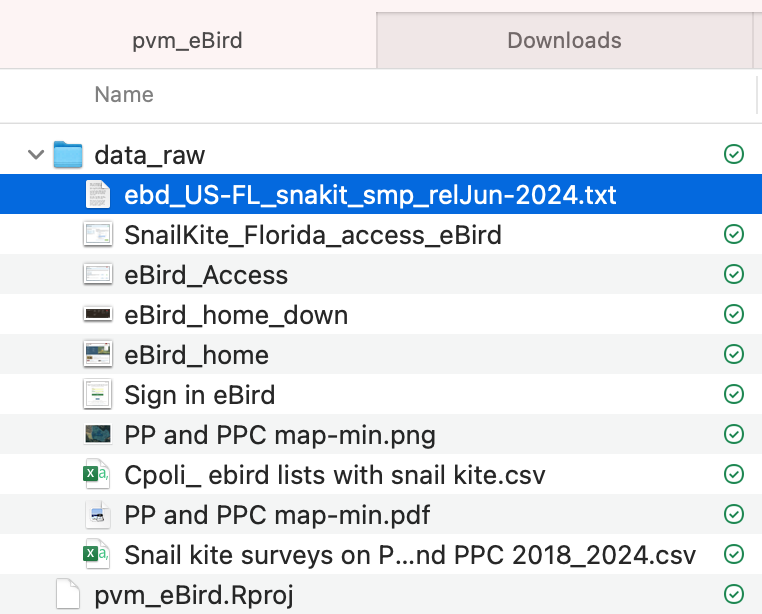{width=20%}

This file will have the detection and observer counts for our species.

\FloatBarrier

## Pre-filtering

We can simplify the eBird data selecting only columns of our interest
(it will reduce the size of the dataset)

```{r columns to filter-ebd, eval=FALSE}
colsE <- c("observer_id", "sampling_event_identifier",
           "group identifier",
           "common_name", "scientific_name",
           "observation_count",
           "country", "state_code", "locality_id", "latitude", "longitude",
           "protocol_type", "all_species_reported",
           "observation_date",
           "time_observations_started",
           "duration_minutes", "effort_distance_km",
           "number_observers")
```

To conduct some filters, we will generate temporal files in our
computer. Here we generate only a single temporal file that can be
overwritten to assess different species.

```{r temporary filter files, eval=FALSE}
f_ebd <- "data_tmp/ebd_Examples.txt" 
f_sed <- "data_tmp/sed_Examples.txt" 
```

The construction of time-series of the individuals counted from
eBird will assume spatiotemporal subsampling, selecting a single value
with the high counts (assuming to be the minimum number of individuals)
per week in spatial sampling units of \~ $100 \text{ km}^2$. To construct a
discrete global grid system, we can use the function `dgconstruct()` in
the package `dgconstruct`; the argument `spacing` indicates the spacing
between the center of adjacent cells (related with Characteristic Length
Scale - CLS), in our case `spacing = 11` indicates a diameter of
\~$11\ km$, representing an area of $95.98\ km^2$ (\~ $100\ km^2$).

```{r construct discrete global grid}
#specify seed for random number generation
dggs_pop <- dgconstruct(spacing = 11) 
```

## Filtering

The package `auk`, in combination with `tidyverse`, allows the filtering
of the eBird data (see [Strimas-Mackey *et al.* 2023](https://ebird.github.io/ebird-best-practices/)). Note that the
first function `auk_ebd()` includes the path of the eBird data
downloaded and saved in your working directory, and it is the initial
creation of an `auk_ebd` object. Then, different functions serve to
filter the data by the metadata of the checklists. In order in the code
below, by protocol (`auk_protocol()`; only traveling or stationary), by
distance (`auk_distance()`, $≤5$ km), by duration (`auk_duration()`, $≤5$
hours, note the units are minutes: $300$), and only complete lists
(`auk_complete()`). Then, the filters defined are converted to an AWK
script with the function `auk_filter()`, generating a filtered eBird
Reference Dataset (ERD), storing in the temporal files `f_ebd` with only
the selected columns (defined in the pre-filtering). Finally, the
function `read_ebd()` read the filtered file.

```{r ebd-filter, eval=FALSE}
ebd_filt <- auk_ebd("data_raw/ebd_US-FL_snakit_smp_relSep-2024.txt") %>%
  auk_protocol(c("Traveling", "Stationary")) %>%
  auk_distance(distance = c(0,5)) %>%
  auk_duration(duration = c(0,300))%>%
  auk_complete() %>%
  auk_filter(f_ebd,overwrite=T, keep = colsE) %>%
  read_ebd()
```

{width=50%}

Then, just for the sake of double checking and organization, we can remove
the observations without counts, add distance $0$ to
stationary protocols, modify the time of observations started to decimal, 
round hour sampling to an integer, extract year, month, week, and
day_of_year. Also, we can confirm and filter out by effort, such as
observers $≤10$, distance $≤5 \text{ km}$, duration $≤5 \text{ hours}$,
and only records with counts included.

```{r ebd-filter2, eval=FALSE}
#Some effort extraction and confirmation
ebd_filt <- ebd_filt %>%
  mutate(
    # We don't want here count in 'X', to convert to NA we use `as.integer()`
    observation_count = as.integer(observation_count),
    # effort_distance_km to 0 for non-travelling counts
    effort_distance_km = if_else(protocol_type == "Stationary",
                                 0, effort_distance_km),
    # convert time to decimal hours since midnight
    time_observations_started = time_to_decimal(time_observations_started),
    hour_sampling = round(time_observations_started, 0),
    # split date into year, month, week, and day of year
    year = year(observation_date),
    month = month(observation_date),
    week = week(observation_date),
    day_of_year = yday(observation_date)) %>%
  filter(number_observers <= 10,         #Only list with less than 10 observers
         effort_distance_km <= 5,        #be sure of distance effort
         duration_minutes %in% (0:300),  #be sure of duration effort
         !is.na(observation_count))      #only records with counts reported
```

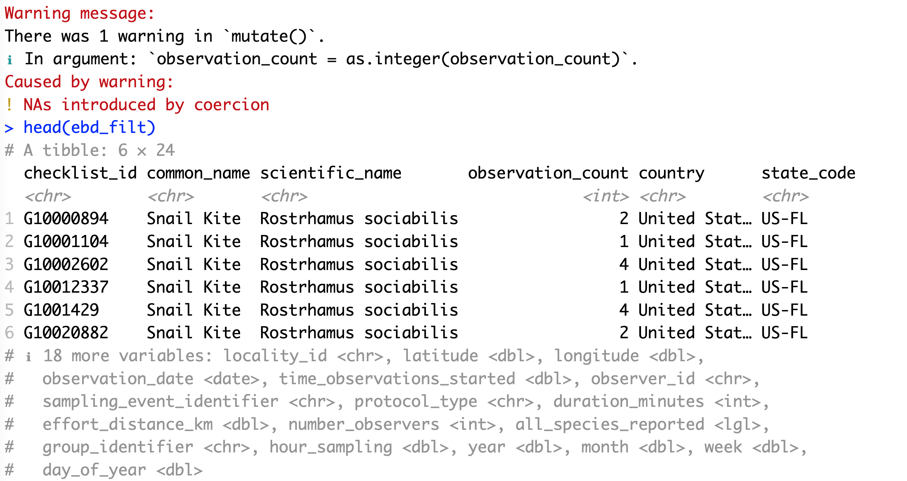{width=50%}

Now we can add a new variable that identify each `cell` from a grid of
hexagons (spatial sampling units), using the `longitude` and `latitude`
information of our `ebd_filt` data set and the function
`dgGEO_to_SEQNUM()`. With the new variable, we can extract the maximum
count of individuals and number of checklists per week per cell.

```{r add cellID, eval=FALSE}
SnailKite <- ebd_filt %>%
  mutate(cell = dgGEO_to_SEQNUM(dggs_pop, #id for cells
                                longitude, latitude)$seqnum) %>%
  group_by(cell, year, month, week) %>%
  mutate(max_count = max(observation_count, na.rm = T), 
         n_lists = n()) |>
  ungroup()
```

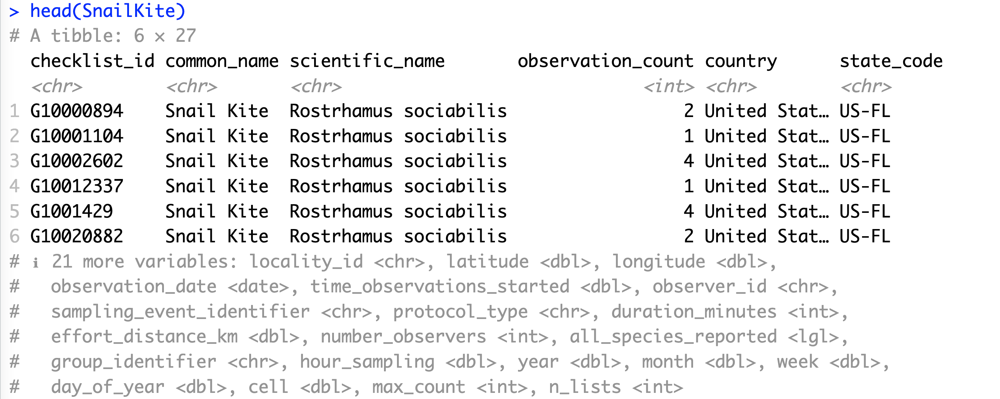{width=50%}

This file is saved as a backup

```{r save SnailKite-rds, eval=FALSE}
#and save the filter
saveRDS(SnailKite, "data_tmp/SnailKiteCellsID_filtered.rds")
```

\FloatBarrier

## Time series of eBird weekly high-counts

We adjusted the time-series from the 1st week of 2018 (January) to the
last with data of 2024 (September). Since 2018, Snail kites reached more than 1000
records.

```{r temporal bias}
SnailKite <- readRDS("data_tmp/SnailKiteCellsID_filtered.rds")

png('data_tmp/FigSI-1_HistogramTemporalBias.png',
    width = 10, height = 5, units = "in", res = 300) 

hist(SnailKite$year, 
     breaks = 50, 
     main = "Florida Snail kites, checklists per year", 
     xlab = "Year")
abline(h = 1000, v = 2017, col = "red")
dev.off()
```

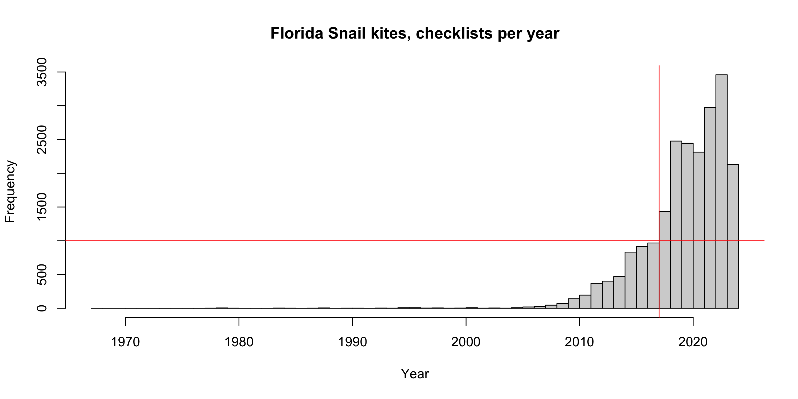

In addition, the spatial cell with higher records overlaps with the
Payne's Prairie State Park wetland in Alachua County, north central
Florida, where Snail kites established in 2018. Thus, we
extracted the high count per week in the cell of Payne's Prairie.

But first, we filter by observation data greater than or equal to
`2018-01-01`, and generate a new variable called `Time.t`, to have the
accumulated id of weeks from 2018 to the end of our time series. We used
the function `case_when()` based on `year`.

```{r filter snailkites since 2018}
snailkites.week <- SnailKite |>
  filter(observation_date >= "2018-01-01") |>
  mutate(Time.t = case_when(year == 2018 ~ week,
                            year > 2018 ~ week+(52*(year-2018)))) 
summary(snailkites.week$observation_date)
summary(snailkites.week$Time.t)
```

Then, we group by the `cell` and `Time.t`, summarizing the maximum
integer count per week, named `Observed.y` in our data set.

```{r week counts snailkites}
snailkites.week.counts <- snailkites.week |>
  group_by(cell, Time.t) |>
  summarise(Observed.y = round(max(max_count),0))

head(snailkites.week.counts)
```

And we can save this outcome as a backup.

```{r save snailkites week counts since 2018, eval=FALSE}
saveRDS(snailkites.week, "data_tmp/SnailKiteCellsWeek.rds")
saveRDS(snailkites.week.counts, "data_tmp/SnailKiteCellsCountsWeek.rds")
```

This file will serve to generate a map figure with the sampling effort
after filtering the eBird data following best practices (see [Johnston *et al.*, 2021](https://onlinelibrary.wiley.com/doi/10.1111/ddi.13271)).

\clearpage

# Snail Kite in Payne's Prairie from eBird

We focused on the sampling unit with higher number of checklists, which
correspond to the Payne's Prairie State Park wetland system in Alachua
County. For this locality, we also have counts published from [Poli *et al.* (2020)](https://bioone.org/journals/the-wilson-journal-of-ornithology/volume-132/issue-1/1559-4491-132.1.183/Recent-breeding-range-expansion-of-the-endangered-Snail-Kite-Rostrhamus/10.1676/1559-4491-132.1.183.full),
and 2 areas under current monitoring: Payne's Prairie and Payne's
Prairie Central.

{width=50%}

This wetland overlap with an hexagonal cell that concentrate most records.

## Map of sampling units

To generate the map of spatiotemporal sampling from eBird, we can use
the package `sf`, using the database included in the function
`st_as_sf()`.

```{r call world map, eval=FALSE}
#A global map to make figures ###
world1 <- sf::st_as_sf(maps::map(database = 'world', plot = FALSE, fill = TRUE))
world1
```

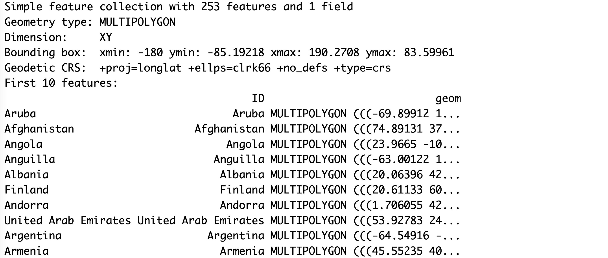{width=50%}

We can summarize the filtered ebd-data set `SnailKite` by the number of
observations in each hexagonal cell. Below code will generate a tibble
with two variables and 444 observations, the count of observations per
each cell.

```{r number of records per cell, eval=FALSE}
#Get the number of observations in each cell
CellObservationsSK   <- SnailKite %>% 
  group_by(cell) %>%
  summarise(count=n())
```

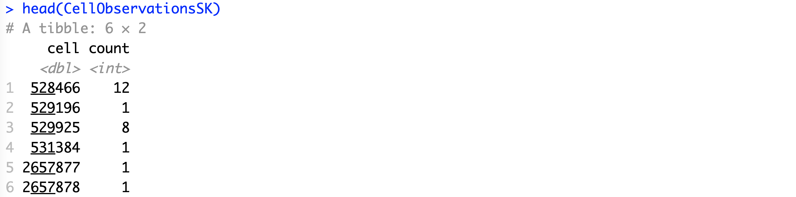{width=50%}

And get a grid cell boundaries for cells with the observations counts
with the function `dgcellstogrid()`, using the discrete global grid
system saved as `dggs_pop`. **CAUTION**, if you generate `dggs_pop` in a
different computer or session than `SnailKite`, there could be conflict
with the `cell` id.

```{r grid cell boundaries, eval=FALSE}
gridSnailKite <- dgcellstogrid(dggs_pop,CellObservationsSK$cell)
```

This is an `sf` object with the `cell` named as `seqnum`. We can update
the grid cells' properties to include the number of lists in each cell
and handling the spatial data with `st_wrap_dateline()`

```{r dealing with weird thinks of the projection, eval=FALSE}
gridSnailKite <- merge(gridSnailKite, CellObservationsSK, by.x="seqnum", by.y="cell")

# Handle cells that cross 180 degrees
wrapped_gridSnailKite = st_wrap_dateline(gridSnailKite,
                                         options = c("WRAPDATELINE=YES",
                                                     "DATELINEOFFSET=180"), 
                                         quiet = TRUE)
```

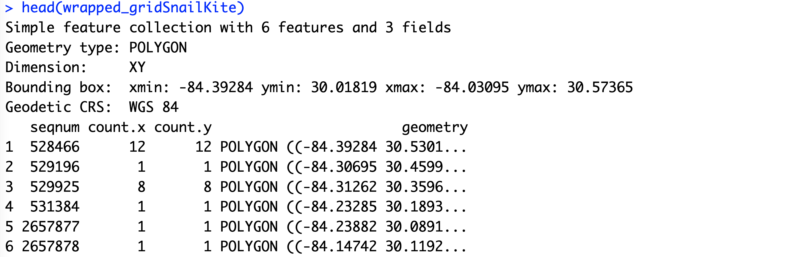{width=50%}

Some aesthetics are defined for the log-scales and arrows

```{r aesthetics of the map, eval=FALSE}
my_breaks = c(5, 50, 500, 5000)

arrow1 <- tibble(
  x1 = -82.3,
  x2 = -80.75,
  y1 = 29.6,
  y2 = 29.7
)
```

and the figure generated

```{r generate map Fig1, eval=FALSE}
Fig1a <- ggplot() +
  geom_sf(data = world1)+
  geom_sf(data=wrapped_gridSnailKite,
          aes(color = count, 
              fill = count),
          alpha = 0.7) +
  #  geom_point(data = SnailKite, aes(x = longitude, y = latitude), size = 0.1)+
  scale_color_gradient(low="#440154", 
                       high="#FDE725",
                       trans = "log10",  
                       breaks = my_breaks,
                       labels = my_breaks)+
  scale_fill_gradient(low="#440154", 
                      high="#FDE725",
                      trans = "log10",  
                      breaks = my_breaks,
                      labels = my_breaks)+
  coord_sf(xlim = c(-84.5, -79.5), 
           ylim =  c(24.1, 30.9)) +
  labs(y = "Latitude",
       x = "Longitude",       
       tag = expression(bold("(a)")),
       title = "Snail Kites in Florida",
       subtitle = "eBird effort in spatial sampling units",
       color = expression(Log["10"]~"lists"),
       fill = expression(Log["10"]~"lists")) +
  annotate("text", x = -80, y = 29.75, label = "Payne's \n Prairie") +
  geom_curve(data = arrow1, aes(x = x1, y = y1, xend = x2, yend = y2),
             arrow = arrow(length = unit(0.08, "inch")), size = 0.5,
             color = "red", curvature = -0.3) +
  theme_classic()+
  theme(legend.position = c(0.2,0.25),
        legend.direction = "vertical",
        legend.box.background = element_rect(colour = "black"))

#Zoom to Payne's Prairie
arrow2 <- tibble(
  x1 = c(-82.328576, -82.334182, -82.303112, -82.292372),
  x2 = c(-82.3, -82.375, -82.25, -82.2),
  y1 = c(29.619306, 29.574222, 29.606876, 29.549109),
  y2 = c(29.7, 29.475, 29.65, 29.535)
)

Fig1b <- ggplot() +
  geom_sf(data=wrapped_gridSnailKite,
          aes(color = count, 
              fill = count)) +
  geom_point(data = SnailKite, aes(x = longitude, y = latitude), 
             size = 0.5, alpha = 0.25)+
  scale_color_gradient(low="#440154", 
                       high="#FDE725",
                       trans = "log10",  
                       breaks = my_breaks,
                       labels = my_breaks)+
  scale_fill_gradient(low = alpha("#440154", 0.25), 
                      high = alpha("#FDE725", 0.25),
                      trans = "log10",  
                      breaks = my_breaks,
                      labels = my_breaks)+
  coord_sf(xlim = c(-82.475, -82.125), 
           ylim =  c(29.45, 29.725),
           expand = T) +
  labs(y = "Latitude",
       x = "Longitude",       
       tag = expression(bold("(b)")),
       title = "Snail Kites in Payne's Prairie wetland",
       subtitle = "with eBird records and popular localities") +
  annotate("text", x = -82.25, y = 29.71, label = "Sweetwater Wetlands \n Park") +
  annotate("text", x = -82.4, y = 29.475, label = "US-441") +
  annotate("text", x = -82.2, y = 29.65, label = "La Chua trail") +
  annotate("text", x = -82.2, y = 29.525, label = "Wacahoota trail") +
  geom_curve(data = arrow2, aes(x = x1, y = y1, xend = x2, yend = y2),
             arrow = arrow(length = unit(0.08, "inch")), size = 0.5,
             color = "red", curvature = -0.3) +
  theme_classic()+
  theme(legend.position = "none")

Fig1 <- grid.arrange(Fig1a, Fig1b, ncol = 2, widths = c(1, 2))

ggsave("results/Fig1_SnailKitesMap.pdf", 
       plot = Fig1, dpi = 300, width = 10, height = 5, units = "in")

ggsave("results/Fig1_SnailKitesMap.png", 
       plot = Fig1, dpi = 300, width = 10, height = 5, units = "in")
```

![Map of spatial eBird sampling of Snail kites in Florida (a) and zoom to the hexagonal cell with higher records in eBird (b). Each hexagonal cell corresponds to an area of ~100 km2, and the bright color identify cells with higher sampling in eBird (note log10 scale). A single cell in northcentral Florida (~Payne’s Prairie Preserve State Park, ~85 km2) concentrated 7,291 checklists (intense yellow color and red arrow in (a), with transparency in (b)). Records of Snail Kite in Payne’s Prairie display some popular visited sites within this sampling unit (b), some overlapping or surrounding areas with standardized long-term monitoring surveys. *Figure 1 in Main text*](results/Fig1_SnailKitesMap.png){width=80%}

\FloatBarrier

## Standardized monitoring - a benchmark to compare eBird

Joining eBird and standardized monitoring (our benchmark) in data set
`snailkites.PP`.

First, load saved data from eBird, identifying the cell with more
checklists.

```{r load data filtered and select PP cell}
#load saved data
SnailKite <- readRDS("data_tmp/SnailKiteCellsID_filtered.rds")
snailkites.week <- readRDS("data_tmp/SnailKiteCellsWeek.rds")
snailkites.week.counts <- readRDS("data_tmp/SnailKiteCellsCountsWeek.rds")

#Cell with more values
CellTop <- SnailKite |>
  group_by(cell) |>
  mutate(n_checklists = n()) |>
  ungroup() |>
  filter(n_checklists == max(n_checklists)) |>
  dplyr::select(cell) |>
  unique()
CellTop #ID of the cell with more records - Payne's Prairie
```

Call the data from [Poli *et al.* (2020)](https://bioone.org/journals/the-wilson-journal-of-ornithology/volume-132/issue-1/1559-4491-132.1.183/Recent-breeding-range-expansion-of-the-endangered-Snail-Kite-Rostrhamus/10.1676/1559-4491-132.1.183.full),
and organize in the same way that eBird data (the highest value per week since
January 2018).

```{r published data for PP}
#The monitoring data of Poli et al. (2020)
Poli.etal <- data.frame(observation.date = c("2018-02-19",
                                             "2018-03-12",
                                             "2018-04-09",
                                             "2018-05-31",
                                             "2018-06-04",
                                             "2018-07-16",
                                             "2018-08-07",
                                             "2018-08-27",
                                             "2018-10-15",
                                             "2018-12-17"),
                        abundance.monitored = c(1,
                                                2,
                                                4,
                                                6,
                                                8,
                                                6,
                                                6,
                                                12,
                                                7,
                                                29))

Poli.etal <- Poli.etal |>
  mutate(observation.date = ymd(observation.date),
         year = year(observation.date),
         week = week(observation.date),
         Time.t = case_when(year == 2018 ~ week,
                            year > 2018 ~ week+(52*(year-2018)))) |>
  dplyr::select(!observation.date)
```

Call the data form standardized monitoring in the project Snail Kites
(since 2019). This data is also organized by the high count per week, as
the eBird data.

```{r Snail Kite project data PP}
snail.kite.project.pp <- read_csv("data_raw/Snail kite surveys on PP and PPC 2018_2024.csv") |> 
  mutate(observation.date = mdy(date),
         year = year(observation.date),
         week = week(observation.date),
         Time.t = case_when(year == 2018 ~ week,
                            year > 2018 ~ week+(52*(year-2018)))) |>
  group_by(Time.t, year, week) |>
  summarise(abundance.monitored = max(count))
```

Combine with the published data to have a single Standardized Monitoring
abundance data set, named `snail.kite.project.pp`. Here is important to
be sure that the data set is organized by the variable `Time.t` (week
since `2018-01-01` id), applying the function `arrange()`.

```{r combining SK-PP}
#including Poli et al.
snail.kite.project.pp <- snail.kite.project.pp |>
  full_join(Poli.etal) |>
  arrange(Time.t)
```

Now we can unify the data sets in a single object. First, we filter the
`snailkites.week.counts` object by the id of the cell that contains
Payne's Prairie (`CellTop$cell`). To avoid conflict with gaps in the time 
series for `observation.date`, we generated an object of dates from the 
minimum value of `snailkites.week$observation_date`, and join it to the
subset of Snail kites high count per week in Payne's Praire 
(`snailkites.paynesp`).

```{r return dates PP and selecting eBird PP}
#Generate the time-series for the cell with more records
snailkites.paynesp <- snailkites.week.counts |>
  filter(cell == CellTop$cell)
head(snailkites.paynesp)

#To return dates from original data
datesPP <- snailkites.week |> 
  group_by(Time.t) |> 
  summarise(observation.date = min(observation_date))
head(datesPP)

snailkites.paynesp <- snailkites.paynesp |>
  left_join(datesPP)
head(snailkites.paynesp)
```

Finally, we add the standardized monitoring (sorted by week id `Time.t`).
**CAUTION** if you do not sort by time, some functions will crash and not
run correctly, also make sure that you have only one value per time-step
selected (in our case, weeks).

```{r combine eBird with Snail Kite project data}
#Add standardized monitored
snailkites.PP <- snailkites.paynesp |>
  left_join(snail.kite.project.pp, by = "Time.t") |>
  arrange(Time.t)
snailkites.PP
```

Note that the `abundance.monitored` variable, from the standardized
monitored surveys, have many `NA` values when compared with the
`Observed.y`, which is the weekly high-counts in eBird.

We can save the backup.

```{r save backup SK PP datasets and dates, eval=FALSE}
#save backup
saveRDS(snailkites.PP, file = "data_tmp/snailkitesPP.rds")
saveRDS(datesPP, file = "data_tmp/datesTimeseriesPaynesPrairie.rds")
```

And we can see both time-series graphically

```{r Figure time series counts per week}
datesPP <- readRDS("data_tmp/datesTimeseriesPaynesPrairie.rds")
snailkites.PP <- readRDS("data_tmp/snailkitesPP.rds")

#Figure
snailkites.PP |>
  pivot_longer(cols = !c(Time.t, cell, year, week, observation.date),
               names_to = "group",
               values_to = "Abundance") |> 
  drop_na(Abundance) |>
  ggplot(aes(x = observation.date, y = Abundance, fill = group))+
    geom_vline(xintercept = snailkites.PP$observation.date[78], 
             color = "gray", linetype = "dotted") +
    geom_line(aes(color = group), alpha = 0.25, linetype = "dashed") +
    geom_point(aes(shape = group), color = "black")+
    labs(x = "Observation date",
       y = "Observed weekly high counts",
       title = "Time series contrast",
       tag = "",
       fill = "",
       color = "",
       shape = "")+
    scale_color_manual(values = c("black", "blue"),
                       labels = c("Standardized Monitored",
                                  "eBird observations"))+
    scale_fill_manual(values = c("black", "blue"),
                       labels = c("Standardized Monitored",
                                  "eBird observations"))+
    scale_shape_manual(values = c(19, 21),
                       labels = c("Standardized Monitored",
                                  "eBird observations"))+
    theme_classic()+
    theme(legend.position = c(0.2, 0.8))
```

Assumed initial population establishment is depicted to the left of the 
vertical dotted gray line (weeks 1-87;January 2018-August 2019). Local persistence 
probability estimation ($\hat{\phi}$) will correspond to the weeks to the 
right of the dotted gray line ($n_{eBird} = 262$, $n_{SM}=33$).

\clearpage

# Viability Population Monitoring framework and local persistence estimation - $\hat{\phi}$

In the next section, we provide a step by step example and the iterated 
process for each week estimation of local persistence probability 
($\hat{\phi}$).

## Fit dynamic population model to a first part of the time-series

Let's fit an EGSS model for the first two years – weeks from 1 to 87, n = 78, 
matching Standardized monitoring data, including the published data ([Poli *et al.*, 2020](https://bioone.org/journals/the-wilson-journal-of-ornithology/volume-132/issue-1/1559-4491-132.1.183/Recent-breeding-range-expansion-of-the-endangered-Snail-Kite-Rostrhamus/10.1676/1559-4491-132.1.183.full)).

First, load the data saved and filter `Time.t` between `1:87`.

```{r load data and filter initial dynamic}
datesPP <- readRDS("data_tmp/datesTimeseriesPaynesPrairie.rds")
snailkites.PP <- readRDS("data_tmp/snailkitesPP.rds")

sk.pp.init <- snailkites.PP |>
  filter(Time.t %in% c(1:87))
```

To fit a first EGSS model for the eBird data observations, we have to
adjust the data as required by the functions (vectors of log-abundance and 
time-steps, in order and with a single value of log-abundance).

```{r fit EGSS initial dynamic}
#Define variables
yt1 = sk.pp.init |>
  ungroup() |>
  arrange(Time.t) |>
  drop_na(Observed.y) |>
  dplyr::select(Observed.y) |>
  log()

#log-abundance estimate as a vector
yt1 <- yt1$Observed.y
yt1

tt1 <- sk.pp.init |>
  ungroup() |>
  arrange(Time.t) |>
  drop_na(Observed.y) |>
  dplyr::select(Time.t)

#time vector (week since 2018-01)
tt1 <- tt1$Time.t
tt1

#Estimate REML parameters
sk.egss.parms <- egss_remle(yt = yt1,
                            tt = tt1,
                            fguess = guess_egss(yt = yt1,
                                                tt = tt1))
print(sk.egss.parms)
```

The function `egss_remle()` fit an EGSS model and compute the Restricted
Maximum Likelihood Estimates, which are stored in the first object of
the list (named here `sk.egss.parms`). The values correspond (in
order) to the trend parameter ($\hat{\theta}_{eBird}=0.0271$), the
environmental noise ($\hat{\sigma^2}_{eBird}=0.0344$), observation
error noise ($\hat{\tau^2}_{eBird}=0.2658$), and initial population
($\hat{x_0}_{eBird}=-0.0128$; note that $e^{x_0}\approx1$).

With the `egss_predict()` function, we can predict the trajectory for
the EGSS model.

```{r predict initial dynamic trajectory with model fitted}
sk.egss.predict.init <- egss_predict(yt = yt1,
                                tt = tt1,
                                parms = sk.egss.parms$remles,
                                plot.it = TRUE)
head(sk.egss.predict.init[[1]])
```

As we put the `plot.it` argument `TRUE`, we have a figure of the
predicted and observed trajectory. The `head()`
of the object shows the vector time (`Time.t`, week since January 2018,
in our case), the predicted abundance (`Predict.EGSS.REML`), and the
observed vector (`Observed.y`, the eBird weekly high counts in our
case). For our example, we want to compare with standardized monitored
surveys, so it might be convenient to change the names of this output.

```{r change names - combine for figure}
#change names to combine
colnames(sk.egss.predict.init[[1]]) <- c("Time.t", "Estimated_eBird_EGSS","eBird.Observed")
```

We can fit the EGSS for the standardized monitored in the same way

```{r fit SK project initial EGSS}
#Define variables
ytSM1 = sk.pp.init |>
  ungroup() |>
  arrange(Time.t) |>
  drop_na(abundance.monitored) |>
  dplyr::select(abundance.monitored) |>
  log()

#Standardized abundance monitored as a vector
ytSM1 <- ytSM1$abundance.monitored
ytSM1

ttSM1 <- sk.pp.init |>
  ungroup() |>
  arrange(Time.t) |>
  drop_na(abundance.monitored) |>
  dplyr::select(Time.t)

#corresponding time vector
ttSM1 <- ttSM1$Time.t
ttSM1

skSM.egss.parms <- egss_remle(yt = ytSM1,
                            tt = ttSM1,
                            fguess = guess_egss(yt = ytSM1,
                                                tt = ttSM1))
skSM.egss.parms
```

Again, the values correspond (in order) to the trend parameter
($\hat{\theta}_{SM}=0.0556$), the environmental noise
($\hat{\sigma}_{SM}^2=0.0346$), observation error noise
($\hat{\tau}_{SM}^2=0.0188$), and initial population
($\hat{x_0}=0.1258$). 

It is interesting that $\hat{\sigma}_{SM}^2$ is
similar ($\sim 0.03$) to $\hat{\sigma}_{eBird}^2$, as well as
$e^{x_0 = 0.126}_{SM}\approx1$ and $e^{x_0 = -0.013}_{eBird}\approx1$,
but the observation error is about an order of magnitude bigger in eBird data
with respect to the standardized monitoring ($\hat{\tau}_{SM}^2=0.018$ $<<$
$\hat{\tau}_{eBird}^2=0.266$). The expected change in log-abundance per week describe lower change in eBird ($\hat{\theta}_{eBird}=0.034$) and higher changes in standardized monitoring weekly counts ($\hat{\theta}_{SM}=0.056$).

Let's predict the trajectory and change the column names for the
figure.

```{r predict initial dynamic trajectory SK project}
skSM.egss.predict.init <- egss_predict(yt = ytSM1,
                                tt = ttSM1,
                                parms = skSM.egss.parms$remles,
                                plot.it = T)
#change names to combine
colnames(skSM.egss.predict.init[[1]]) <- c("Time.t", "Estimated_SKProj_EGSS","abundance.monitored")
```

To make the figure 2, we combine the predicted trajectories in a single
data frame to use `tidyverse` and `ggplot`.

```{r Figure 2a}
sk.Estimated <- data.frame(sk.egss.predict.init) |>
  left_join(data.frame(skSM.egss.predict.init)) |>
  left_join(datesPP) #this recover the observation date per week

FigS2a <- sk.Estimated |>
  pivot_longer(cols = !c(Time.t,observation.date),
               names_to = "group",
               values_to = "Abundance") |>
  drop_na(Abundance) |>
  ggplot(aes(x = observation.date, 
             y = Abundance, 
             fill = factor(group,
                           levels = c("abundance.monitored",
                                      "Estimated_SKProj_EGSS",
                                      "eBird.Observed",
                                      "Estimated_eBird_EGSS"))))+
    geom_line(aes(color = factor(group,
                           levels = c("abundance.monitored",
                                      "Estimated_SKProj_EGSS",
                                      "eBird.Observed",
                                      "Estimated_eBird_EGSS")), 
                  linetype = factor(group,
                           levels = c("abundance.monitored",
                                      "Estimated_SKProj_EGSS",
                                      "eBird.Observed",
                                      "Estimated_eBird_EGSS"))), 
              alpha = 0.75) +
    geom_point(aes(shape = factor(group,
                           levels = c("abundance.monitored",
                                      "Estimated_SKProj_EGSS",
                                      "eBird.Observed",
                                      "Estimated_eBird_EGSS"))), 
               color = "black", 
               alpha = 0.75, size = 2)+
    labs(x = "Observation date",
       y = "Observed/predicted weekly high count",
       tag = expression(bold("(a)")),
       fill = "",
       color = "",
       shape = "",
       linetype = "")+
  scale_x_date(breaks = seq(as.Date("2018-01-01"), as.Date(Sys.Date( )), 
                            by = "2 months"), date_labels="%b-%y")+
    scale_color_manual(values = c("white", "#fc8d59","white", "#91bfdb"),
                       labels = c("Standardized Monitoring (SM)", 
                                  "Predicted trajectory (SM - EGSS)", 
                                  "eBird", 
                                  "Predicted trajectory (eBird - EGSS)"))+
    scale_fill_manual(values = c("#d73027", "#fc8d59", "#4575b4", "#91bfdb"),
                       labels = c("Standardized Monitoring (SM)", 
                                  "Predicted trajectory (SM - EGSS)", 
                                  "eBird", 
                                  "Predicted trajectory (eBird - EGSS)"))+
    scale_shape_manual(values = c(21, 24, 21, 24),
                       labels = c("Standardized Monitoring (SM)", 
                                  "Predicted trajectory (SM - EGSS)", 
                                  "eBird", 
                                  "Predicted trajectory (eBird - EGSS)"))+
  scale_linetype_manual(values = c("solid","dashed","solid","dashed"),
                        labels = c("Standardized Monitoring (SM)", 
                                   "Predicted trajectory (SM - EGSS)", 
                                   "eBird",
                                   "Predicted trajectory (eBird - EGSS)"))+
    theme_classic()+
    theme(legend.position = c(0.3, 0.85))
FigS2a
```

How much is the prediction out of the observed data in SM? Lets generate Figure
2b (we can draw the equation in the figure with our function `lm_eqn()`, removed for now).

```{r Figure 2b}
#Predicted EGSS from eBird ~ Observed counts SM
lm(Estimated_eBird_EGSS~abundance.monitored, data = sk.Estimated)
#Predicted EGSS from Standardized Monitored ~ Observed counts SM
lm(Estimated_SKProj_EGSS~abundance.monitored, data = sk.Estimated)


FigS2b <- ggplot(sk.Estimated)+
  geom_abline(slope = 1)+
  geom_smooth(aes(x=abundance.monitored, y=Estimated_SKProj_EGSS),
              method = "lm", color = "#fc8d59", 
              se = T, fill = "#fc8d5905", linetype = "dashed")+
  geom_point(aes(x=abundance.monitored, y=Estimated_SKProj_EGSS), 
             color = "black", fill = "#fc8d59", shape = 24, alpha = 0.75, size = 2)+
# geom_text(x = 25, y = 50, 
#            label = lm_eqn(df = sk.Estimated,
#                           x = sk.Estimated$abundance.monitored, 
#                           y = sk.Estimated$Estimated_SKProj_EGSS), 
#            parse = TRUE, color = "#fc8d59")+
  geom_smooth(aes(x=abundance.monitored, y=Estimated_eBird_EGSS),
              method = "lm", color = "#91bfdb", 
              se = T, fill = "#91bfdb05", linetype = "dashed")+
  geom_point(aes(x=abundance.monitored, y=Estimated_eBird_EGSS), 
             color = "black", fill = "#91bfdb", shape = 24, alpha = 0.75, size = 2)+
#    geom_text(x = 50, y = 0, 
#            label = lm_eqn(df = sk.Estimated,
#                           x = sk.Estimated$abundance.monitored, 
#                           y = sk.Estimated$Estimated_eBird_EGSS), 
#            parse = TRUE, color = "#91bfdb")+
  scale_y_continuous(limits = c(0,80))+
  labs(x = "Observed weekly high count (SM)",
       y = "Predicted trajectory of weekly high count",
       tag = expression(bold("(b)")))+
  coord_fixed()+
  theme_classic()

#and combine in the figure
FigS2 <- grid.arrange(FigS2a, FigS2b, ncol = 2, widths = c(1.5, 1))
```

It looks not good in the `Rmd` file, but it is saved with good proportions

```{r exporting figure 2, eval=TRUE}
ggsave("results/Figure2ab_EstimatedTrajectory2initdays.pdf", 
       plot = FigS2, dpi = 300, width = 10, height = 4, units = "in")

ggsave("results/Figure2ab_EstimatedTrajectory2initdays.png", 
       plot = FigS2, dpi = 300, width = 10, height = 4, units = "in")
```

![Weekly predicted (triangles) and observed (circles) high counts of the number of Snail Kites from standardized monitoring (orange) and eBird (blue). Predicted values correspond to Exponential Growth State-Space (EGSS) models fitted for the two datasets during population establishment (week 1: January 2018 to week 87: August 2019) in northcentral Florida (a). The predicted trajectory of standardized monitoring data matched closely the weekly high counts data ($y=-0.41+0.95x; R^2=0.985$), while the predicted trajectory from eBird data was far low of the identity ($y=2.6+0.056x; R^2=0.274$) compared with observed standardized monitored high counts; solid black line in (b) is the identity (1:1 relationship). *Figure 2 in Main text*](results/Figure2ab_EstimatedTrajectory2initdays.png){width=80%}

\FloatBarrier

## Three timeframe (~three, ~five, ~ten years) of first estimation $\hat{\phi}$

With the estimated model parameters and the data during establishment of the population (up to week 87 with observations, $i=1$ is week 88), we estimated the
probability that the population declines to values below a critical
threshold ($N_{critical}$, as the critical number of individuals to
assume quasi-extinction), in three different periods or given timeframes
(\~three years $150$ weeks, \~five years $250$ weeks, and \~ten years $500$ weeks). 
Let assume $N_{critical~eBird} = \frac{1}{2} (e^{\bar{y}}) = 5.58$. The probability 
of persistence in each trajectory $m$ ($\phi_m$) will be the mathematical complement of the number of time steps within the three different periods (150, 250, 500) that
the population was lower than the threshold. The resulting probability $\phi_m$ is recorded for each trajectory $m$ ($M = 50,000$), estimating the
expected value ($\hat{\phi}$) and standard deviation ($\sqrt{Var(\hat{\phi})}$)
as variability of the estimation per each week with data.

```{r set variables}
#variables:
#Log observations for the entire dataset
yt = snailkites.PP |>
  ungroup() |>
  arrange(Time.t) |>
  drop_na(Observed.y) |>
  dplyr::select(Observed.y) |>
  log()

#Vector form
yt <- yt$Observed.y
yt

tt <- snailkites.PP |>
  ungroup() |>
  arrange(Time.t) |>
  drop_na(Observed.y) |>
  dplyr::select(Time.t)

#Time vector of the time series
tt <- tt$Time.t
tt

#the establishment (matching SM data) is going up to the last position
last.tt <- 79

#Define N_critical for eBird
N.critical = round(1/2*mean(exp(yt)),0)

#number of simulations
ntraj = 50000

#last observed time (week 87 - August 2019)
l = last(tt[1:last.tt])

#Simulation length
len.sim <- c(151, 251, 501)

#which correspond to three timeframes
timeframes <- c("150 weeks or ~3 years", 
                "250 weeks or ~5 years", 
                "500 weeks or ~10 years")
```


```{r phi estimation first week, eval=FALSE}
#eval=FALSE

#save φ (SD) 
phi_results <- list()

# Set the base filename
base_filename <- "supporting/FigS2_Step2_1stTrajectories_10_5"

#time of starting process
StartTime <- Sys.time()

for (i in seq_along(len.sim)){
  #to save figures in png and call them after
  png_filename <- paste0(base_filename, "_", (len.sim[i]-1), ".png")
  png(png_filename, width = 10, height = 5, units = "in", res = 300)
  
  #plot the abundance data and model estimation
  plot(tt[1:last.tt], 
     exp(yt[1:last.tt]), 
     type="b", lwd=2, cex.lab=1.25, col = "#4575b4", pch = 1,
     xlim=c(min(tt), (max(tt)*3)),
     ylim=c(0,250), 
     ylab="Observed/predicted weekly high counts", 
     xlab="Time (week since January 2018)");
  
  points(x = sk.Estimated$Time.t,
     y = sk.Estimated$Estimated_eBird_EGSS,
     type = "b", col = "#91bfdb", pch = 2)

  thres.times <- as.numeric(0:(len.sim[i]-1))
  len <- max(thres.times)+1
  
  sim.mat.eBird <- egss_sim(ntraj,
                          tt = thres.times,
                          parms = sk.egss.parms$remles)
  phi <- rep(0, ntraj) 
  last.points <- rep(0, ntraj)

  for(n in 1:ntraj){
    Pop.sim <- exp(c(yt[last.tt], sim.mat.eBird[-1,n]));
    last.points[n] <- Pop.sim[len] 
 
    #How many times each trajectory go below the threshold?
    below.threshold <- sum(Pop.sim < N.critical) 
    phi[n] <- 1-(below.threshold/len)
    
        if( phi[n]>=0.5){
      lines(l+thres.times, Pop.sim, col="#d3d3d308", lty = "solid")
    }else{lines(l+thres.times, Pop.sim, col="#FF000008", lty = "solid")
    }
  }
    #add critical value line
  abline(h=N.critical, lty=2, lwd=1);
     
  #Expected value of probability of local persistence, and SD
  phi_mean <- mean(phi)
  phi_SD <- sqrt(var(phi))
  
  phi_results[[timeframes[i]]] <- cbind(phi_mean,phi_SD)
  
  #Create a kernel density estimate (KDE) of the `last.points` results (library(ke31d))
  kde.sims <- kde1d(x=last.points);
  
  #add the distribution to the plot
  #above the threshold
  lines(x = (kde.sims$values*(ntraj/5) + 
               l + last(thres.times)),
      y = kde.sims$grid_points,
      col="#d3d3d398", lwd=2, lty=1)

    lines(x = (kde.sims$values[kde.sims$grid_points <= N.critical]*(ntraj/5) + 
                 l + last(thres.times)),
      y = kde.sims$grid_points[kde.sims$grid_points <= N.critical],
      col="#FF000098", lwd=2, lty=1)
    
    title(main=paste0("φ = ", 
                  signif(phi_mean,2),
                  " (SD: ",
                  signif(phi_SD,2),
                  ")", "; 1st EGSS through week ", tt[last.tt],
                  ", projected for ~", 
                  signif((len.sim[i]-1)/52, 1), 
                  " year(s)"), 
      cex=1.5)
    dev.off();
    
    print(cbind(tt[last.tt], phi_mean, phi_SD, len.sim[i]-1))
}

#time process finished
EndTime <- Sys.time()
#difference of time (time lasted in the process)
timelast <- EndTime-StartTime
timelast
  
#Results for the first week in three timeframes
phi_results
```

We can see graphically the trajectories and the difference of $\phi$ estimated for the week 88. The figures show the observed weekly high counts (blue circles), the fitted
model (light blue triangles), 50,000 trajectories (lines; those with
$\phi<0.5$ in reddish, else in gray), $N_{critical}$ as horizontal dashed
line, and the kernel density estimates of the last point of the
trajectories (reddish below $N_{critical}$, else gray).

{width=50%} 

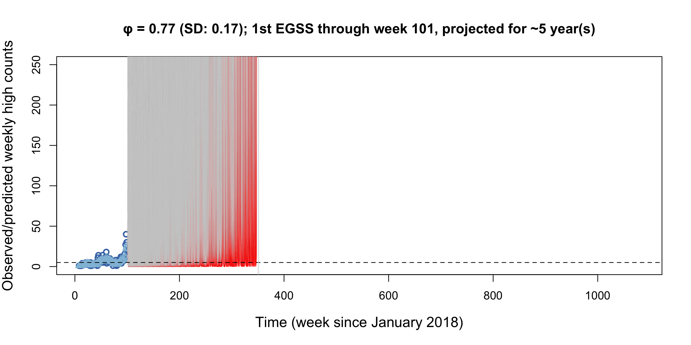{width=50%} 

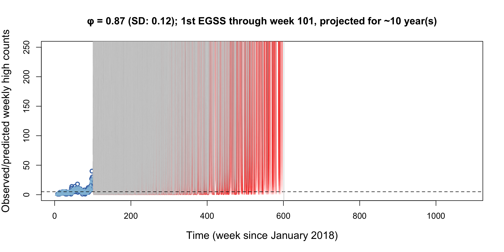{width=50%} 

\FloatBarrier

## Add the next observations, repeat model fit, projection, and $\hat{\phi}$

We can add the next week of observations (week 89; second week of September 2019)
to the time-series, re-estimate model parameters as well as the
probability of crashing below the $N_{critical}$ during the three
timeframes (150, 250, 500 weeks). Here, users can try to fit the OUSS model the following weeks, and decided by the density dependence
parameter $\hat{\theta}$ to fit the EGSS model instead. We provide below the example, but the main results focused on EGSS, which is the expected dynamic in this expanded population.

```{r fit model second week}
#The next week: 88+1
last.tt <- which(tt==89)

yt[1:last.tt] #It was already converted to the log-abundance
tt[1:last.tt]

#fit the OUSS
OUSS.partial <- ouss_remle(yt = yt[1:last.tt],
                           tt = tt[1:last.tt],
                           fguess = guess_ouss(yt = yt[1:last.tt],
                                               tt = tt[1:last.tt]))

OUSS.partial$remles 
```

The function `ouss_remle()` fit the OUSS model and estimate parameters.
In order, the values correspond to the mean stationary distribution
log-abundance ($\hat{\mu}_{eBird}=0.99186$); the trend, speed of equilibration, rate to approach stationary distribution, or density dependence parameter ($\hat{\theta}_{eBird}=0.0000002$); the environmental noise
($\hat{\sigma}^2_{SM}=0.03265$); and the observation error noise
($\hat{\tau}^2_{SM}=0.26995$). Note that the density dependence
parameter $\hat{\theta}<0.025$, which suggests density independence and the use of the EGSS model instead.

```{r select model and predict week2}
model <- if(OUSS.partial$remles[2] < 0.025){"EGSS"}else{"OUSS"}

model

#Lets fit EGSS model partial for second observation (week 89)
EGSS.partial <- egss_remle(yt = yt[1:last.tt], 
                         tt = tt[1:last.tt],
                         fguess = guess_egss(yt = yt[1:last.tt],
                                             tt = tt[1:last.tt]))
EGSS.partial

sk.egss.predict1 <- egss_predict(yt = yt[1:last.tt],
                                         tt = tt[1:last.tt],
                                         parms = EGSS.partial$remles,
                                 plot.it = F)

head(sk.egss.predict1[[1]])
```

Remember that `Time` is the week in our case, and `Observed.y` the
weekly high count in eBird. Let's change column names to combine with
the `datesPP`.

```{r change names second prediction for figure}
colnames(sk.egss.predict1[[1]]) <- c("Time.t", "Estimated_eBird_EGSS","eBird.Observed")

sk.Estimated.1 <- data.frame(sk.egss.predict1) |>
  left_join(datesPP)
```

And we can run the simulations with the new model updated, saving the
$\hat{\phi}$ values and their standard deviation for three timeframes.

```{r Simulate trajectories, eval=FALSE}
#eval=FALSE
l = last(tt[1:last.tt])

#save φ (SD) 
phi_results <- list()

# Set the base filename
base_filename <- "supporting/FigS3_Step3_2ndTrajectories_10_5"

StartTime <- Sys.time()

for (i in seq_along(len.sim)){
  
  #to save figures in png and call them after
  png_filename <- paste0(base_filename, "_", len.sim[i]-1, ".png")
  png(png_filename, width = 10, height = 5, units = "in", res = 300)
  
  #plot the abundance data and model estimation
  plot(tt[1:last.tt], 
     exp(yt[1:last.tt]), 
     type="b", lwd=2, cex.lab=1.25, col = "#4575b4", pch = 1,
     xlim=c(min(tt), (max(tt)*3)),
     ylim=c(0,250), 
     ylab="Observed/predicted weekly high counts", 
     xlab="Time (week since January 2018)");
  
  points(x = sk.Estimated.1$Time.t,
     y = sk.Estimated.1$Estimated_eBird_EGSS,
     type = "b", col = "#91bfdb", pch = 2)

  thres.times <- as.numeric(0:(len.sim[i]-1))
  len <- max(thres.times)+1
  
  sim.mat.eBird <- egss_sim(ntraj,
                          tt = thres.times,
                          parms = EGSS.partial$remles)
  phi <- rep(0, ntraj) 
  last.points <- rep(0, ntraj)

  for(n in 1:ntraj){
    Pop.sim <- exp(c(yt[last.tt], sim.mat.eBird[-1,n]));
    last.points[n] <- Pop.sim[len] 
 
    #How many times each trajectory go below the threshold?
    below.threshold <- sum(Pop.sim < N.critical) 
    phi[n] <- 1-(below.threshold/len)
    
        if(phi[n]>=0.5){
      lines(l+thres.times, Pop.sim, col="#d3d3d308", lty = "solid")
    }else{lines(l+thres.times, Pop.sim, col="#FF000008", lty = "solid")
    }
  }
    #add critical value line
  abline(h=N.critical, lty=2, lwd=1);
  
  #Expected value of probability of local persistence, and SD
  phi_mean <- mean(phi)
  phi_SD <- sqrt(var(phi))
  
  phi_results[[timeframes[i]]] <- cbind(phi_mean,phi_SD)
     
  #Create a kernel density estimate (KDE) of the `last.points` results (library(ke31d))
  kde.sims <- kde1d(x=last.points);
  
    #add the distribution to the plot
  #above the threshold
  lines(x = (kde.sims$values*(ntraj/5) + 
               l + 
               last(thres.times)),
      y = kde.sims$grid_points,
      col="#d3d3d398", lwd=2, lty=1)

    lines(x = (kde.sims$values[kde.sims$grid_points <= N.critical] * 
                 ntraj + l + last(thres.times)),
      y = kde.sims$grid_points[kde.sims$grid_points <= N.critical],
      col="#FF000098", lwd=2, lty=1)
    
    title(main=paste0("φ = ", 
                  signif(phi_mean,2),
                  " (SD: ",
                  signif(phi_SD,2),
                  ")", "; 2nd EGSS through week ", tt[last.tt],
                  ", projected for ~", 
                  signif((len.sim[i]-1)/52, 1), 
                  " year(s)"), 
      cex=1.5)
    
    dev.off()
    print(cbind(tt[last.tt], phi_mean, phi_SD, len.sim[i]-1))
}
#time process finished
EndTime <- Sys.time()
#difference of time (time lasted in the process)
timelast <- EndTime-StartTime
timelast

phi_results
```

And we can see the new trajectories projected in three timeframes.

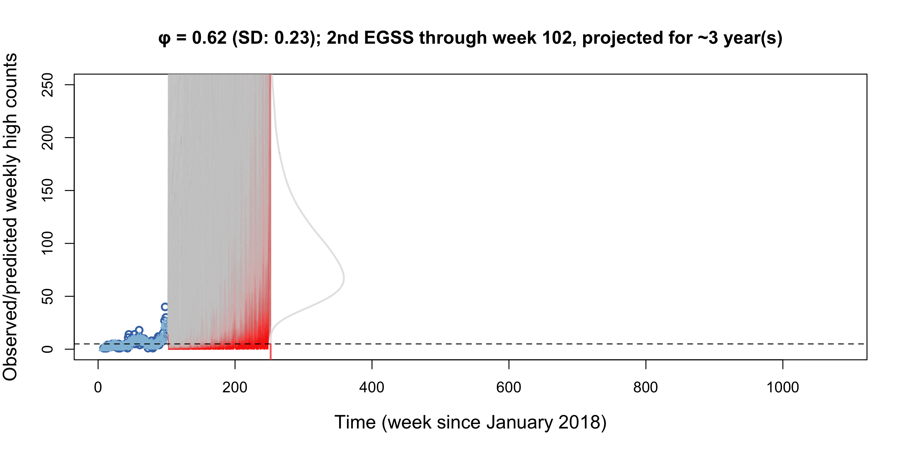{width=50%} 

{width=50%} 

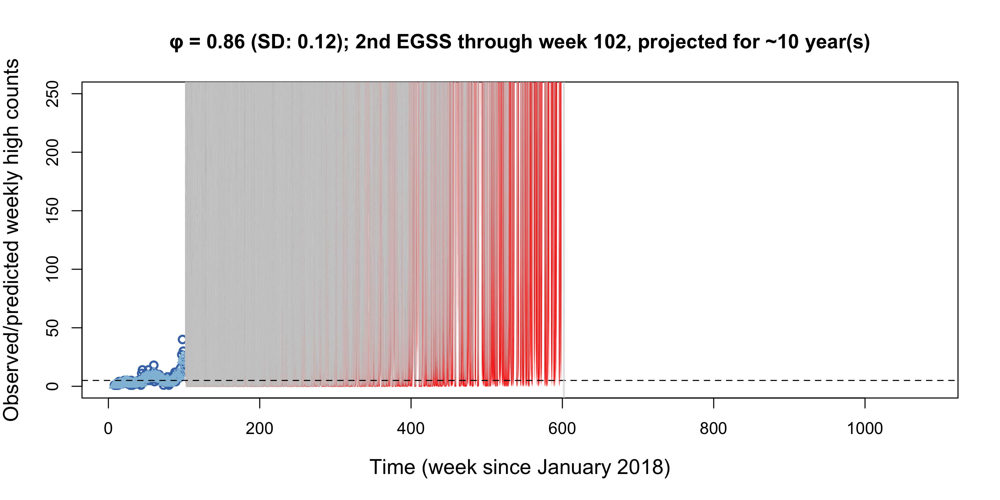{width=50%} 

\FloatBarrier

## Iterate the process

### Iterate the process with eBird contrasting OUSS-EGSS (some figure examples)

Let's iterate the process for some weeks that share data in eBird
and Standardized Monitored. This is going to change the ending position;
instead of manually change 88 to 89, we use a vector of the "ending
positions" and iterate from a sequence of length of that vector.

```{r iterate process eBird with some figure examples, eval=FALSE}
#eval=FALSE
#It last an hour
# Log observations for the entire dataset
yt = snailkites.PP |>
  ungroup() |>
  arrange(Time.t) |>
  drop_na(Observed.y) |>
  dplyr::select(Observed.y) |>
  log()

# Vector form
yt <- yt$Observed.y
yt

tt <- snailkites.PP |>
  ungroup() |>
  arrange(Time.t) |>
  drop_na(Observed.y) |>
  dplyr::select(Time.t)

# Time vector of the time series
tt <- tt$Time.t
tt

# Define N_critical for eBird
N.critical = round((1/2)*mean(exp(yt)), 0)

# List of end positions to be used
which(tt == 95) #week 95 - around 2019-10-22 - is position 86 in tt
#which(tt == 148) #week 148 - around 2020-10-28 - is position 139 in tt
which(tt == 211) #week 211 - around 2022-01-15 - is position 200 in tt
#which(tt == 263) #week 263 - around 2023-01-15 - is position 252 in tt
which(tt == 316) #week 316 - around 2024-01-22 - is position 305 in tt

end_positions <- c(86,200,305) 

#save φ (SD) 
phi_results <- vector("list", length = length(end_positions))

#save model used
modelSS <- vector("list", length = length(end_positions))

# Set the base filename for figures
base_filename <- "supporting/FigS4_Step4_IterateTraj_10_5"

# Start process timing
StartTime <- Sys.time()

for (j in seq_along(end_positions)) {
  
  last.tt <- end_positions[j]
  l <- tt[last.tt]

  for (i in seq_along(len.sim)){
      # Set up plot for all three timeframes
  png_filename <- paste0(base_filename, 
                         "_endpos_", l, 
                         "_timeframe_",(len.sim[i]-1),
                         ".png")
  png(png_filename, width = 10, height = 5, units = "in", res = 300)

    plot(tt[1:last.tt],
         exp(yt[1:last.tt]),
         type="b", lwd=2, cex.lab=1.25, col = "#4575b4", pch = 1,
         xlim=c(min(tt), (max(tt)*3)),
         ylim=c(0,250), 
         ylab="Observed/predicted weekly high counts", 
         xlab="Time (week since January 2018)");
    
    OUSS.partial <- ouss_remle(yt = yt[1:last.tt],
                               tt = tt[1:last.tt],
                               fguess = guess_ouss(yt = yt[1:last.tt],
                                                   tt = tt[1:last.tt]))
    
    model <- if(OUSS.partial$remles[2] < 0.025){
      "EGSS"
    }else{
      "OUSS"
    }
    modelSS[[j]][[timeframes[i]]] <- model
    
    if(model == "OUSS"){
      parcial.predict <- ouss_predict(yt = yt[1:last.tt],
                                      tt = tt[1:last.tt],
                                      parms = OUSS.partial$remles,
                                      plot.it = F)
      
      points(x = (parcial.predict)[[1]][,1],
             y = (parcial.predict)[[1]][,2],
             type = "b", col = "#91bfdb", pch = 2)
      
      thres.times <- as.numeric(0:(len.sim[i]-1))
      len <- max(thres.times) + 1
      
      sim.mat.eBird <- ouss_sim(ntraj, 
                                tt = thres.times, 
                                parms = OUSS.partial$remles)
      
      phi <- rep(0, ntraj)
      last.points <- rep(0, ntraj)
      
      for(n in 1:ntraj){
        Pop.sim <- exp(c(yt[last.tt], sim.mat.eBird[-1,n]));
        last.points[n] <- Pop.sim[len] 
      
      # How many times each trajectory go below the threshold?
        below.threshold <- sum(Pop.sim < N.critical)
        phi[n] <- 1-(below.threshold/len)
        
        if(phi[n] >= 0.5){
          lines(l + thres.times, Pop.sim, col="#d3d3d308", lty = "solid")
          } else {
            lines(l + thres.times, Pop.sim, col="#FF000008", lty = "solid")
            }
    }
      # Add critical value line
      abline(h=N.critical, lty=2, lwd=1);
      
      #Expected value of probability of local persistence, and SD
      phi_mean <- mean(phi)
      phi_SD <- sqrt(var(phi))
  
      phi_results[[j]][[timeframes[i]]] <- cbind(phi_mean,phi_SD)
      
      # Create a kernel density estimate (KDE) of the `last.points` results (library(ke31d))
      kde.sims <- kde1d(x=last.points);
      
      # Add the distribution to the plot
      lines(x = (kde.sims$values*(ntraj/5) + l + last(thres.times)),
            y = kde.sims$grid_points,
            col="#d3d3d398", lwd=2, lty=1)
      
      lines(x = (kde.sims$values[kde.sims$grid_points <= N.critical]*(ntraj/5) +
                   l + last(thres.times)),
            y = kde.sims$grid_points[kde.sims$grid_points <= N.critical],
            col="#FF000098", lwd=2, lty=1)
      
      title(main=paste0("φ = ", 
                      signif(phi_mean,2),
                      " (SD: ",
                      signif(phi_SD,2),
                      "); ", model, "; through week ", tt[last.tt],
                      ", projected for ~", 
                      signif((len.sim[i]-1)/52, 1), 
                      " year(s)"), 
          cex=1.5)
    }
    
    else{
      
      EGSS.partial <- egss_remle(yt = yt[1:last.tt],
                                 tt = tt[1:last.tt],
                                 fguess = guess_egss(yt = yt[1:last.tt],
                                                     tt = tt[1:last.tt]));
      parcial.predict <- egss_predict(yt = yt[1:last.tt],
                                      tt = tt[1:last.tt],
                                      parms = EGSS.partial$remles,
                                      plot.it = F)
      
      points(x = (parcial.predict)[[1]][,1],
             y = (parcial.predict)[[1]][,2],
             type = "b", col = "#91bfdb", pch = 2)
      
      thres.times <- as.numeric(0:(len.sim[i]-1))
      len <- max(thres.times) + 1
      
      sim.mat.eBird <- egss_sim(ntraj, 
                                tt = thres.times, 
                                parms = EGSS.partial$remles)
      
      phi <- rep(0, ntraj)
      last.points <- rep(0, ntraj)
      
      for(n in 1:ntraj){
        Pop.sim <- exp(c(yt[last.tt], sim.mat.eBird[-1,n]));
        last.points[n] <- Pop.sim[len] 
      
      # How many times each trajectory go below the threshold?
        below.threshold <- sum(Pop.sim < N.critical)
        phi[n] <- 1-(below.threshold/len)
        
        if(phi[n] >= 0.5){
          lines(l+thres.times, Pop.sim, col="#d3d3d308", lty = "solid")
          } else {
            lines(l+thres.times, Pop.sim, col="#FF000008", lty = "solid")
            }
    }
      # Add critical value line
      abline(h=N.critical, lty=2, lwd=1);
      
      #Expected value of probability of local persistence, and SD
      phi_mean <- mean(phi)
      phi_SD <- sqrt(var(phi))
  
      phi_results[[j]][[timeframes[i]]] <- cbind(phi_mean,phi_SD)
      
      # Create a kernel density estimate (KDE) of the `last.points` results (library(ke31d))
      kde.sims <- kde1d(x=last.points);
      
      # Add the distribution to the plot
      lines(x = (kde.sims$values*(ntraj/5) + l + last(thres.times)),
            y = kde.sims$grid_points,
            col="#d3d3d398", lwd=2, lty=1)
      
      lines(x = (kde.sims$values[kde.sims$grid_points <= N.critical]*(ntraj/5) + 
                   l + last(thres.times)),
            y = kde.sims$grid_points[kde.sims$grid_points <= N.critical],
            col="#FF000098", lwd=2, lty=1)
      
      title(main=paste0("φ = ", 
                      signif(phi_mean,2),
                      " (SD: ",
                      signif(phi_SD,2),
                      "); ", model, "; through week ", tt[last.tt],
                      ", projected for ~", 
                      signif((len.sim[i]-1)/52, 1), 
                      " year(s)"), 
          cex=1.5)
    }
    
    dev.off()
  
  }
  print(cbind(l, model, phi_mean, phi_SD, len.sim[i]-1))
}

#time process finished
EndTime <- Sys.time()
#difference of time (time lasted in the process)
timelast <- EndTime-StartTime
timelast
```

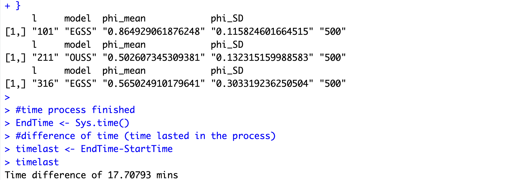{width=50%}

\FloatBarrier

#### Trajectories in timeframe of ~3 years.

Let's see the examples.

How is changing in three moments $\hat{\phi}_{eBird\ \sim three\ years~simulated}$?

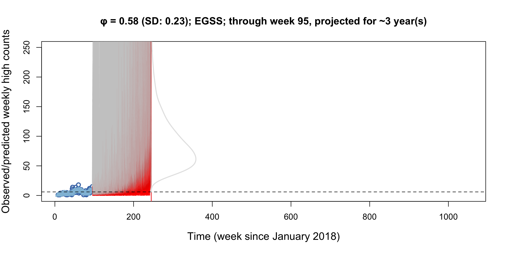{width=50%}

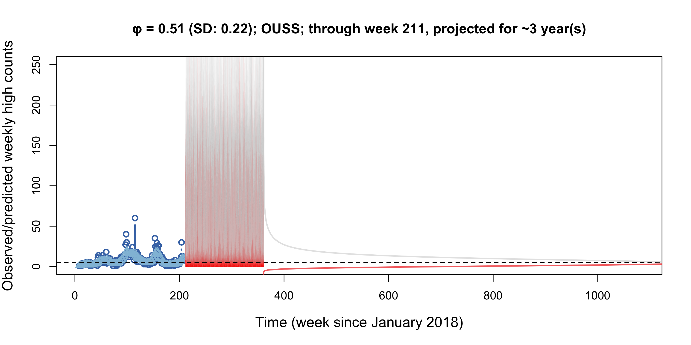{width=50%}

Note that for the week 211 (January 2022) the population model fitted is the density dependence model (OUSS). However, this might be do to the fact that lower and less variable weekly high counts are similar to the initial population, misidentifying density dependence dynamic in this expanding population. We include this example to show the users how to apply the contrast for established populations (see also Section 8 - Other populations of Snail Kite).

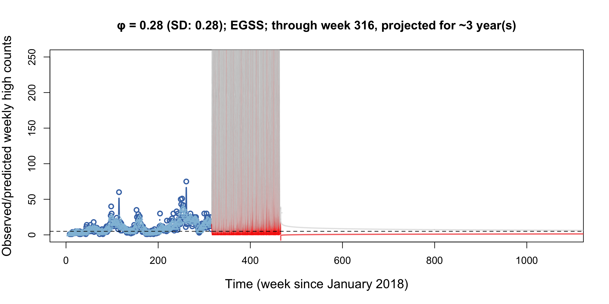{width=50%}

\FloatBarrier

#### Trajectories in timeframe of ~5 years.

How is changing in 5 moments $\hat{\phi}_{eBird\ \sim five\ years~simulated}$?

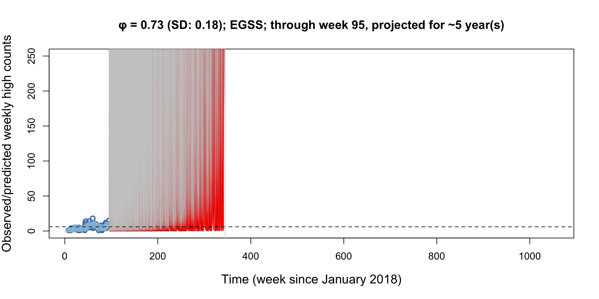{width=50%}

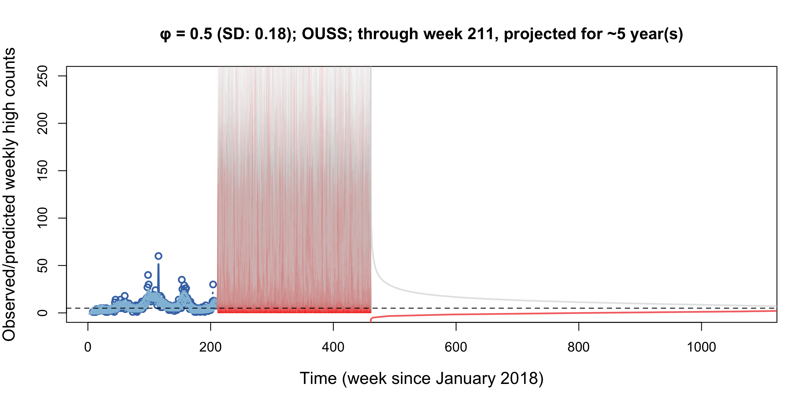{width=50%}

Again, it is not expected for the population to be at stationary distribution, unless we adjust a new initial population of the time series (see [Dennis & Ponciano](https://esajournals.onlinelibrary.wiley.com/doi/abs/10.1890/13-1486.1) for more details on the OUSS model).

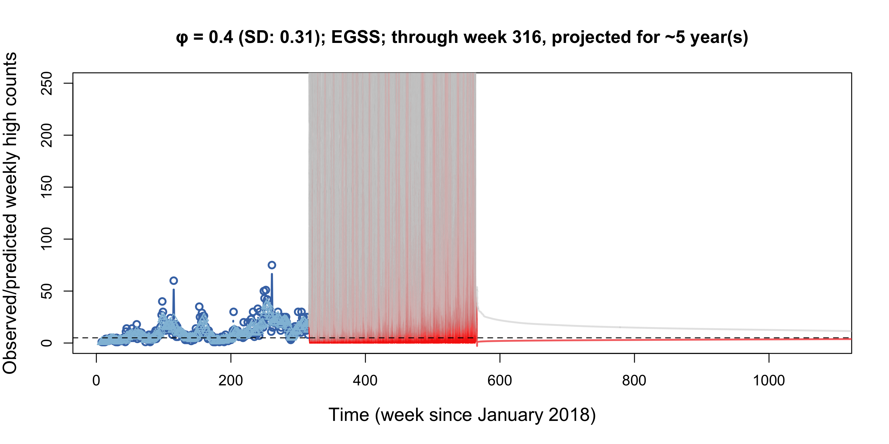{width=50%}

\FloatBarrier

#### Trajectories in timeframe of ~10 years.

How is changing in 5 moments $\hat{\phi}_{eBird\ \sim ten~years~simulated}$?

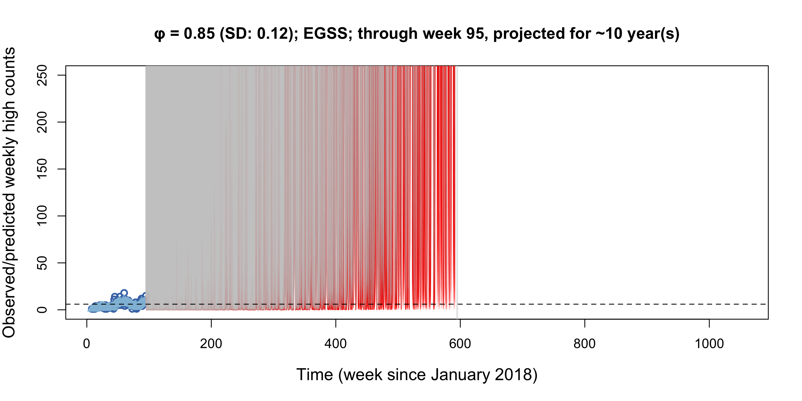{width=50%}

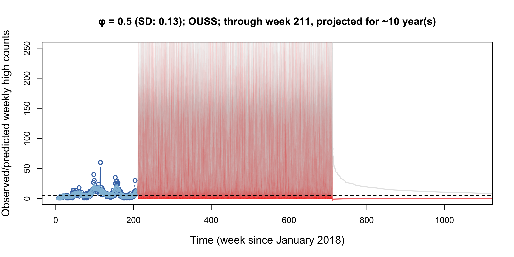{width=50%}

The pattern selected on week 211 keeps selecting OUSS, likely misidentifying density dependence from the eBird data.

{width=50%}

\FloatBarrier

### Iterate each week to extract $\hat{\phi}$ and SD from eBird contrasting OUSS-EGSS (no figures)

```{r iterate process eBird contrasting OUSS-EGSS, eval=FALSE}
#Change at the end to `{r eval=FALSE}`; it might take long time

#the data
snailkites.PP <- readRDS("data_tmp/snailkitesPP.rds")

#Log observations for the entire data set
yt = snailkites.PP |>
  ungroup() |>
  arrange(Time.t) |>
  drop_na(Observed.y) |>
  dplyr::select(Observed.y) |>
  log()

#Vector form
yt <- yt$Observed.y
yt

# Define N_critical for eBird
N.critical = round((1/2)*mean(exp(yt)),0)

tt <- snailkites.PP |>
  ungroup() |>
  arrange(Time.t) |>
  drop_na(Observed.y) |>
  dplyr::select(Time.t)

#Time vector of the time series
tt <- tt$Time.t
tt

#the first two years length
last.tt <- 87 

#Number of trajectories and bootstraps (CIs)
ntraj = 50000

# End positions to modeling (steps)
end_positions <- which(tt > last.tt)

#check weeks ID selected as `end_positions`
tt[end_positions]

#save φ (SD) 
phi_results <- vector("list", length = length(end_positions))

#save model used
modelSS <- vector("list", length = length(end_positions))

# Start process timing
StartTime <- Sys.time()

for (j in seq_along(end_positions)) {
  
  last.tt <- end_positions[j]
  l <- tt[last.tt]

  for (i in seq_along(len.sim)){
    
    OUSS.partial <- ouss_remle(yt = yt[1:last.tt],
                               tt = tt[1:last.tt],
                               fguess = guess_ouss(yt = yt[1:last.tt],
                                                   tt = tt[1:last.tt]))
    
    model <- if(OUSS.partial$remles[2] < 0.025){
      "EGSS"
    }else{
      "OUSS"
    }
    modelSS[[j]][[timeframes[i]]] <- model
    
    if(model == "OUSS"){
      
      thres.times <- as.numeric(0:(len.sim[i]-1))
      len <- max(thres.times) + 1
      
      sim.mat.eBird <- ouss_sim(ntraj, 
                                tt = thres.times, 
                                parms = OUSS.partial$remles)
      
      phi <- rep(0, ntraj)
      last.points <- rep(0, ntraj)
      
      for(n in 1:ntraj){
        Pop.sim <- exp(c(yt[last.tt], sim.mat.eBird[-1,n]));
        last.points[n] <- Pop.sim[len] 
      
      # How many times each trajectory go below the threshold?
        below.threshold <- sum(Pop.sim < N.critical)
        phi[n] <- 1-(below.threshold/len)
      }
      
      #Expected value of probability of local persistence, and SD
      phi_mean <- mean(phi)
      phi_SD <- sqrt(var(phi))
  
      phi_results[[j]][[timeframes[i]]] <- cbind(phi_mean,phi_SD)
      
    }
    else{
      
      EGSS.partial <- egss_remle(yt = yt[1:last.tt],
                                 tt = tt[1:last.tt],
                                 fguess = guess_egss(yt = yt[1:last.tt],
                                                     tt = tt[1:last.tt]));
      
      thres.times <- as.numeric(0:(len.sim[i]-1))
      len <- max(thres.times) + 1
      
      sim.mat.eBird <- egss_sim(ntraj, 
                                tt = thres.times, 
                                parms = EGSS.partial$remles)
      
      phi <- rep(0, ntraj)
      last.points <- rep(0, ntraj)
      
      for(n in 1:ntraj){
        Pop.sim <- exp(c(yt[last.tt], sim.mat.eBird[-1,n]));
        last.points[n] <- Pop.sim[len] 
      
      # How many times each trajectory go below the threshold?
        below.threshold <- sum(Pop.sim < N.critical)
        phi[n] <- 1-(below.threshold/len)
      }
      
      #Expected value of probability of local persistence, and SD
      phi_mean <- mean(phi)
      phi_SD <- sqrt(var(phi))
  
      phi_results[[j]][[timeframes[i]]] <- cbind(phi_mean,phi_SD)
      
    }
  }
  print(cbind(l, model, 
              phi_mean,
              phi_SD, 
              len.sim[i]-1))
}

#time process finished
EndTime <- Sys.time()
#difference of time (time lasted in the process)
timelast <- EndTime-StartTime
timelast
```

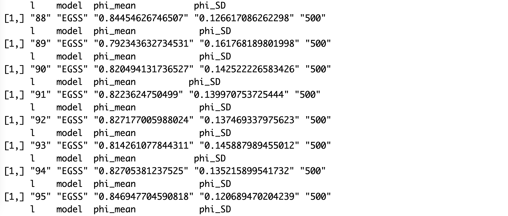{width=50%}

\...

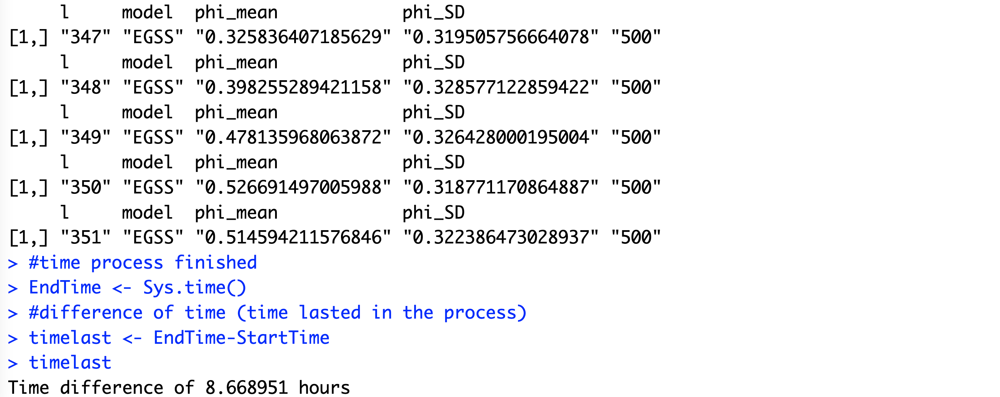{width=50%}

This is a longer process ($\sim9$ hours; currently is `{r eval=FALSE}`), so
we save the `phi_results` (with `phi_mean` and `phi_SD`), and `modelSS` vectors as data frames to make a plot.

```{r extracting results phi estimation ebird in df contrasting OUSS and EGSS, eval=FALSE}
#creating data frames for phi_mean, phi_SD, and modelSS
phi_eBird_df <- do.call(rbind, lapply(seq_along(phi_results), function(j) {
  do.call(rbind, lapply(seq_along(phi_results[[j]]), function(i) {
    data.frame(
      Time.t = tt[end_positions[j]],
      Timeframe = timeframes[i],
      phi.hat = phi_results[[j]][[i]][1],
      SD.phi = phi_results[[j]][[i]][2],
      Model = modelSS[[j]][[i]]
    )
  }))
}))

# Convert to factors for better plotting
phi_eBird_df$Timeframe <- factor(phi_eBird_df$Timeframe, levels = timeframes)
head(phi_eBird_df, n = 12)

saveRDS(phi_eBird_df, "results/phi_hat_SD_eBird_OUSS_EGSS.rds")
```

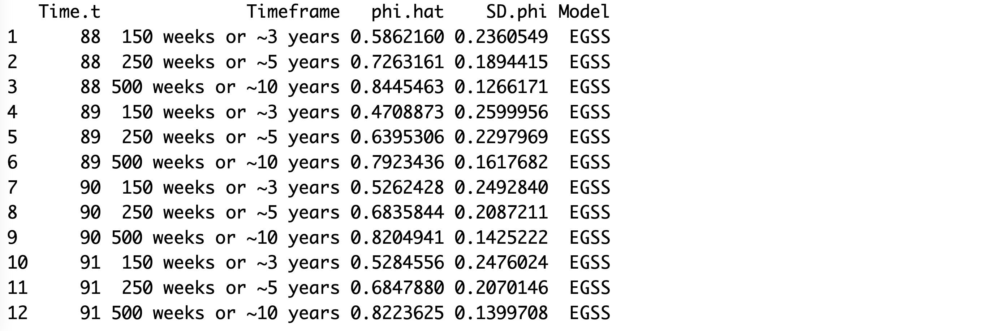{width=50%}

\FloatBarrier


### Iterate each week to extract $\hat{\phi}$ and SD from eBird only EGSS (no figures)

```{r iterate process eBird NO figures but data, eval=FALSE}
#Change at the end to `{r eval=FALSE}`; it might take long time

#the data
snailkites.PP <- readRDS("data_tmp/snailkitesPP.rds")

#Log observations for the entire data set
yt = snailkites.PP |>
  ungroup() |>
  arrange(Time.t) |>
  drop_na(Observed.y) |>
  dplyr::select(Observed.y) |>
  log()

#Vector form
yt <- yt$Observed.y
yt

# Define N_critical for eBird
N.critical = round((1/2)*mean(exp(yt)),0)

tt <- snailkites.PP |>
  ungroup() |>
  arrange(Time.t) |>
  drop_na(Observed.y) |>
  dplyr::select(Time.t)

#Time vector of the time series
tt <- tt$Time.t
tt

#the first two years length
last.tt <- 87 

#Number of trajectories and bootstraps (CIs)
ntraj = 50000

# End positions to modeling (steps)
end_positions <- which(tt > last.tt)

#check weeks ID selected as `end_positions`
tt[end_positions]

#save φ (SD) 
phi_results <- vector("list", length = length(end_positions))

#save model used
modelSS <- vector("list", length = length(end_positions))

# Start process timing
StartTime <- Sys.time()

for (j in seq_along(end_positions)) {
  
  last.tt <- end_positions[j]
  l <- tt[last.tt]

  for (i in seq_along(len.sim)){
    
    model <- "EGSS"
    
    modelSS[[j]][[timeframes[i]]] <- model
    
      EGSS.partial <- egss_remle(yt = yt[1:last.tt],
                                 tt = tt[1:last.tt],
                                 fguess = guess_egss(yt = yt[1:last.tt],
                                                     tt = tt[1:last.tt]));
      
      thres.times <- as.numeric(0:(len.sim[i]-1))
      len <- max(thres.times) + 1
      
      sim.mat.eBird <- egss_sim(ntraj, 
                                tt = thres.times, 
                                parms = EGSS.partial$remles)
      
      phi <- rep(0, ntraj)
      last.points <- rep(0, ntraj)
      
      for(n in 1:ntraj){
        Pop.sim <- exp(c(yt[last.tt], sim.mat.eBird[-1,n]));
        last.points[n] <- Pop.sim[len] 
      
      # How many times each trajectory go below the threshold?
        below.threshold <- sum(Pop.sim < N.critical)
        phi[n] <- 1-(below.threshold/len)
      }
      
      #Expected value of probability of local persistence, and SD
      phi_mean <- mean(phi)
      phi_SD <- sqrt(var(phi))
  
      phi_results[[j]][[timeframes[i]]] <- cbind(phi_mean,phi_SD)
      
    
  }
  print(cbind(l, model, 
              phi_mean,
              phi_SD, 
              len.sim[i]-1))
}

#time process finished
EndTime <- Sys.time()
#difference of time (time lasted in the process)
timelast <- EndTime-StartTime
timelast
```

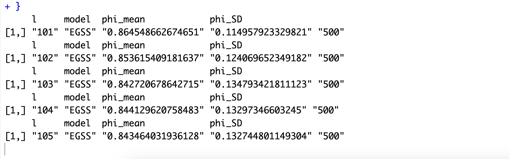{width=50%}

\...

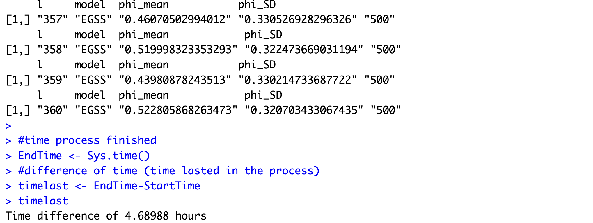{width=50%}

This is a longer process ($\sim10$ hours; currently is `{r eval=FALSE}`), so
we saved the `phi_results` (with `phi_mean` and `phi_SD`), and `modelSS` vectors as data frames to make a plot.

```{r extracting results phi estimation ebird in df, eval=FALSE}
#creating data frames for phi_mean, phi_SD, and modelSS
phi_eBird_df <- do.call(rbind, lapply(seq_along(phi_results), function(j) {
  do.call(rbind, lapply(seq_along(phi_results[[j]]), function(i) {
    data.frame(
      Time.t = tt[end_positions[j]],
      Timeframe = timeframes[i],
      phi.hat = phi_results[[j]][[i]][1],
      SD.phi = phi_results[[j]][[i]][2],
      Model = modelSS[[j]][[i]]
    )
  }))
}))

# Convert to factors for better plotting
phi_eBird_df$Timeframe <- factor(phi_eBird_df$Timeframe, levels = timeframes)
head(phi_eBird_df, n = 12)

saveRDS(phi_eBird_df, "results/phi_hat_SD_eBird.rds")
```

{width=50%}

\FloatBarrier


### Iterate the process with Standardized Monitoring data (figure examples)

Let iterates for the periods that share data in eBird and Standardized
Monitored (data available in standardized monitored)

```{r iterate process for SK project data}
#Standardized monitored data
#Log observations for the entire dataset
ytSM = snailkites.PP |>
  ungroup() |>
  arrange(Time.t) |>
  drop_na(abundance.monitored) |>
  dplyr::select(abundance.monitored) |>
  log()

#Vector form
ytSM <- ytSM$abundance.monitored
ytSM

#N crticial
N.criticalSM <- round((1/2)*mean(exp(ytSM)),0)

ttSM <- snailkites.PP |>
  ungroup() |>
  arrange(Time.t) |>
  drop_na(abundance.monitored) |>
  dplyr::select(Time.t)

#Time vector of the time series
ttSM <- ttSM$Time.t
ttSM
```

And run the model

```{r iterate SK project with figures, eval=FALSE}
#This will take ~2 hours, consider change `{r eval=FALSE}`

ntraj =50000

# End positions to modeling (steps)
end_positions <- which(ttSM >= 88)

#actual weeks
ttSM[end_positions]

#save φ (SD) 
phi_results <- vector("list", length = length(end_positions))

#save model used
modelSS <- vector("list", length = length(end_positions))

# Set the base filename for figures
base_filename <- "supporting/FigS5_IterateTrajSM_10_5" 

# Start process timing
StartTime <- Sys.time()

for (j in seq_along(end_positions)) {
  
  last.tt <- end_positions[j]
  l <- ttSM[last.tt]

  for (i in seq_along(len.sim)){
      # Set up plot for all three timeframes
  png_filename <- paste0(base_filename, 
                         "_endpos_",l, 
                         "_timeframe_",(len.sim[i]-1),
                         ".png")
  png(png_filename, width = 10, height = 5, units = "in", res = 300)

    
    plot(ttSM[1:last.tt],
         exp(ytSM[1:last.tt]),
         type="b", lwd=2, cex.lab=1.25, col = "#d73027", pch = 1,
         xlim=c(min(tt), (max(tt)*3)),
         ylim=c(0,250), 
         ylab="Observed/predicted weekly high counts", 
         xlab="Time (week since January 2018)");
    
    OUSS.partial <- ouss_remle(yt = ytSM[1:last.tt],
                               tt = ttSM[1:last.tt],
                               fguess = guess_ouss(yt = ytSM[1:last.tt],
                                                   tt = ttSM[1:last.tt]))
    
    model <- if(OUSS.partial$remles[2] < 0.025){
      "EGSS"
    }else{
      "OUSS"
    }
    modelSS[[j]][[timeframes[i]]] <- model
    
    if(model == "OUSS"){
      parcial.predict <- ouss_predict(yt = ytSM[1:last.tt],
                                      tt = ttSM[1:last.tt],
                                      parms = OUSS.partial$remles,
                                      plot.it = F)
      
      points(x = (parcial.predict)[[1]][,1],
             y = (parcial.predict)[[1]][,2],
             type = "b", col = "#fc8d59", pch = 2)
      
      thres.times <- as.numeric(0:(len.sim[i]-1))
      len <- max(thres.times) + 1
      
      sim.mat.eBird <- ouss_sim(ntraj, 
                                tt = thres.times, 
                                parms = OUSS.partial$remles)
      
      phi <- rep(0, ntraj)
      last.points <- rep(0, ntraj)
      
      for(n in 1:ntraj){
        Pop.sim <- exp(c(ytSM[last.tt], sim.mat.eBird[-1,n]));
        last.points[n] <- Pop.sim[len] 
      
      # How many times each trajectory go below the threshold?
        below.threshold <- sum(Pop.sim < N.criticalSM)
        phi[n] <- 1-(below.threshold/len)
        
        if(phi[n] >= 0.5){
          lines(l+thres.times, Pop.sim, col="#d3d3d308", lty = "solid")
          } else {
            lines(l+thres.times, Pop.sim, col="#FF000008", lty = "solid")
            }
    }
      # Add critical value line
      abline(h=N.criticalSM, lty=2, lwd=1);
      
      #Expected value of probability of local persistence, and SD
      phi_mean <- mean(phi)
      phi_SD <- sqrt(var(phi))
  
      phi_results[[j]][[timeframes[i]]] <- cbind(phi_mean,phi_SD)
      
      # Create a kernel density estimate (KDE) of the `last.points` results (library(ke31d))
      kde.sims <- kde1d(x=last.points);
      
      # Add the distribution to the plot
      lines(x = (kde.sims$values*(ntraj/5) + l + last(thres.times)),
            y = kde.sims$grid_points,
            col="#d3d3d398", lwd=2, lty=1)
      
      lines(x = (kde.sims$values[kde.sims$grid_points <= N.criticalSM]*(ntraj/5) + 
                   l + last(thres.times)),
            y = kde.sims$grid_points[kde.sims$grid_points <= N.criticalSM],
            col="#FF000098", lwd=2, lty=1)
      
      title(main=paste0("φ = ", 
                      signif(phi_mean,2),
                      " (SD: ",
                      signif(phi_SD,2),
                      "); ", model, "; through week ", ttSM[last.tt],
                      ", projected for ~", 
                      signif((len.sim[i]-1)/52, 2), 
                      " year(s)"), 
          cex=1.5)
    }
    
    else{
      
      EGSS.partial <- egss_remle(yt = ytSM[1:last.tt],
                                 tt = ttSM[1:last.tt],
                                 fguess = guess_egss(yt = ytSM[1:last.tt],
                                                          tt = ttSM[1:last.tt]));
      parcial.predict <- egss_predict(yt = ytSM[1:last.tt],
                                      tt = ttSM[1:last.tt],
                                      parms = EGSS.partial$remles,
                                      plot.it = F)
      
      points(x = (parcial.predict)[[1]][,1],
             y = (parcial.predict)[[1]][,2],
             type = "b", col = "#fc8d59", pch = 2)
      
      thres.times <- as.numeric(0:(len.sim[i]-1))
      len <- max(thres.times) + 1
      
      sim.mat.eBird <- egss_sim(ntraj, 
                                tt = thres.times, 
                                parms = EGSS.partial$remles)
      
      phi <- rep(0, ntraj)
      last.points <- rep(0, ntraj)
      
      for(n in 1:ntraj){
        Pop.sim <- exp(c(ytSM[last.tt], sim.mat.eBird[-1,n]));
        last.points[n] <- Pop.sim[len] 
      
      # How many times each trajectory go below the threshold?
        below.threshold <- sum(Pop.sim < N.criticalSM)
        phi[n] <- 1-(below.threshold/len)
        
        if(phi[n] >= 0.5){
          lines(l+thres.times, Pop.sim, col="#d3d3d308", lty = "solid")
          } else {
            lines(l+thres.times, Pop.sim, col="#FF000008", lty = "solid")
            }
    }
      # Add critical value line
      abline(h=N.criticalSM, lty=2, lwd=1);
      
      #Expected value of probability of local persistence, and SD
      phi_mean <- mean(phi)
      phi_SD <- sqrt(var(phi))
  
      phi_results[[j]][[timeframes[i]]] <- cbind(phi_mean,phi_SD)
      
      # Create a kernel density estimate (KDE) of the `last.points` results (library(ke31d))
      kde.sims <- kde1d(x=last.points);
      
      # Add the distribution to the plot
      lines(x = (kde.sims$values*(ntraj/5) + l + last(thres.times)),
            y = kde.sims$grid_points,
            col="#d3d3d398", lwd=2, lty=1)
      
      lines(x = (kde.sims$values[kde.sims$grid_points <= N.criticalSM]*(ntraj/5) + 
                   l + last(thres.times)),
            y = kde.sims$grid_points[kde.sims$grid_points <= N.criticalSM],
            col="#FF000098", lwd=2, lty=1)
      
      title(main=paste0("φ = ", 
                      signif(phi_mean,2),
                      " (SD: ",
                      signif(phi_SD,2),
                      "); ", model, "; through week ", ttSM[last.tt],
                      ", projected for ~", 
                      signif((len.sim[i]-1)/52, 2), 
                      " year(s)"), 
          cex=1.5)
    }
    
    dev.off()
  
  }
  print(cbind(l, model, 
              phi_mean,
              phi_SD, 
              len.sim[i]-1))
}
#time process finished
EndTime <- Sys.time()
#difference of time (time lasted in the process)
timelast <- EndTime-StartTime
timelast
```

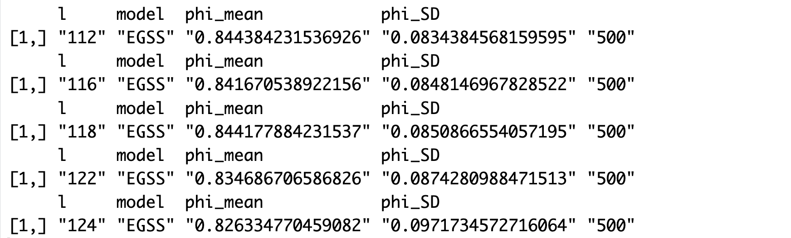{width=50%}

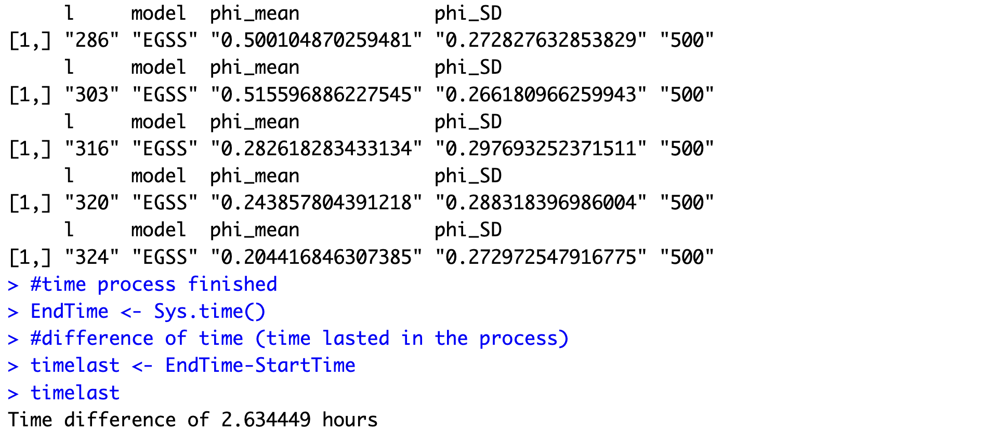{width=50%}

Now we save the `phi_results` and `modelSS` vectors as data
frames to make a plot.

```{r save phi results in df, eval=FALSE}
#creating data frames for phi_mean, phi_SD, and modelSS
phi_SM_df <- do.call(rbind, lapply(seq_along(phi_results), function(j) {
  do.call(rbind, lapply(seq_along(phi_results[[j]]), function(i) {
    data.frame(
      Time.t = ttSM[end_positions[j]],
      Timeframe = timeframes[i],
      phi.hatSM = phi_results[[j]][[i]][1],
      SD.phiSM = phi_results[[j]][[i]][2],
      Model = modelSS[[j]][[i]]
    )
  }))
}))

# Convert to factors for better plotting
phi_SM_df$Timeframe <- factor(phi_SM_df$Timeframe, levels = timeframes)
head(phi_SM_df, n = 12)

saveRDS(phi_SM_df, "results/phi_hat_SD_SM.rds")
```

\FloatBarrier

#### Trajectories in timeframe of ~3 years.

Let's see the examples.

How is changing in 3 moments $\hat{\phi}_{SM\ \sim three~years~simulated}$?

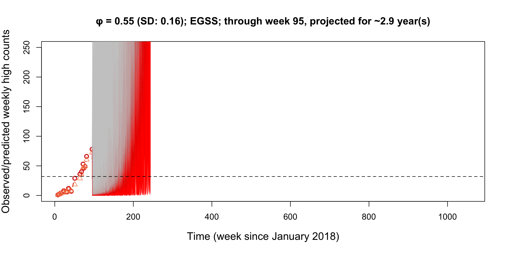{width=50%}

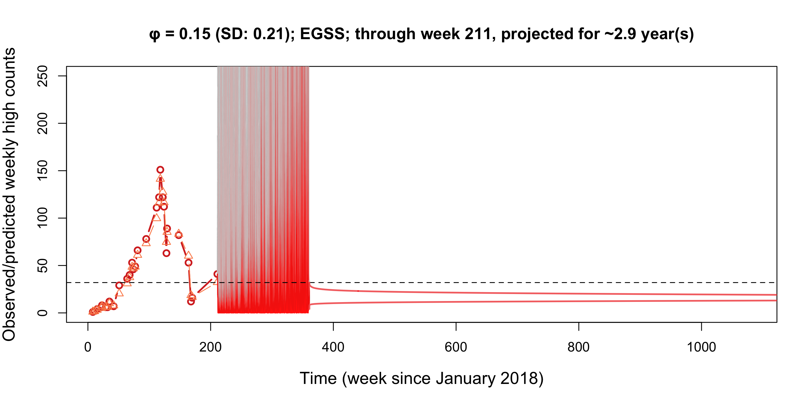{width=50%}

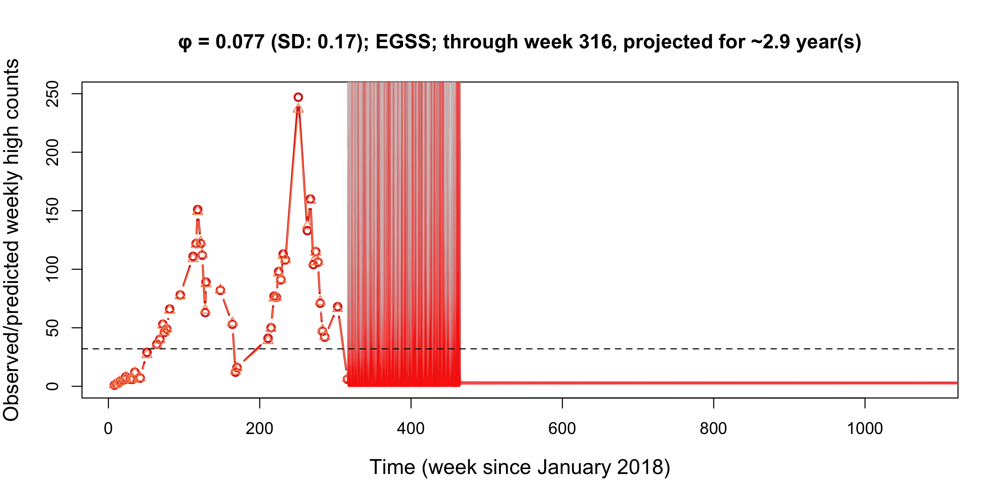{width=50%}

\FloatBarrier

#### Trajectories in timeframe of ~5 years.

How is changing in 3 moments $\hat{\phi}_{SM\ \sim five~years~simulated}$?

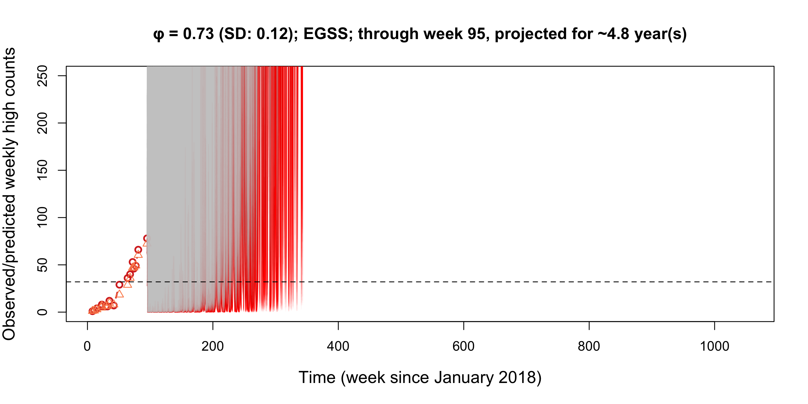{width=50%}

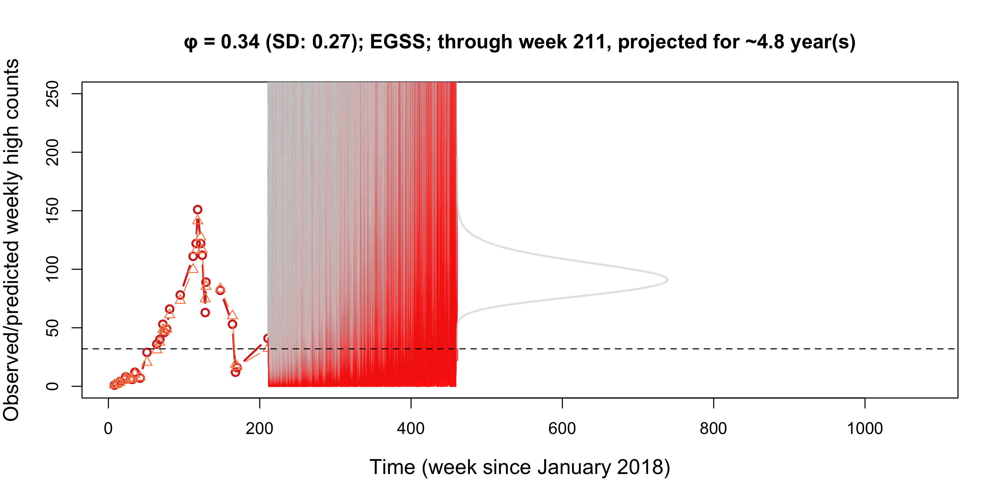{width=50%}

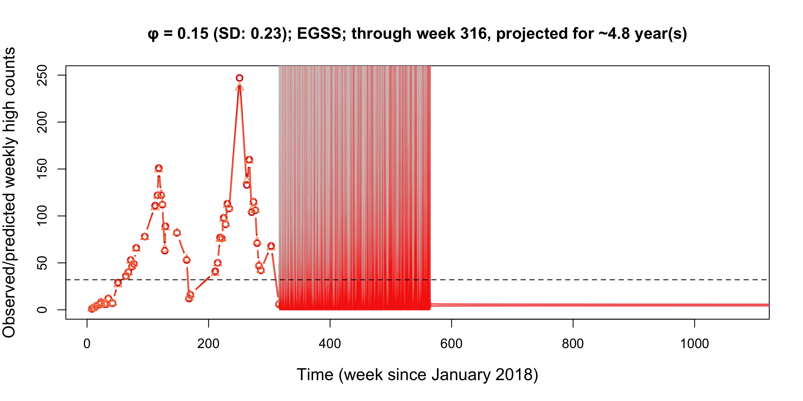{width=50%}

\FloatBarrier

#### Trajectories in timeframe of ~10 years.

How is changing in 3 moments $\hat{\phi}_{SM\ \sim ten~years~simulated}$?

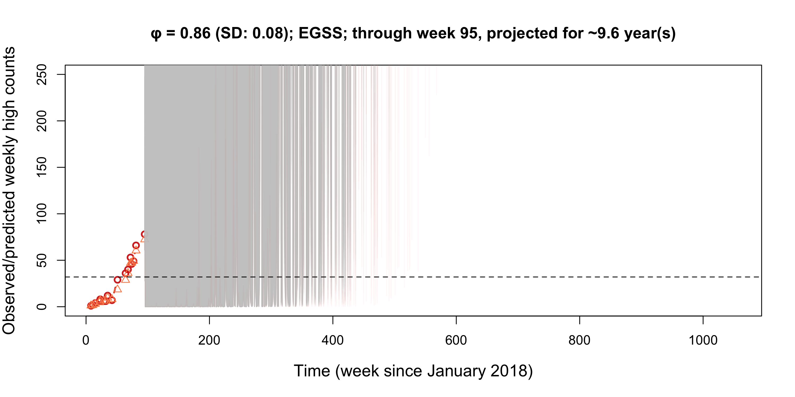{width=50%}

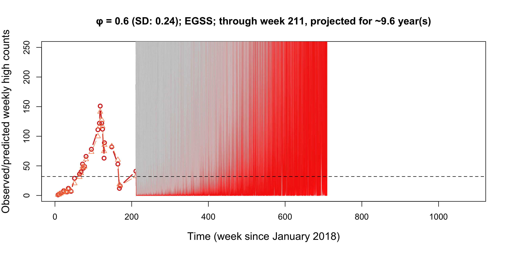{width=50%}

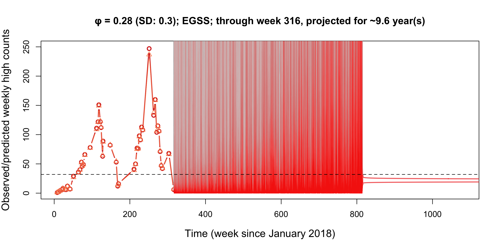{width=50%}

\clearpage

# Results - $\hat{\phi}$

Call the data and establish transformation of second Y-axis (supplementary figure to include time series counts and $\phi$).

```{r load data to figure 3}
#Load data saved
  #data organized
  snailkites.PP <- readRDS("data_tmp/snailkitesPP.rds")
  #local persistence from eBird - OUSS or EGSS
  phi.eBird.OUSS.EGSS <- readRDS("results/phi_hat_SD_eBird_OUSS_EGSS.rds") 
  #local persistence from eBird - EGSS
  phi.eBird <- readRDS("results/phi_hat_SD_eBird.rds") 
  #local persistence from Standardized Monitored
  phi.SM <-readRDS("results/phi_hat_SD_SM.rds")
  
  N.critical <- 6 # 1/2*empirical K = 1/2 mean(exp(yt))
  N.criticalSM <- 32 # 1/2*empirical K = 1/2 mean(exp(ytSM))

#coefficient to convert second Y-axis
coeff <- 100
coeffSM <- 250
```

We can compare the overlap of $\phi$ estimation. First we combine the `phi.eBird` and `phi.SM` results.

```{r combine phi eBird and phi SK project}
head(phi.eBird)
head(phi.eBird.OUSS.EGSS)
head(phi.SM)

#combine phi dataframes
phi_combined <- phi.eBird |>
  bind_rows(.id = "dataset", phi.eBird.OUSS.EGSS) |> 
  mutate(dataset = case_when(dataset == 1~"eBird.EGSS",
                             dataset != 1~"eBird.OUSS.EGSS")) |>
  bind_rows(.id = "original.dataset", phi.SM) |> 
  mutate(original.dataset = case_when(original.dataset == 1~"eBird",
                             original.dataset != 1~"SM"),
         dataset = case_when(original.dataset == "SM"~"SM",
                                   original.dataset != "SM"~dataset))

head(phi_combined)
```

Then, we add the dates and filter by the three Timeframes

```{r figure 3a}
#add dates while filtering Timeframe
phi_data_plot <- datesPP |> 
  left_join(phi_combined |> 
              filter(Timeframe == "150 weeks or ~3 years")) |>
  ungroup() |>
  pivot_longer(cols = !c(Timeframe, 
                         Time.t, 
                         observation.date, 
                         Model,
                         original.dataset,
                         dataset),
               names_to = "group",
               values_to = "phi_values") |> 
  drop_na(phi_values)
  
phi_data_plot

#Ribbon lo-hi phi (SD) for the two datasets
#eBird EGSS
ribbon_phi_eBird <- phi_data_plot |>
  filter(dataset == "eBird.EGSS",
         group %in% c("phi.hat", "SD.phi")) |>
  pivot_wider(names_from = group, values_from = phi_values, values_fn = {mean}) |>
  mutate(phi_values = phi.hat)

#eBird OUSS vs EGSS
ribbon_phi_eBird_OUSSEGSS <- phi_data_plot |>
  filter(dataset == "eBird.OUSS.EGSS",
         group %in% c("phi.hat", "SD.phi")) |>
  pivot_wider(names_from = group, values_from = phi_values, values_fn = {mean}) |>
  mutate(phi_values = phi.hat)

ribbon_phi_SM <- phi_data_plot |>
  filter(dataset == "SM",
         group %in% c("phi.hatSM", "SD.phiSM")) |>
  pivot_wider(names_from = group, values_from = phi_values, values_fn = {mean})|>
  mutate(phi_values = phi.hatSM)

#three trends
FigOUSS_A <- ggplot(phi_data_plot, 
       aes(x = observation.date, y = phi_values)) +
  facet_grid(~dataset)+
  geom_vline(xintercept = snailkites.PP$observation.date[78], 
             color = "gray", linetype = "dotted") +
  geom_ribbon(data = ribbon_phi_SM,
              aes(ymin = phi_values+SD.phiSM, 
                  ymax = phi_values-SD.phiSM),
              fill = "#fc8d5925") +
  geom_ribbon(data = ribbon_phi_eBird,
              aes(ymin = phi_values+SD.phi, 
                  ymax = phi_values-SD.phi),
              fill = "#91bfdb25")+
  geom_ribbon(data = ribbon_phi_eBird_OUSSEGSS,
              aes(ymin = phi_values+SD.phi, 
                  ymax = phi_values-SD.phi),
              fill = "#91bfdb25")+
  geom_line(data = phi_data_plot |> 
               filter(group %in% c("phi.hat", "phi.hatSM")),
            aes(color = group), linetype = "dashed") +
  geom_point(data = phi_data_plot |> 
               filter(group %in% c("phi.hat", "phi.hatSM")),
             aes(shape = Model,
                 color = group),
             size = 2) +
  labs(x = "Observation date",
       y = expression(italic(phi)),
       tag = expression(bold("(a)")),
       title = "Timeframe: 150 weeks or ~3 years")  +
  coord_cartesian(ylim = c(0, 1))+
  scale_x_date(limits = c(snailkites.PP$observation.date[78],
                          max(snailkites.PP$observation.date)),
               breaks = seq(as.Date("2018-01-01"), as.Date(Sys.Date( )), 
                            by = "10 months"), date_labels="%b-%y")+
  scale_color_manual(values = c("#91bfdb95",
                                "#fc8d5995"),
                     labels = c(expression(italic(phi)[eBird]),
                                expression(italic(phi)[SM])))+
  theme_bw() +
  theme(legend.title = element_blank(),
        legend.position = c(0.85, 0.85),
        legend.spacing.y = unit(-0.5, "cm"),
        legend.background = element_blank(),
        legend.box.background = element_rect(colour = "black"))+
  guides(color = guide_legend(ncol=2),
         shape = guide_legend(ncol=2))

FigOUSS_A

#Only EGSS comparison

#Figure overlap phi
Figure3a <- ggplot(phi_data_plot, 
                aes(x = observation.date, y = phi_values)) +
  geom_vline(xintercept = snailkites.PP$observation.date[78], 
             color = "gray", linetype = "dotted") +
  geom_ribbon(data = ribbon_phi_SM,
              aes(ymin = phi_values+SD.phiSM, 
                  ymax = phi_values-SD.phiSM),
              fill = "#fc8d5925") +
  geom_ribbon(data = ribbon_phi_eBird,
              aes(ymin = phi_values+SD.phi, 
                  ymax = phi_values-SD.phi),
              fill = "#91bfdb25") +
  geom_line(data = phi_data_plot |> 
               filter(dataset != "eBird.OUSS.EGSS",
                      group %in% c("phi.hat", "phi.hatSM")),
            aes(color = group), linetype = "dashed") +
  geom_point(data = phi_data_plot |> 
               filter(dataset != "eBird.OUSS.EGSS",
                      group %in% c("phi.hat", "phi.hatSM")),
             aes(color = group, fill = group),
             size = 2, shape = 21) +
  labs(x = "Observation date",
       y = expression(italic(phi)),
       tag = expression(bold("(a)")),
       title = "Timeframe: 150 weeks or ~3 years")  +
  coord_cartesian(ylim = c(0, 1))+
  scale_x_date(limits = c(snailkites.PP$observation.date[78],
                          max(snailkites.PP$observation.date)),
               breaks = seq(as.Date("2018-01-01"), as.Date(Sys.Date( )), 
                            by = "10 months"), date_labels="%b-%y")+
  scale_color_manual(values = c("#91bfdb95",
                                "#fc8d5995"),
                     labels = c(expression(italic(phi)[eBird]),
                                expression(italic(phi)[SM])))+
  scale_fill_manual(values = c("#91bfdb75",
                                "#fc8d5975"),
                     labels = c(expression(italic(phi)[eBird]),
                                expression(italic(phi)[SM])))+
  theme_bw() +
  theme(legend.title = element_blank(),
        legend.position = c(0.85, 0.85),
        legend.spacing.y = unit(-0.5, "cm"),
        legend.background = element_blank(),
        legend.box.background = element_rect(colour = "black"))+
  guides(color = guide_legend(ncol=2),
         shape = guide_legend(ncol=2))

Figure3a
```


```{r figure 3b}
#add dates while filtering Timeframe
phi_data_plot <- datesPP |> 
  left_join(phi_combined|> filter(Timeframe == "250 weeks or ~5 years")) |>
  ungroup() |>
  pivot_longer(cols = !c(Timeframe, 
                         Time.t, 
                         observation.date, 
                         Model,
                         original.dataset,
                         dataset),
               names_to = "group",
               values_to = "phi_values") |> 
  drop_na(phi_values)
  
phi_data_plot

#Ribbon lo-hi phi (SD) for the two datasets
#eBird EGSS
ribbon_phi_eBird <- phi_data_plot |>
  filter(dataset == "eBird.EGSS",
         group %in% c("phi.hat", "SD.phi")) |>
  pivot_wider(names_from = group, values_from = phi_values, values_fn = {mean}) |>
  mutate(phi_values = phi.hat)

#eBird OUSS vs EGSS
ribbon_phi_eBird_OUSSEGSS <- phi_data_plot |>
  filter(dataset == "eBird.OUSS.EGSS",
         group %in% c("phi.hat", "SD.phi")) |>
  pivot_wider(names_from = group, values_from = phi_values, values_fn = {mean}) |>
  mutate(phi_values = phi.hat)

ribbon_phi_SM <- phi_data_plot |>
  filter(dataset == "SM",
         group %in% c("phi.hatSM", "SD.phiSM")) |>
  pivot_wider(names_from = group, values_from = phi_values, values_fn = {mean})|>
  mutate(phi_values = phi.hatSM)

#three trends
FigOUSS_B <- ggplot(phi_data_plot, 
       aes(x = observation.date, y = phi_values)) +
  facet_grid(~dataset)+
  geom_vline(xintercept = snailkites.PP$observation.date[78], 
             color = "gray", linetype = "dotted") +
  geom_ribbon(data = ribbon_phi_SM,
              aes(ymin = phi_values+SD.phiSM, 
                  ymax = phi_values-SD.phiSM),
              fill = "#fc8d5925") +
  geom_ribbon(data = ribbon_phi_eBird,
              aes(ymin = phi_values+SD.phi, 
                  ymax = phi_values-SD.phi),
              fill = "#91bfdb25")+
  geom_ribbon(data = ribbon_phi_eBird_OUSSEGSS,
              aes(ymin = phi_values+SD.phi, 
                  ymax = phi_values-SD.phi),
              fill = "#91bfdb25")+
  geom_line(data = phi_data_plot |> 
               filter(group %in% c("phi.hat", "phi.hatSM")),
            aes(color = group), linetype = "dashed") +
  geom_point(data = phi_data_plot |> 
               filter(group %in% c("phi.hat", "phi.hatSM")),
             aes(shape = Model,
                 color = group),
             size = 2) +
  labs(x = "Observation date",
       y = expression(italic(phi)),
       tag = expression(bold("(b)")),
       title = "Timeframe: 250 weeks or ~5 years")  +
  coord_cartesian(ylim = c(0, 1))+
  scale_x_date(limits = c(snailkites.PP$observation.date[78],
                          max(snailkites.PP$observation.date)),
               breaks = seq(as.Date("2018-01-01"), as.Date(Sys.Date( )), 
                            by = "10 months"), date_labels="%b-%y")+
  scale_color_manual(values = c("#91bfdb95",
                                "#fc8d5995"),
                     labels = c(expression(italic(phi)[eBird]),
                                expression(italic(phi)[SM])))+
  theme_bw() +
  theme(legend.title = element_blank(),
        legend.position = "none",
        legend.spacing.y = unit(-0.5, "cm"),
        legend.background = element_blank(),
        legend.box.background = element_rect(colour = "black"))+
  guides(color = guide_legend(ncol=2),
         shape = guide_legend(ncol=2))
FigOUSS_B

#Only EGSS comparison

#Figure overlap phi
Figure3b <- ggplot(phi_data_plot, 
                aes(x = observation.date, y = phi_values)) +
  geom_vline(xintercept = snailkites.PP$observation.date[78], 
             color = "gray", linetype = "dotted") +
  geom_ribbon(data = ribbon_phi_SM,
              aes(ymin = phi_values+SD.phiSM, 
                  ymax = phi_values-SD.phiSM),
              fill = "#fc8d5925") +
  geom_ribbon(data = ribbon_phi_eBird,
              aes(ymin = phi_values+SD.phi, 
                  ymax = phi_values-SD.phi),
              fill = "#91bfdb25") +
  geom_line(data = phi_data_plot |> 
               filter(dataset != "eBird.OUSS.EGSS",
                      group %in% c("phi.hat", "phi.hatSM")),
            aes(color = group), linetype = "dashed") +
  geom_point(data = phi_data_plot |> 
               filter(dataset != "eBird.OUSS.EGSS",
                      group %in% c("phi.hat", "phi.hatSM")),
             aes(color = group, fill = group),
             size = 2, shape = 21) +
  labs(x = "Observation date",
       y = expression(italic(phi)),
       tag = expression(bold("(b)")),
       title = "Timeframe: 250 weeks or ~5 years")  +
  coord_cartesian(ylim = c(0, 1))+
  scale_x_date(limits = c(snailkites.PP$observation.date[78],
                          max(snailkites.PP$observation.date)),
               breaks = seq(as.Date("2018-01-01"), as.Date(Sys.Date( )), 
                            by = "10 months"), date_labels="%b-%y")+
  scale_color_manual(values = c("#91bfdb95",
                                "#fc8d5995"),
                     labels = c(expression(italic(phi)[eBird]),
                                expression(italic(phi)[SM])))+
  scale_fill_manual(values = c("#91bfdb75",
                                "#fc8d5975"),
                     labels = c(expression(italic(phi)[eBird]),
                                expression(italic(phi)[SM])))+
  theme_bw() +
  theme(legend.position = "none")

Figure3b
```


```{r figure 3c}
#add dates while filtering Timeframe
phi_data_plot <- datesPP |> 
  left_join(phi_combined|> filter(Timeframe == "500 weeks or ~10 years")) |>
  ungroup() |>
  pivot_longer(cols = !c(Timeframe, 
                         Time.t, 
                         observation.date, 
                         Model,
                         original.dataset,
                         dataset),
               names_to = "group",
               values_to = "phi_values") |> 
  drop_na(phi_values)
  
phi_data_plot

#Ribbon lo-hi phi (SD) for the two datasets
#eBird EGSS
ribbon_phi_eBird <- phi_data_plot |>
  filter(dataset == "eBird.EGSS",
         group %in% c("phi.hat", "SD.phi")) |>
  pivot_wider(names_from = group, values_from = phi_values, values_fn = {mean}) |>
  mutate(phi_values = phi.hat)

#eBird OUSS vs EGSS
ribbon_phi_eBird_OUSSEGSS <- phi_data_plot |>
  filter(dataset == "eBird.OUSS.EGSS",
         group %in% c("phi.hat", "SD.phi")) |>
  pivot_wider(names_from = group, values_from = phi_values, values_fn = {mean}) |>
  mutate(phi_values = phi.hat)

ribbon_phi_SM <- phi_data_plot |>
  filter(dataset == "SM",
         group %in% c("phi.hatSM", "SD.phiSM")) |>
  pivot_wider(names_from = group, values_from = phi_values, values_fn = {mean})|>
  mutate(phi_values = phi.hatSM)

#three trends
FigOUSS_C <- ggplot(phi_data_plot, 
       aes(x = observation.date, y = phi_values)) +
  facet_grid(~dataset)+
  geom_vline(xintercept = snailkites.PP$observation.date[78], 
             color = "gray", linetype = "dotted") +
  geom_ribbon(data = ribbon_phi_SM,
              aes(ymin = phi_values+SD.phiSM, 
                  ymax = phi_values-SD.phiSM),
              fill = "#fc8d5925") +
  geom_ribbon(data = ribbon_phi_eBird,
              aes(ymin = phi_values+SD.phi, 
                  ymax = phi_values-SD.phi),
              fill = "#91bfdb25")+
  geom_ribbon(data = ribbon_phi_eBird_OUSSEGSS,
              aes(ymin = phi_values+SD.phi, 
                  ymax = phi_values-SD.phi),
              fill = "#91bfdb25")+
  geom_line(data = phi_data_plot |> 
               filter(group %in% c("phi.hat", "phi.hatSM")),
            aes(color = group), linetype = "dashed") +
  geom_point(data = phi_data_plot |> 
               filter(group %in% c("phi.hat", "phi.hatSM")),
             aes(shape = Model,
                 color = group),
             size = 2) +
  labs(x = "Observation date",
       y = expression(italic(phi)),
       tag = expression(bold("(c)")),
       title = "Timeframe: 500 weeks or ~10 years")  +
  coord_cartesian(ylim = c(0, 1))+
  scale_x_date(limits = c(snailkites.PP$observation.date[78],
                          max(snailkites.PP$observation.date)),
               breaks = seq(as.Date("2018-01-01"), as.Date(Sys.Date( )), 
                            by = "10 months"), date_labels="%b-%y")+
  scale_color_manual(values = c("#91bfdb95",
                                "#fc8d5995"),
                     labels = c(expression(italic(phi)[eBird]),
                                expression(italic(phi)[SM])))+
  theme_bw() +
  theme(legend.title = element_blank(),
        legend.position = "none",
        legend.spacing.y = unit(-0.5, "cm"),
        legend.background = element_blank(),
        legend.box.background = element_rect(colour = "black"))+
  guides(color = guide_legend(ncol=2),
         shape = guide_legend(ncol=2))
FigOUSS_C

#Only EGSS comparison

#Figure overlap phi
Figure3c <- ggplot(phi_data_plot, 
                aes(x = observation.date, y = phi_values)) +
  geom_vline(xintercept = snailkites.PP$observation.date[78], 
             color = "gray", linetype = "dotted") +
  geom_ribbon(data = ribbon_phi_SM,
              aes(ymin = phi_values+SD.phiSM, 
                  ymax = phi_values-SD.phiSM),
              fill = "#fc8d5925") +
  geom_ribbon(data = ribbon_phi_eBird,
              aes(ymin = phi_values+SD.phi, 
                  ymax = phi_values-SD.phi),
              fill = "#91bfdb25") +
  geom_line(data = phi_data_plot |> 
               filter(dataset != "eBird.OUSS.EGSS",
                      group %in% c("phi.hat", "phi.hatSM")),
            aes(color = group), linetype = "dashed") +
  geom_point(data = phi_data_plot |> 
               filter(dataset != "eBird.OUSS.EGSS",
                      group %in% c("phi.hat", "phi.hatSM")),
             aes(color = group, fill = group),
             size = 2, shape = 21) +
  labs(x = "Observation date",
       y = expression(italic(phi)),
       tag = expression(bold("(c)")),
       title = "Timeframe: 500 weeks or ~10 years")  +
  coord_cartesian(ylim = c(0, 1))+
  scale_x_date(limits = c(snailkites.PP$observation.date[78],
                          max(snailkites.PP$observation.date)),
               breaks = seq(as.Date("2018-01-01"), as.Date(Sys.Date( )), 
                            by = "10 months"), date_labels="%b-%y")+
  scale_color_manual(values = c("#91bfdb95",
                                "#fc8d5995"),
                     labels = c(expression(italic(phi)[eBird]),
                                expression(italic(phi)[SM])))+
  scale_fill_manual(values = c("#91bfdb75",
                                "#fc8d5975"),
                     labels = c(expression(italic(phi)[eBird]),
                                expression(italic(phi)[SM])))+
  theme_bw() +
  theme(legend.position = "none")

Figure3c
```

And combine the figures

```{r exporting Figure 3 - extended figure}
#and combine in the figure
Figure3Ext <- grid.arrange(FigOUSS_A, FigOUSS_B, FigOUSS_C, 
                          ncol = 1)

#lets saved it with good proportions
ggsave("results/Figure3_Extended_OUSS_EGSS_3-5-10yrsSimulated.pdf", 
       plot = Figure3Ext, dpi = 300, width = 12, height = 9, units = "in")

ggsave("results/Figure3_Extended_OUSS_EGSS_3-5-10yrsSimulated.png", 
       plot = Figure3Ext, dpi = 300, width = 12, height = 9, units = "in")
```

![Estimated local persistence probability ($\hat{\phi}$ +/- standard deviation) during ~5 years of monitoring (September 2019 to September 2024) after 50,000 population trajectories simulated for three timeframes (a-c). The shape of the points in the central column shows the model selected in each week of estimation (EGSS and OUSS, the preference of the latter by the model suggestion of density dependence). Model selection was conducted for the benchmark (right column), but all suggested density-independent dynamic (EGSS). Higher temporal resolution evident in eBird (n = 262) when compared with standardized monitored data (n = 33).](results/Figure3_Extended_OUSS_EGSS_3-5-10yrsSimulated.png){width=80%}


```{r exporting Figure 3}
#and combine in the figure
Figure3 <- grid.arrange(Figure3a, Figure3b, Figure3c, 
                          ncol = 1)

#lets saved it with good proportions
ggsave("results/Figure3_PLocalPersi_3-5-10yrsSimulated.pdf", 
       plot = Figure3, dpi = 300, width = 5.5, height = 8, units = "in")

ggsave("results/Figure3_PLocalPersi_3-5-10yrsSimulated.png", 
       plot = Figure3, dpi = 300, width = 5.5, height = 8, units = "in")
```

![Estimated local persistence probability ($\hat{\phi}$ +/- standard deviation) during ~5 years of monitoring (October 2019 to July 2024) after 50,000 population trajectories simulated for three timeframes (a-c). For each week of estimation, a density independence model (EGSS) was fitted for the observation time series, estimate parameters, and simulate trajectories. Higher temporal resolution is evident in eBird (n = 262) when compared with standardized monitored data (n = 33). See extended supplementary figure S6 with the observed abundance time series. *Figure 3 in Main text*](results/Figure3_PLocalPersi_3-5-10yrsSimulated.png){width=80%}

How correlated are the $\hat{\phi}$?

```{r correlation in three timeframes}
correlations <- phi.eBird |>
  full_join(phi.SM) |>
  group_by(Timeframe) |>
  summarise(correlation = cor(phi.hatSM, 
                              phi.hat, 
                              use = "pairwise.complete.obs"))
correlations
```

Time frame of ~5 years had the higher Pearson correlation among the three time frames.

\FloatBarrier

## Results for \~3 years (150 weeks)

```{r eBird extended figure 3yrs - a, eval=TRUE}

#Extended figures

phi_data_plot <- snailkites.PP |> 
  left_join(phi.eBird |>
              full_join(phi.SM) |>
              filter(Timeframe == "150 weeks or ~3 years")) |>
  ungroup() |>
    mutate(phi.hat = phi.hat * coeff,
           SD.phi = SD.phi * coeff,
           phi.hatSM = phi.hatSM * coeffSM,
           SD.phiSM = SD.phiSM * coeffSM) |> 
  pivot_longer(cols = !c(cell, year, week, Timeframe, Time.t, observation.date, Model),
               names_to = "group",
               values_to = "phi_values") |> 
  drop_na(phi_values)

phi_data_plot

#Ribbon lo-hi phi (SD) for the two datasets
ribbon_phi_eBird <- phi_data_plot |>
  filter(group %in% c("phi.hat", "SD.phi")) |>
  pivot_wider(names_from = group, values_from = phi_values, values_fn = {mean}) |>
  mutate(phi_values = phi.hat)

ribbon_phi_SM <- phi_data_plot |>
  filter(group %in% c("phi.hatSM", "SD.phiSM")) |>
  pivot_wider(names_from = group, values_from = phi_values, values_fn = {mean})|>
  mutate(phi_values = phi.hatSM)

  #figurea
Fig3aExt <- ggplot(phi_data_plot |> 
                  filter(group %in% c("phi.hat", "Observed.y")), 
                aes(x = observation.date,
                    y = phi_values,
                    fill = group)) +
  geom_vline(xintercept = snailkites.PP$observation.date[78], 
             color = "gray", linetype = "dotted") +
  geom_ribbon(data = ribbon_phi_eBird,
              aes(ymin = phi.hat-SD.phi, ymax = phi.hat+SD.phi),
              fill = "#91bfdb25") +
  geom_line(aes(color = group, linetype = group)) +
  geom_point(data = phi_data_plot |> 
                  filter(group %in% c("Observed.y")),
             color = "#4575b445", size = 0.5, fill = "#4575b445", shape = 21)+
  geom_point(data = phi_data_plot |> 
                  filter(group %in% c("phi.hat")) |>
               drop_na(Model),
              color = "black",
             shape = 21, fill = "#91bfdb95") +
  labs(x = "Observation date",
       y = "Observed weekly high count",
       tag = expression(bold("(a)")),
       fill = "",
       color = "",
       linetype = "",
       shape = "") +
  scale_y_continuous(sec.axis = sec_axis(trans = ~./coeff, 
                                         name = expression("eBird " * italic(phi)))) +
  coord_cartesian(ylim = c(0, coeff))+
  scale_x_date(limits = c(min(snailkites.PP$observation.date),
                          max(snailkites.PP$observation.date)),
               breaks = seq(as.Date("2018-01-01"), as.Date(Sys.Date( )), 
                            by = "10 months"), date_labels="%b-%y")+
  scale_linetype_manual(values = c("solid",
                                   "solid"),
                     labels = c("eBird weekly high count", 
                                expression("P(local persistence) = " * italic(phi))))+
  scale_color_manual(values = c("#4575b475", 
                                "#91bfdb75"),
                     labels = c("eBird weekly high count", 
                                expression("P(local persistence) = " * italic(phi)))) +
  geom_hline(yintercept = N.critical, linetype = "dashed", color = "red")+
  theme_classic() +
  theme(legend.title = element_blank(),
        legend.position = c(0.125,0.7),
        legend.background = element_blank(),
        legend.box.background = element_rect(colour = "black"),
        axis.line.y.right = element_line(color = "#91bfdb"),
        axis.ticks.y.right = element_line(color = "#91bfdb"))
Fig3aExt

#SM figure

  #figurea
Fig3bExt <- ggplot(phi_data_plot |> 
                  filter(group %in% c("phi.hatSM", "abundance.monitored")), 
                aes(x = observation.date,
                    y = phi_values,
                    fill = group)) +
  geom_vline(xintercept = snailkites.PP$observation.date[78], 
             color = "gray", linetype = "dashed") +
  geom_ribbon(data = ribbon_phi_SM,
              aes(ymin = phi.hatSM-SD.phiSM, ymax = phi.hatSM+SD.phiSM),
              fill = "#fc8d5925") +
  geom_line(aes(color = group, linetype = group)) +
  geom_point(data = phi_data_plot |> 
                  filter(group %in% c("abundance.monitored")),
             color = "#d7302745", size = 0.5, fill = "#d7302745", shape = 21)+
  geom_point(data = phi_data_plot |> 
                  filter(group %in% c("phi.hatSM")) |>
               drop_na(Model),
             shape = 21, color = "black",
             fill = "#fc8d5995") +
  labs(x = "Observation date",
       y = "Observed weekly high count",
       tag = expression(bold("(b)")),
       fill = "",
       color = "",
       linetype = "",
       shape = "") +
  scale_y_continuous(sec.axis = sec_axis(trans = ~./coeffSM, 
                                         name = expression("Standardized Monitored " * italic(phi)))) +
  coord_cartesian(ylim = c(0, coeffSM))+
  scale_x_date(limits = c(min(snailkites.PP$observation.date),
                          max(snailkites.PP$observation.date)),
               breaks = seq(as.Date("2018-01-01"), as.Date(Sys.Date( )), 
                            by = "6 months"), date_labels="%b-%y")+
  scale_linetype_manual(values = c("solid",
                                   "solid"),
                     labels = c("Standardized Monitored", 
                                expression("P(local persistence) = " * italic(phi))))+
  scale_color_manual(values = c("#d7302745", 
                                "#fc8d5945"),
                     labels = c("Standardized Monitored", 
                                expression("P(local persistence) = " * italic(phi)))) +
  geom_hline(yintercept = N.critical, linetype = "dashed", color = "red")+
  theme_classic() +
  theme(legend.title = element_blank(),
        legend.position = c(0.125,0.7),
        legend.background = element_blank(),
        legend.box.background = element_rect(colour = "black"),
        axis.line.y.right = element_line(color = "#fc8d59"),
        axis.ticks.y.right = element_line(color = "#fc8d59"))
Fig3bExt


#Performance comparison
phidata <- phi.eBird |>
              full_join(phi.SM) |>
  filter(Timeframe == "150 weeks or ~3 years") 

#relationship?
lm(phi.hat~phi.hatSM, data = phidata)

Fig3cExt <- ggplot(phidata)+
    geom_abline(slope = 1)+
    geom_pointrange(aes(x = phi.hatSM, y = phi.hat, 
                        ymin = phi.hat-SD.phi, 
                        ymax = phi.hat+SD.phi),
                    shape = 23, fill = "gray", color = "gray",
                    alpha = 0.25) +
    geom_errorbarh(aes(x = phi.hatSM, y = phi.hat,
                       xmax = phi.hatSM+SD.phiSM, 
                       xmin = phi.hatSM-SD.phiSM, height = 0),
                   color = "gray",
                   alpha = 0.25)+
    geom_point(aes(x = phi.hatSM, y = phi.hat),
                    shape = 23, fill = "gray", 
               color = "black", size = 2, alpha = 0.5)+
    geom_text(x = 0.5, y = 0.05, 
            label = lm_eqn(df = phidata,
                           x = phidata$phi.hatSM, 
                           y = phidata$phi.hat), 
            parse = TRUE, color = "black")+
      geom_smooth(aes(x=phi.hatSM, y=phi.hat),
              method = "lm", fullrange=TRUE,
              color = "black", se = F, linetype = "dashed", size = 1)+
    scale_y_continuous(limits = c(0,1))+
    scale_x_continuous(limits = c(0,1))+
    labs(x = expression("Standardized Monitored "*italic(phi)),
         y = expression("eBird "*italic(phi)),
         tag = expression(bold("(c)")),
         title = "150 weeks or ~3 years")+
  coord_fixed()+
  theme_classic()
  
#and combine in the figure
Fig3ab <- grid.arrange(Fig3aExt, Fig3bExt, ncol = 1)

Fig3 <- grid.arrange(Fig3ab, Fig3cExt, ncol = 2, widths = c(1.5,1))

#It looks not good in the `Rmd`, but it is saved with good proportions
ggsave("results/Figure3_timeseries_PLocalPersi_150weeks.pdf", 
       plot = Fig3, dpi = 300, width = 16, height = 6, units = "in")

ggsave("results/Figure3_timeseries_PLocalPersi150weeks.png", 
       plot = Fig3, dpi = 300, width = 16, height = 6, units = "in")
```

![Time series of weekly high counts of Snail kites in Payne's Prairie wetland from eBird (a) and standardized monitoring surveys (b), with local persistence probability ($\phi$) +/- standard deviation estimated for each dataset after 50,000 population trajectories simulated. (c) Local persistence probability extimated from eBird data plotted against local persistence probability estimated from standardized monitored, with standard deviation. Estimation of $\phi$ from 50,000 trajectories in a timeframe of \~3 years (150 weeks). Solid black line is the line of identity, while dashed black line is linear regression (equation in gray).](results/Figure3_timeseries_PLocalPersi150weeks.png){width=80%}

\FloatBarrier

## Results for \~5 years (250 weeks) - selected

```{r eBird extended figure 5yrs, eval=TRUE}
#Extended figures

phi_data_plot <- snailkites.PP |> 
  left_join(phi.eBird |>
              full_join(phi.SM)  |> 
              filter(Timeframe == "250 weeks or ~5 years")) |>
  ungroup() |>
    mutate(phi.hat = phi.hat * coeff,
           SD.phi = SD.phi * coeff,
           phi.hatSM = phi.hatSM * coeffSM,
           SD.phiSM = SD.phiSM * coeffSM) |> 
  pivot_longer(cols = !c(cell, year, week, Timeframe, Time.t, observation.date, Model),
               names_to = "group",
               values_to = "phi_values") |> 
  drop_na(phi_values)

phi_data_plot

#Ribbon lo-hi phi (SD) for the two datasets
ribbon_phi_eBird <- phi_data_plot |>
  filter(group %in% c("phi.hat", "SD.phi")) |>
  pivot_wider(names_from = group, values_from = phi_values, values_fn = {mean}) |>
  mutate(phi_values = phi.hat)

ribbon_phi_SM <- phi_data_plot |>
  filter(group %in% c("phi.hatSM", "SD.phiSM")) |>
  pivot_wider(names_from = group, values_from = phi_values, values_fn = {mean})|>
  mutate(phi_values = phi.hatSM)

  #figurea
Fig3aExt <- ggplot(phi_data_plot |> 
                  filter(group %in% c("phi.hat", "Observed.y")), 
                aes(x = observation.date,
                    y = phi_values,
                    fill = group)) +
  geom_vline(xintercept = snailkites.PP$observation.date[78], 
             color = "gray", linetype = "dashed") +
  geom_ribbon(data = ribbon_phi_eBird,
              aes(ymin = phi.hat-SD.phi, ymax = phi.hat+SD.phi),
              fill = "#91bfdb25") +
  geom_line(aes(color = group, linetype = group)) +
  geom_point(data = phi_data_plot |> 
                  filter(group %in% c("Observed.y")),
             color = "#4575b445", size = 0.5, fill = "#4575b445", shape = 21)+
  geom_point(data = phi_data_plot |> 
                  filter(group %in% c("phi.hat")) |>
               drop_na(Model),
             shape = 21, fill = "#91bfdb95", color = "black") +
  labs(x = "Observation date",
       y = "Observed weekly high counts",
       tag = expression(bold("(a)")),
       fill = "",
       color = "",
       linetype = "",
       shape = "") +
  scale_y_continuous(sec.axis = sec_axis(trans = ~./coeff, 
                                         name = expression("eBird " * italic(phi)))) +
  coord_cartesian(ylim = c(0, coeff))+
  scale_x_date(limits = c(min(snailkites.PP$observation.date),
                          max(snailkites.PP$observation.date)),
               breaks = seq(as.Date("2018-01-01"), as.Date(Sys.Date( )), 
                            by = "6 months"), date_labels="%b-%y")+
  scale_linetype_manual(values = c("solid",
                                   "solid"),
                     labels = c("eBird weekly high count", 
                                expression("P(local persistence) = " * italic(phi))))+
  scale_color_manual(values = c("#4575b445", 
                                "#91bfdb45"),
                     labels = c("eBird weekly high count", 
                                expression("P(local persistence) = " * italic(phi)))) +
  geom_hline(yintercept = N.critical, linetype = "dashed", color = "red")+
  theme_classic() +
  theme(legend.title = element_blank(),
        legend.position = c(0.125,0.7),
        legend.background = element_blank(),
        legend.box.background = element_rect(colour = "black"),
        axis.line.y.right = element_line(color = "#91bfdb"),
        axis.ticks.y.right = element_line(color = "#91bfdb"))
Fig3aExt

#SM figure

  #figurea
Fig3bExt <- ggplot(phi_data_plot |> 
                  filter(group %in% c("phi.hatSM", "abundance.monitored")), 
                aes(x = observation.date,
                    y = phi_values,
                    fill = group)) +
  geom_vline(xintercept = snailkites.PP$observation.date[78], 
             color = "gray", linetype = "dashed") +
  geom_ribbon(data = ribbon_phi_SM,
              aes(ymin = phi.hatSM-SD.phiSM, ymax = phi.hatSM+SD.phiSM),
              fill = "#fc8d5925") +
  geom_line(aes(color = group, linetype = group)) +
  geom_point(data = phi_data_plot |> 
                  filter(group %in% c("abundance.monitored")),
             color = "#d7302745", size = 0.5, fill = "#d7302745", shape = 21)+
  geom_point(data = phi_data_plot |> 
                  filter(group %in% c("phi.hatSM")) |>
               drop_na(Model),
             shape = 21, fill = "#fc8d5995", color = "black") +
  labs(x = "Observation date",
       y = "Observed weekly high counts",
       tag = expression(bold("(b)")),
       fill = "",
       color = "",
       linetype = "",
       shape = "") +
  scale_y_continuous(sec.axis = sec_axis(trans = ~./coeffSM, 
                                         name = expression("Standardized Monitored " * italic(phi)))) +
  coord_cartesian(ylim = c(0, coeffSM))+
  scale_x_date(limits = c(min(snailkites.PP$observation.date),
                          max(snailkites.PP$observation.date)),
               breaks = seq(as.Date("2018-01-01"), as.Date(Sys.Date( )), 
                            by = "6 months"), date_labels="%b-%y")+
  scale_linetype_manual(values = c("solid",
                                   "solid"),
                     labels = c("Standardized Monitored", 
                                expression("P(local persistence) = " * italic(phi))))+
  scale_color_manual(values = c("#d7302745", 
                                "#fc8d5945"),
                     labels = c("Standardized Monitored", 
                                expression("P(local persistence) = " * italic(phi)))) +
  geom_hline(yintercept = N.critical, linetype = "dashed", color = "red")+
  theme_classic() +
  theme(legend.title = element_blank(),
        legend.position = c(0.125,0.7),
        legend.background = element_blank(),
        legend.box.background = element_rect(colour = "black"),
        axis.line.y.right = element_line(color = "#fc8d59"),
        axis.ticks.y.right = element_line(color = "#fc8d59"))
Fig3bExt


#Performance comparison
phidata <- phi.eBird |>
              full_join(phi.SM)  |>
  filter(Timeframe == "250 weeks or ~5 years") 

#relationship?
lm(phi.hat~phi.hatSM, data = phidata)

Fig3cExt <- ggplot(phidata)+
    geom_abline(slope = 1)+
    geom_pointrange(aes(x = phi.hatSM, y = phi.hat, 
                        ymin = phi.hat-SD.phi, 
                        ymax = phi.hat+SD.phi),
                    shape = 23, fill = "gray", color = "gray",
                    alpha = 0.25) +
    geom_errorbarh(aes(x = phi.hatSM, y = phi.hat,
                       xmax = phi.hatSM+SD.phiSM, 
                       xmin = phi.hatSM-SD.phiSM, height = 0),
                   color = "gray",
                   alpha = 0.25)+
    geom_point(aes(x = phi.hatSM, y = phi.hat),
                    shape = 23, fill = "gray", 
               color = "black", size = 2, alpha = 0.5)+
    geom_text(x = 0.5, y = 0.05, 
            label = lm_eqn(df = phidata,
                           x = phidata$phi.hatSM, 
                           y = phidata$phi.hat), 
            parse = TRUE, color = "black")+
      geom_smooth(aes(x=phi.hatSM, y=phi.hat),
              method = "lm", fullrange=TRUE,
              color = "black", se = F, linetype = "dashed", size = 1)+
    scale_y_continuous(limits = c(0,1))+
    scale_x_continuous(limits = c(0,1))+
    labs(x = expression("Standardized Monitored "*italic(phi)),
         y = expression("eBird "*italic(phi)),
         tag = expression(bold("(c)")),
         title = "250 weeks or ~5 years")+
  coord_fixed()+
  theme_classic()

Fig3cExt
  
#and combine in the figure
Fig3ab <- grid.arrange(Fig3aExt, Fig3bExt, ncol = 1)

Fig3 <- grid.arrange(Fig3ab, Fig3cExt, ncol = 2, widths = c(1.5,1))

#It looks not good in the `Rmd`, but it is saved with good proportions
ggsave("results/Figure3_timeseries_PLocalPersi_250weeks.pdf", 
       plot = Fig3, dpi = 300, width = 16, height = 6, units = "in")

ggsave("results/Figure3_timeseries_PLocalPersi250weeks.png", 
       plot = Fig3, dpi = 300, width = 16, height = 6, units = "in")
```

![Time series of weekly high counts of Snail kites in Payne's Prairie wetland from eBird (a) and standardized monitoring surveys (b), with local persistence probability ($\phi$) +/- standard deviation estimated for each dataset after 50,000 population trajectories simulated. (c) Local persistence probability extimated from eBird data plotted against local persistence probability estimated from standardized monitored, with standard deviation. Estimation of $\phi$ from 50,000 trajectories in a timeframe of \~5 years (250 weeks). Solid black line is the line of identity, while dashed black line is linear regression (equation in gray).](results/Figure3_timeseries_PLocalPersi250weeks.png){width=80%}

\FloatBarrier

## Results for \~10 years (500 weeks)

```{r eBird extended figure 10yrs, eval=TRUE}
#Extended figures

phi_data_plot <- snailkites.PP |> 
  left_join(phi.eBird |>
              full_join(phi.SM) |> 
              filter(Timeframe == "500 weeks or ~10 years")) |>
  ungroup() |>
    mutate(phi.hat = phi.hat * coeff,
           SD.phi = SD.phi * coeff,
           phi.hatSM = phi.hatSM * coeffSM,
           SD.phiSM = SD.phiSM * coeffSM) |> 
  pivot_longer(cols = !c(cell, year, week, Timeframe, Time.t, observation.date, Model),
               names_to = "group",
               values_to = "phi_values") |> 
  drop_na(phi_values)

phi_data_plot

#Ribbon lo-hi phi (SD) for the two datasets
ribbon_phi_eBird <- phi_data_plot |>
  filter(group %in% c("phi.hat", "SD.phi")) |>
  pivot_wider(names_from = group, values_from = phi_values, values_fn = {mean}) |>
  mutate(phi_values = phi.hat)

ribbon_phi_SM <- phi_data_plot |>
  filter(group %in% c("phi.hatSM", "SD.phiSM")) |>
  pivot_wider(names_from = group, values_from = phi_values, values_fn = {mean})|>
  mutate(phi_values = phi.hatSM)

  #figurea
Fig3aExt <- ggplot(phi_data_plot |> 
                  filter(group %in% c("phi.hat", "Observed.y")), 
                aes(x = observation.date,
                    y = phi_values,
                    fill = group)) +
  geom_vline(xintercept = snailkites.PP$observation.date[78], 
             color = "gray", linetype = "dashed") +
  geom_ribbon(data = ribbon_phi_eBird,
              aes(ymin = phi.hat-SD.phi, ymax = phi.hat+SD.phi),
              fill = "#91bfdb25") +
  geom_line(aes(color = group, linetype = group)) +
  geom_point(data = phi_data_plot |> 
                  filter(group %in% c("Observed.y")),
             color = "#4575b445", size = 0.5, fill = "#4575b445", shape = 21)+
  geom_point(data = phi_data_plot |> 
                  filter(group %in% c("phi.hat")) |>
               drop_na(Model),
             shape = 21, fill = "#91bfdb95", color = "black") +
  labs(x = "Observation date",
       y = "Observed weekly high counts",
       tag = expression(bold("(a)")),
       fill = "",
       color = "",
       linetype = "",
       shape = "") +
  scale_y_continuous(sec.axis = sec_axis(trans = ~./coeff, 
                                         name = expression("eBird " * italic(phi)))) +
  coord_cartesian(ylim = c(0, coeff))+
  scale_x_date(limits = c(min(snailkites.PP$observation.date),
                          max(snailkites.PP$observation.date)),
               breaks = seq(as.Date("2018-01-01"), as.Date(Sys.Date( )), 
                            by = "6 months"), date_labels="%b-%y")+
  scale_linetype_manual(values = c("solid",
                                   "solid"),
                     labels = c("eBird weekly high count", 
                                expression("P(local persistence) = " * italic(phi))))+
  scale_color_manual(values = c("#4575b445", 
                                "#91bfdb45"),
                     labels = c("eBird weekly high count", 
                                expression("P(local persistence) = " * italic(phi)))) +
  geom_hline(yintercept = N.critical, linetype = "dashed", color = "red")+
  theme_classic() +
  theme(legend.title = element_blank(),
        legend.position = c(0.125,0.7),
        legend.background = element_blank(),
        legend.box.background = element_rect(colour = "black"),
        axis.line.y.right = element_line(color = "#91bfdb"),
        axis.ticks.y.right = element_line(color = "#91bfdb"))
Fig3aExt

#SM figure

  #figurea
Fig3bExt <- ggplot(phi_data_plot |> 
                  filter(group %in% c("phi.hatSM", "abundance.monitored")), 
                aes(x = observation.date,
                    y = phi_values,
                    fill = group)) +
  geom_vline(xintercept = snailkites.PP$observation.date[78], 
             color = "gray", linetype = "dashed") +
  geom_ribbon(data = ribbon_phi_SM,
              aes(ymin = phi.hatSM-SD.phiSM, ymax = phi.hatSM+SD.phiSM),
              fill = "#fc8d5925") +
  geom_line(aes(color = group, linetype = group)) +
  geom_point(data = phi_data_plot |> 
                  filter(group %in% c("abundance.monitored")),
             color = "#d7302745", size = 0.5, fill = "#d7302745", shape = 21)+
  geom_point(data = phi_data_plot |> 
                  filter(group %in% c("phi.hatSM")) |>
               drop_na(Model),
             shape = 21, fill = "#fc8d5995", color = "black") +
  labs(x = "Observation date",
       y = "Observed weekly high counts",
       tag = expression(bold("(b)")),
       fill = "",
       color = "",
       linetype = "",
       shape = "") +
  scale_y_continuous(sec.axis = sec_axis(trans = ~./coeffSM, 
                                         name = expression("Standardized Monitored " * italic(phi)))) +
  coord_cartesian(ylim = c(0, coeffSM))+
  scale_x_date(limits = c(min(snailkites.PP$observation.date),
                          max(snailkites.PP$observation.date)),
               breaks = seq(as.Date("2018-01-01"), as.Date(Sys.Date( )), 
                            by = "6 months"), date_labels="%b-%y")+
  scale_linetype_manual(values = c("solid",
                                   "solid"),
                     labels = c("Standardized Monitored", 
                                expression("P(local persistence) = " * italic(phi))))+
  scale_color_manual(values = c("#d7302745", 
                                "#fc8d5945"),
                     labels = c("Standardized Monitored", 
                                expression("P(local persistence) = " * italic(phi)))) +
  geom_hline(yintercept = N.critical, linetype = "dashed", color = "red")+
  theme_classic() +
  theme(legend.title = element_blank(),
        legend.position = c(0.125,0.7),
        legend.background = element_blank(),
        legend.box.background = element_rect(colour = "black"),
        axis.line.y.right = element_line(color = "#fc8d59"),
        axis.ticks.y.right = element_line(color = "#fc8d59"))
Fig3bExt


#Performance comparison
phidata <- phi.eBird |>
              full_join(phi.SM) |>
  filter(Timeframe == "500 weeks or ~10 years") 

#relationship?
lm(phi.hat~phi.hatSM, data = phidata)

Fig3cExt <- ggplot(phidata)+
    geom_abline(slope = 1)+
    geom_pointrange(aes(x = phi.hatSM, y = phi.hat, 
                        ymin = phi.hat-SD.phi, 
                        ymax = phi.hat+SD.phi),
                    shape = 23, fill = "gray", color = "gray",
                    alpha = 0.25) +
    geom_errorbarh(aes(x = phi.hatSM, y = phi.hat,
                       xmax = phi.hatSM+SD.phiSM, 
                       xmin = phi.hatSM-SD.phiSM, height = 0),
                   color = "gray",
                   alpha = 0.25)+
    geom_point(aes(x = phi.hatSM, y = phi.hat),
                    shape = 23, fill = "gray", 
               color = "black", size = 2, alpha = 0.5)+
    geom_text(x = 0.5, y = 0.05, 
            label = lm_eqn(df = phidata,
                           x = phidata$phi.hatSM, 
                           y = phidata$phi.hat), 
            parse = TRUE, color = "black")+
      geom_smooth(aes(x=phi.hatSM, y=phi.hat),
              method = "lm", fullrange=TRUE,
              color = "black", se = F, linetype = "dashed", size = 1)+
    scale_y_continuous(limits = c(0,1))+
    scale_x_continuous(limits = c(0,1))+
    labs(x = expression("Standardized Monitored "*italic(phi)),
         y = expression("eBird "*italic(phi)),
         tag = expression(bold("(c)")),
         title = "500 weeks or ~10 years")+
  coord_fixed()+
  theme_classic()

Fig3cExt
  
#and combine in the figure
Fig3ab <- grid.arrange(Fig3aExt, Fig3bExt, ncol = 1)

Fig3 <- grid.arrange(Fig3ab, Fig3cExt, ncol = 2, widths = c(1.5,1))

#It looks not good in the `Rmd`, but it is saved with good proportions
ggsave("results/Figure3_timeseries_PLocalPersi_500weeks.pdf", 
       plot = Fig3, dpi = 300, width = 16, height = 6, units = "in")

ggsave("results/Figure3_timeseries_PLocalPersi500weeks.png", 
       plot = Fig3, dpi = 300, width = 16, height = 6, units = "in")
```

![Time series of weekly high counts of Snail kites in Payne's Prairie wetland from eBird (a) and standardized monitoring surveys (b), with local persistence probability ($\phi$) +/- standard deviation estimated for each dataset after 50,000 population trajectories simulated. (c) Local persistence probability extimated from eBird data plotted against local persistence probability estimated from standardized monitored, with standard deviation. Estimation of $\phi$ from 50,000 trajectories in a timeframe of \~10 years (500 weeks). Solid black line is the line of identity, while dashed black line is linear regression (equation in gray).](results/Figure3_timeseries_PLocalPersi500weeks.png){width=80%}

\clearpage

# Sensitivity analysis

As a sensitivity analysis, we randomly removed 5% 
of the data in eBird, and projected under the timeframe of \~5 years
(250 weeks). This process last ~13 hours.

```{r Sensitivity, eval=FALSE}
#the original data
snailkites.PP <- readRDS("data_tmp/snailkitesPP.rds")

#recall the number of trajectories
ntraj =50000

# Define percentages for sensitivity analysis
percentages <- seq(0.95, 0.05, -0.05)

# Initialize lists to store results of the sensitivity analysis
results <- list()

# Loop over each percentage
for (p in percentages) {

  # Start timing for each percentage
  StartTime <- Sys.time()

  # Sample tt and yt for the current percentage p
  sampled_data <- snailkites.PP |>
    ungroup() |>
    drop_na(Observed.y) |>
    sample_frac(p) |>
    arrange(Time.t)

  # Extract tt and yt
  tt_sampled <- sampled_data$Time.t
  yt_sampled <- log(sampled_data$Observed.y)

  # Define N_critical
  N.critical <- round((1/2) * mean(exp(yt_sampled)),0)

  # End positions to modeling
  end_positions <- which(tt_sampled >= 88) #having the initial phi fixed

  #save φ (SD)
  phi_results <- vector("list", length = length(end_positions))

  #save model used
  modelSS <- vector("list", length = length(end_positions))

  for (j in seq_along(end_positions)) {
    last.tt <- end_positions[j]
    m <- tt_sampled[last.tt]

    #only for ~five years
    #Forcing EGSS
    model <- "EGSS"
    modelSS[[j]] <- model

    EGSS.partial <- egss_remle(yt = yt_sampled[1:last.tt],
                                 tt = tt_sampled[1:last.tt],
                                 fguess = guess_egss(yt = yt_sampled[1:last.tt],
                                                     tt = tt_sampled[1:last.tt]));

      thres.times <- as.numeric(0:(250)) #~5 years
      len <- max(thres.times) + 1

      sim.mat.eBird <- egss_sim(ntraj,
                                tt = thres.times,
                                parms = EGSS.partial$remles)

      phi <- rep(0, ntraj)
      last.points <- rep(0, ntraj)

      for(n in 1:ntraj){
        Pop.sim <- exp(c(yt_sampled[last.tt], sim.mat.eBird[-1,n]));
        last.points[n] <- Pop.sim[len]

        # How many times each trajectory go below the threshold?
        below.threshold <- sum(Pop.sim < N.critical)
        phi[n] <- 1-(below.threshold/len)
      }

      #Expected value of probability of local persistence, and SD
      phi_mean <- mean(phi)
      phi_SD <- sqrt(var(phi))

      phi_results[[j]] <- cbind(phi_mean,phi_SD)

    #see advance by printing results
    print(cbind(c(p*100),model,
                (phi_mean-phi_SD),
                phi_mean,
                (phi_mean+phi_SD)))

    # Store results in lists for each percentage
    phi_results[[j]] <- cbind(phi_mean,phi_SD)
    modelSS[[j]] <- model
  }

  # End timing for this percentage
  EndTime <- Sys.time()
  timelast <- EndTime - StartTime

  # Store results for this percentage
  results[[paste0("p", p*100)]] <- list(
    Time.t = tt_sampled[end_positions],
    phi_sensitivity = phi_results,
    modelSS = modelSS,
    time_taken = timelast
  )
}

```

Recover and save the results as data frame for comparison (with an iterative process for each percentage).

```{r explorting sensitivity results in df, eval=FALSE}
# Initialize an empty data frame to store results
phiSD_df_sensitivity <- data.frame(
  Percentage = numeric(),
  Time.t = numeric(),
  phi.hat = numeric(),
  SD.phi = numeric(),
  Model = character(),
  Time_Taken = character()
)

# Loop through each percentage in the results
for (p in names(results)) {
  for (j in seq_along(results[[p]]$phi_sensitivity)) {
    # Extract data for this specific percentage and end position
    phi_hat <- results[[p]]$phi_sensitivity[[j]][1]
    SD_phi <- results[[p]]$phi_sensitivity[[j]][2]
    model <- results[[p]]$modelSS[[j]]
    time_t <- results[[p]]$Time.t[j]
    time_taken <- results[[p]]$time_taken
    
    # Combine the extracted data into a data frame
    temp_df <- data.frame(
      Percentage = p,
      Time.t = time_t,
      phi.hat = phi_hat,
      SD.phi = SD_phi,
      Model = model,
      Time_Taken = time_taken
    )
    
    # Bind the temp_df to the final data frame
    phiSD_df_sensitivity <- rbind(phiSD_df_sensitivity, temp_df)
  }
}

head(phiSD_df_sensitivity)
tail(phiSD_df_sensitivity)

# Save the data frame to a file
saveRDS(phiSD_df_sensitivity, "results/phi_SD_Sensitivity.rds")
```

{width=50%}

With the data saved, we can compare how the reduction of data affect the inference. 

```{r load data phi and sensitivity}
#Load data saved
  #data organized
  datesPP <- readRDS("data_tmp/datesTimeseriesPaynesPrairie.rds")
  #local persistence from Standardized Monitored
  phi.SM <-readRDS("results/phi_hat_SD_SM.rds") |>
    left_join(datesPP) |>
    filter(Timeframe == "250 weeks or ~5 years")
  #local persistence from eBird
  phi.eBird <- readRDS("results/phi_hat_SD_eBird.rds") |>
    left_join(datesPP) |>
    filter(Timeframe == "250 weeks or ~5 years")
  #data reduced
  phiSD_df_sensitivity <- readRDS("results/phi_SD_Sensitivity.rds") |>
    left_join(datesPP) |>
    full_join(phi.eBird |>
                mutate(Percentage = "All")) |>
    mutate(Percentage = case_when(Percentage == "p9.99999999999999"~"p10",
                                  Percentage != "p9.99999999999999"~Percentage))
```

For example, using Pearson correlation coefficient

```{r correlation in sensitivity}
#generate a dataframe to estimate correlation and make a figure
cor_sen <- phiSD_df_sensitivity |>
  left_join(phi.SM, by = c("Time.t", "observation.date"))

#correlation estimation for each percentage
cor_sen |>
  group_by(Percentage) |>
  summarise(correlation = cor(phi.hatSM, 
                              phi.hat, 
                              use = "pairwise.complete.obs"),
            n_obs = n())

#overlapping weeks
cor_sen |> 
  filter(Timeframe.y == "250 weeks or ~5 years") |>
  group_by(Percentage) |>
  summarise(correlation = cor(phi.hatSM, 
                              phi.hat, 
                              use = "pairwise.complete.obs"),
            n_obs = n())

#labeller object for the `facet_wrap()`
sensilab <- c(
  'All' = "Complete (n = 262; 33)",
  'p95' = "95% dataset (n = 250; 33)",
  'p90' = "90% dataset (n = 232; 32)",
  'p85' = "85% dataset (n = 226; 29)",
  'p80' = "80% dataset (n = 210; 28)",
  'p75' = "75% dataset (n = 197; 23)",
  'p70' = "70% dataset (n = 184; 23)",
  'p65' = "65% dataset (n = 171; 21)",
  'p60' = "60% dataset (n = 169; 23)",
  'p55' = "55% dataset (n = 146; 19)",
  'p50' = "50% dataset (n = 128; 21)",
  'p45' = "45% dataset (n = 120; 17)",
  'p40' = "40% dataset (n = 111; 20)",
  'p35' = "35% dataset (n = 99; 10)",
  'p30' = "30% dataset (n = 77; 8)",
  'p25' = "25% dataset (n = 65; 6)",
  'p20' = "20% dataset (n = 50; 2)",
  'p15' = "15% dataset (n = 39; 3)",
  'p10' = "10% dataset (n = 25; 5)",
  'p5' = "5% dataset (n = 12; 1)"
)

Figure4 <- ggplot(cor_sen,
       aes(x = phi.hatSM, y = phi.hat))+
  geom_abline(slope = 1)+
  facet_wrap(~factor(Percentage,
                     levels = c("All","p95","p90","p85","p80",
                                "p75","p70","p65","p60","p55",
                                "p50","p45","p40","p35","p30",
                                "p25","p20","p15","p10","p5")),
             ncol = 5, 
             labeller = as_labeller(sensilab))+
  geom_point()+
  geom_smooth(method = "lm", fullrange = T)+
  stat_regline_equation(label.x = 0.35, label.y = 0.2, size = 2.5) +
  stat_cor(method = "pearson", 
         aes(label = paste("rho == ", ..r.., "*','~~p == ", ..p..)), 
         label.x = 0.25, label.y = 0.1, size = 2.5, parse = TRUE)+
  labs(x = expression(phi[SM]),
       y = expression(phi[eBird]),
       title = expression("Persistence probability ("~phi~") comparison"))+
  scale_x_continuous(limits = c(0,1))+
  scale_y_continuous(limits = c(0,1))+
  coord_equal(ratio = 1)+
  theme_classic()

Figure4


#lets saved it with good proportions
ggsave("results/Figure4_Sensitivity_correlations.pdf", 
       plot = Figure4, dpi = 300, width = 9, height = 8, units = "in")

ggsave("results/Figure4_Sensitivity_correlations.png", 
       plot = Figure4, dpi = 300, width = 9, height = 8, units = "in")
```

![Relationship of estimated local persistence probability ($\hat{\phi}$) from eBird (ordinate) and standardized monitoring (abscissa) under data reduction as sensitivity analysis. Sequence of panels represent reduction from the complete eBird dataset (relationship of trends in Figure 3b) to different percentages of randomly subsampled data, from top-left to bottom-right. Local persistence probability was estimated using a ~five-year timeframe of population simulations from iteratively fitted population models. A linear model is fitted and deployed with a blue line, including confidence intervals in gray ribbon ($\rho$ below the equation shows Pearson correlation coefficient); the diagonal line is the line of identity (relation 1:1). See extended figure in Supporting Information-Section 7 for specific trends of $\hat{\phi}$ across the time series. Although model accuracy varies with decreasing data and some underestimation of $\hat{\phi}$ from eBird data suggest less conservative estimation, the relationship with standardized monitoring data might stands with as little as 25% of the observed eBird weekly high counts](results/Figure4_Sensitivity_correlations.png){width=80%}

And we can see the differences in a figure

```{r Figure 4}

Fig4Ext <- ggplot(phiSD_df_sensitivity, aes(x = observation.date, 
                                 y = phi.hat))+
  geom_ribbon(aes(ymin = phi.hat-SD.phi, 
                      ymax = phi.hat+SD.phi), 
              fill = "#91bfdb25")+
  geom_ribbon(data = phi.SM, 
             aes(x = observation.date,
                 y = phi.hatSM,
                 ymin = phi.hatSM-SD.phiSM,
                 ymax = phi.hatSM+SD.phiSM),
             fill = "#fc8d5925")+
  geom_line(color = "#91bfdb95")+
  geom_point(aes(shape = Model),
             size = 2, color = "#91bfdb95")+
  geom_line(data = phi.SM, 
             aes(x = observation.date,
                 y = phi.hatSM),
             color = "#fc8d5995")+
  geom_point(data = phi.SM, 
             aes(x = observation.date,
                 y = phi.hatSM,
                 shape = Model),
             size = 2, color = "#fc8d5995")+
  facet_wrap(~factor(Percentage,
                     levels = c("All","p95","p90","p85","p80",
                                "p75","p70","p65","p60","p55",
                                "p50","p45","p40","p35","p30",
                                "p25","p20","p15","p10","p5")),
             ncol = 5,
             labeller = as_labeller(sensilab))+
  labs(x = "Observation date",
       y = expression(phi))+
  theme_classic() +
  theme(legend.position = "none")

Fig4Ext

#lets saved it with good proportions
ggsave("results/Figure4ext_sensitivity_datareduction.pdf", 
       plot = Fig4Ext, dpi = 300, width = 10, height = 7, units = "in")

ggsave("results/Figure4ext_sensitivity_datareduction.png", 
       plot = Fig4Ext, dpi = 300, width = 10, height = 7, units = "in")

```

{width=100%}

\clearpage

# Other populations of Snail Kite

```{r filtering other populations - EGSS per month}
#load saved data
SnailKite <- readRDS("data_tmp/SnailKiteCellsID_filtered.rds")

SnailKite |>
  group_by(cell) |>
  filter(year >= 2018) |>
  summarise(count = n(), 
            mu_lat = mean(latitude), 
            mu_lon = mean(longitude)) |> 
  filter(count >= 100) |>
  arrange(mu_lat)

sk.others <- SnailKite |>
  filter(cell %in% c("2702386", #Central Everglades
                     "2690719", #West site of Lake Okeechobee
                     "2677594")) |> #North Lake Tohopekaliga
  mutate(cell = case_when(cell == "2702386"~"Everglades",
                          cell == "2690719"~"Okeechobee",
                          cell == "2677594"~"Tohopekaliga"))

sk.others.ts <- sk.others |>
  group_by(cell) |>
  filter(observation_date >= "2018-01-01") |>
  mutate(Time.t = case_when(year == 2018 ~ month,
                            year > 2018 ~ month+(12*(year-2018)))) |> 
  group_by(cell, Time.t) |>
  summarise(Observed.y = round(max(max_count),0),
            observation_date = min(observation_date))

ggplot(sk.others.ts, aes(x = observation_date, 
                         y = Observed.y,
                         fill = cell))+
  geom_line(aes(color = cell), alpha = 0.5)+
  geom_point(shape = 21)+
  labs(x = "Observation date",
       y = "eBird monthly high-counts",
       color = "Population",
       fill = "Population")+
  theme_classic() +
  theme(legend.position = "bottom")
```


And iterate for each cell and each week with data of eBird high count

```{r running phi estimation in three populations}
# Initialize lists to store results of the sensitivity analysis
sk.others.results <- list()

ntraj = 50000

cells <- c(unique(sk.others.ts$cell))

# Loop over each percentage
for (k in cells) {
  
  # Start timing for this percentage
  StartTime <- Sys.time()
  
  # Sample tt and yt for the current percentage p
  cell_data <- sk.others.ts |>
    ungroup() |>
    drop_na(Observed.y) |>
    filter(cell == k) |>
    arrange(Time.t)
  
  # Extract tt and yt
  tt_sampled <- cell_data$Time.t
  yt_sampled <- log(cell_data$Observed.y)
  
  # Define N_critical
  N.critical <- (1/2) * mean(exp(yt_sampled))
  
  #Initial time vector (for fist model fitting)
  init.tt <- min(tt_sampled) + 12
  
  # End positions to modeling
  end_positions <- which(tt_sampled >= init.tt)
  
  #save φ (SD) 
  phi_results <- vector("list", length = length(end_positions))

  #save model used
  modelSS <- vector("list", length = length(end_positions))
  
  #save trend parameter
  pop.growth.rate <- vector("list", length = length(end_positions))

  for (j in seq_along(end_positions)) {
    last.tt <- end_positions[j]
    m <- tt_sampled[last.tt]
    
    #only for ~5 years
  
    OUSS.partial <- ouss_remle(yt = yt_sampled[1:last.tt],
                               tt = tt_sampled[1:last.tt],
                               fguess = guess_ouss(yt = yt_sampled[1:last.tt],
                                                   tt = tt_sampled[1:last.tt]))
    
    model <- if(OUSS.partial$remles[2] < 0.025){
      "EGSS"
    }else{
      "OUSS"
    }
    modelSS[[j]] <- model
    
    if(model == "OUSS"){
      
      #Transformation in Dennis & Ponciano (Ecology 2014. pg 2072):
        #a = mu(1-e^(-theta))
      trendP <- (OUSS.partial$remles[1])*(1-exp(-OUSS.partial$remles[2]))
  
      thres.times <- as.numeric(0:(60)) #~5 years
      len <- max(thres.times) + 1
      
      sim.mat.eBird <- ouss_sim(ntraj, 
                                tt = thres.times, 
                                parms = OUSS.partial$remles)
      
      phi <- rep(0, ntraj)
      last.points <- rep(0, ntraj)
      
      for(n in 1:ntraj){
        Pop.sim <- exp(c(yt_sampled[last.tt], sim.mat.eBird[-1,n]));
        last.points[n] <- Pop.sim[len] 
      
      # How many times each trajectory go below the threshold?
        below.threshold <- sum(Pop.sim < N.critical)
        phi[n] <- 1-(below.threshold/len)
      }

      #Expected value of probability of local persistence, and SD
      phi_mean <- mean(phi)
      phi_SD <- sqrt(var(phi))
      
    }
    else{
      
      EGSS.partial <- egss_remle(yt = yt_sampled[1:last.tt],
                                 tt = tt_sampled[1:last.tt],
                                 fguess = guess_egss(yt = yt_sampled[1:last.tt],
                                                     tt = tt_sampled[1:last.tt]));

      trendP <- EGSS.partial$remles[1]
      
      thres.times <- as.numeric(0:(60)) #~5 years
      len <- max(thres.times) + 1
      
      sim.mat.eBird <- egss_sim(ntraj, 
                                tt = thres.times, 
                                parms = EGSS.partial$remles)
      
      phi <- rep(0, ntraj)
      last.points <- rep(0, ntraj)
      
      for(n in 1:ntraj){
        Pop.sim <- exp(c(yt_sampled[last.tt], sim.mat.eBird[-1,n]));
        last.points[n] <- Pop.sim[len] 
      
      # How many times each trajectory go below the threshold?
        below.threshold <- sum(Pop.sim < N.critical)
        phi[n] <- 1-(below.threshold/len)
      }
      
      #Expected value of probability of local persistence, and SD
      phi_mean <- mean(phi)
      phi_SD <- sqrt(var(phi))
  
    }
    
    #see advance by printing results
    print(cbind(k, #cell ID
                m, #week modeled
                model, #model selected
                round(trendP, 3), #trend parameter
                (phi_mean-phi_SD), #lower ribbon
                phi_mean, #Expected value
                (phi_mean+phi_SD))) #higher ribbon
  
      # Store results in lists for each percentage
      phi_results[[j]] <- cbind(phi_mean,phi_SD)
      modelSS[[j]] <- model
      pop.growth.rate[[j]] <- trendP
  }
  
  # End timing for this percentage
  EndTime <- Sys.time()
  timelast <- EndTime - StartTime
  
  # Store results for this percentage
  sk.others.results[[paste0("cell - ", k)]] <- list(
    Time.t = tt_sampled[end_positions],
    phi_others = phi_results,
    modelSS = modelSS,
    trendParm = trendP,
    time_taken = timelast
  )
}

```

Recover and save the results as data frame (with an iterative process for each location).

```{r save other populations results in df, eval=TRUE}
# Initialize an empty data frame to store results
phiSD_df_pops <- data.frame(
  Population = numeric(),
  Time.t = numeric(),
  phi.hat = numeric(),
  SD.phi = numeric(),
  Model = character(),
  Time_Taken = character()
)

# Loop through each percentage in the results
for (k in seq_along(cells)) {
  for (j in seq_along(sk.others.results[[k]]$phi_others)) {
    # Extract data for this specific percentage and end position
    phi_hat <- sk.others.results[[k]]$phi_others[[j]][1]
    SD_phi <- sk.others.results[[k]]$phi_others[[j]][2]
    model <- sk.others.results[[k]]$modelSS[[j]]
    time_t <- sk.others.results[[k]]$Time.t[j]
    time_taken <- sk.others.results[[k]]$time_taken
    
    # Combine the extracted data into a data frame
    temp_df <- data.frame(
      Population = cells[k],
      Time.t = time_t,
      phi.hat = phi_hat,
      SD.phi = SD_phi,
      Model = model,
      Time_Taken = time_taken
    )
    
    # Bind the temp_df to the final data frame
    phiSD_df_pops <- rbind(phiSD_df_pops, temp_df)
  }
}

head(phiSD_df_pops)
tail(phiSD_df_pops)

# Save the data frame to a file
saveRDS(phiSD_df_pops, "results/phi_SD_OtherPopulations.rds")
```

```{r Figure phi other populations}
phiSD_df_pops |> 
  left_join(sk.others.ts, by = c("Population" = "cell", 
                                 "Time.t")) |>
  ggplot(aes(x = observation_date, y = phi.hat))+
    geom_line(aes(color = Population))+
    geom_ribbon(aes(ymin = phi.hat-SD.phi,
                    ymax = phi.hat+SD.phi,
                    fill = Population),
                alpha = 0.25) +
    geom_point(aes(fill = Population, shape = Model),
               color = "black")+
  coord_cartesian(ylim = c(0, 1))+
  scale_x_date(breaks = seq(as.Date("2018-01-01"), as.Date(Sys.Date( )), 
                            by = "6 months"), date_labels="%b-%y")+
  scale_color_manual(values = c("red", "blue", "darkgreen"))+
  scale_fill_manual(values = c("red", "blue", "darkgreen"))+
  scale_shape_manual(values = c(21,24))+
  labs(x = "Observation date",
       y = expression(phi*" - estimated with monthly high-counts in eBird"))+
  facet_wrap(~Population, ncol = 1)+
  theme_classic() +
  theme(legend.position = "right") +
  guides(color = "none",
         fill = "none")
```

The mean coordinates of the points for these three populations are:

```{r}
sk.others |> 
  group_by(cell) |>
  summarise(count = n(),
            mu_lat = mean(latitude),
            mu_lon = mean(longitude))
```

